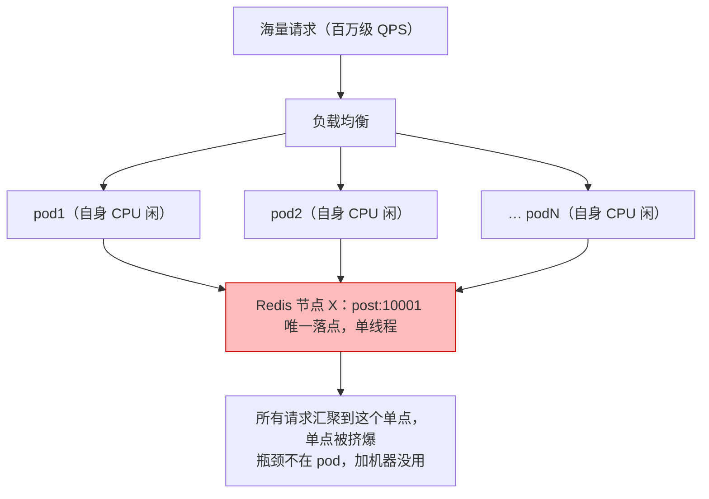

# C 端推荐系统高并发应对 · 深度调研 + MiniForum 现状与差距

> 创建：2026-08-26
> 主题：① 主流互联网 C 端系统（微博/抖音/今日头条/小红书）如何应对高并发在线访问；② 本项目是否考虑过高并发、已做了哪些相关设计、还缺什么。
> 配套：与《推荐系统深度调研报告-微博/抖音/小红书版》《推荐系统微服务拆分方案》《数据存储矩阵》《生产化落地开发清单》并列，本文从"高并发"这个**专门的横切视角**切入。
> 说明：外部事实均标注来源等级（A=官方/演讲一手，B=知名团队/资深作者，C=第三方设计文，D=AI 低质已弃用）；详见文末来源。

---

## 0. 结论先行（TL;DR）

**主流系统扛高并发的"四板斧"**：

```
① 漏斗削减   召回→粗排→精排→重排，每层把候选量砍一个数量级，让在线算力只碰"最可能对的几十条"
② 预计算+缓存 能离线/近线算的绝不实时算；在线只读 Redis / 本地缓存，毫秒级拼装
③ 异步削峰   写路径（发帖/互动/打点）先落 MQ/近线，把瞬时高峰拉平，不拖慢读
④ 熔断降级   限流、熔断、降级、隔离、热点预案——峰值来了"有预案"，不雪崩
```

> 四板斧其实是下面"三层模型"里的手段——先厘清概念再往下读。

### 0.1 先厘清概念：高并发是"扛什么"？——三层模型

**并发的主体永远是"请求"，不是 pod。** 一个请求被负载均衡到哪个 pod 执行，决定了这个问题的难度：

- 请求跑在**一个进程**（单 pod）：并发 = 线程并发，共享同一块内存，`ConcurrentHashMap` / 锁即可协调；
- 请求分散在**多个进程**（多 pod）：并发 = 分布式并发，进程间没有共享内存，协调必须靠外部存储（Redis/MySQL）的原子规则。

所以"应对高并发"不是"堆机器"或"压榨单机"二选一，而是**三层问题一起解**：

| 层 | 解决什么 | 手段 | 堆机器能解吗 |
|---|---|---|---|
| ① **能不能堆机器**（架构前提） | 应用有本地状态时，加机器就"裂"（pod A 写、pod B 读不到） | **无状态化 + 状态外置**（Redis/MySQL/Kafka） | 这是堆机器的**前提**，不是手段 |
| ② **堆得起机器**（单机效率） | 每请求算力成本 + P99 时延 | 多级缓存 / 预聚合 / 漏斗 / 异步 | ❌ 加机器不降单请求成本与时延 |
| ③ **堆了机器之后**（分布式正确与稳定） | 热点、一致性/幂等、部分失败 | 热点处理 / 分布式幂等锁 / 限流熔断降级 / 可观测 | ❌ 恰恰是加机器**带来**的新问题 |

支撑这个模型的三个事实：

**事实一：加机器不是免费的，前提是"状态外置"。** 总容量 = 单机 QPS × 机器数，QPS 翻倍最直接的杠杆就是翻机器；但只要应用有本地状态，翻机器就翻不动——本项目默认全内存：加 pod 后各 pod 的内存库各算各的、用户被路由到不同 pod 会看到不同数据。所以"堆机器"本身**强制你先做状态外置**——这不是优化，是资格证（对应 Part 2 里"单实例内存库不可扩展"那条）。

**事实二：堆机器解决总量，解决不了"伴随问题"**（正是"随之而来的其他问题"）：
- **热点**：同一个 key（如爆款帖热度）在集群里**只有一个物理节点**，所有 pod 的请求都汇聚到这个单点，单点吞吐固定——加 pod 只是增加客户端去挤它（图见下）；
- **一致性/幂等**：同一条写请求落在不同 pod = 不同进程，没有共享内存，各自的 `putIfAbsent` 各生效一条就是重复——必须下沉到存储层的原子规则（Redis `SET NX EX` / DB 唯一约束）；
- **稳定性**：分布式下"部分失败"是常态（一个 pod 慢、一个下游挂），需要限流/熔断/降级/超时防止雪崩正循环；
- **可观测**：请求跨多 pod，没有 trace ID 查不了问题。

**事实三：单机效率决定成本与延迟，而这俩堆机器解决不了。**
- **成本**：`QPS × 每请求成本 = 机器数`。单机 100→500 QPS，同样扛 100 万 QPS，机器数从 1 万台变 2000 台（字节"近线预聚合下游 QPS 降 1/10" = 机器数也能降 1/10）；
- **延迟**：加机器不降单请求时延（还可能多一跳网络），P99 靠缓存/预聚合/漏斗；
- **加机器也不是瞬时的**：微博热搜"3 分钟翻 5~10 倍"，3 分钟加不了几台机器，靠"提前维持冗余 + 动态扩容（10 分钟 5000 台）+ 降级兜底"三者配合——**降级是扩容到位前先扛住的桥**。

**热点为什么"加机器没用"——一张图**：



**并发写为什么"多 pod"把同步问题变成分布式问题——对比**：

| | 单 pod（同一进程） | 多 pod（多进程） |
|---|---|---|
| 内存 | 共享同一块 JVM 内存 | 无共享内存 |
| 幂等 | `ConcurrentHashMap.putIfAbsent` 天然原子 | 各自生效 → 重复，必须下沉存储层 |
| 协调 | 锁 / 共享内存 | Redis `SET NX EX` / DB 唯一约束 |

**一句话心智模型**：请求是并发的"人"；**pod 决定这些人住一间房还是分住 100 间房**。住一间房（单 pod）靠锁（共享内存）协调；分住 100 间房（多 pod）靠"中央档案室"（Redis/MySQL）的原子规则协调；而**热点是所有人都涌向档案室的同一份档案**，开再多房间也没用，得把这份档案复制到各房间（本地缓存 / L1）。

**MiniForum 现状一句话**：

> **架构骨架是对的，在线层的"厚度"不够。**
> - ✅ **已具备（结构层）**：在线/近线/离线三层物理分离（offline-job、flink-nearline 独立模块）、多级漏斗削减候选、事件驱动 + Outbox、生产侧 Redis/Kafka/MySQL/ClickHouse 适配齐备、推模式关注流、幂等。
> - ⚠️ **缺的（在线层）**：多级缓存（无 L1 本地缓存、画像/物品特征每次现算）、缓存穿透/击穿/雪崩防护、限流/熔断/降级/隔离、热点内容处理、行为削峰（打点同步广播）、监控/链路/压测。
> - 默认（`!prod`）是**演示形态**（全内存，不追求并发）；生产（`prod`）是**"中间件接上了、但稳定性与缓存机制还没接"**的半成品。

---

# Part 1　主流系统如何应对高并发

## 1.0 先建立心智：高并发到底在优化什么

一条推荐请求在高并发下要满足三点：**快**（毫秒级返回）、**省**（每请求算力成本足够低，才能撑住峰值 QPS）、**稳**（任何一路依赖挂了都不雪崩）。主流的做法全部围绕这三点展开，归纳成四个字——**"层、缓存、异步、兜底"**。

## 1.1 微博：多级缓存 + 热点联动 + 热搜 + 推拉结合（与本项目同形态，重点看）

微博是 MiniForum 的对标对象（微博式社区），它的高并发手段最具参考价值。

### 1.1.1 读路径：Main-HA-L1 三层缓存【A】

微博 Feed 缓存演进：`单层 HASH → Main-HA → Main-HA-L1`。

- **Main 层**：分布式缓存（Memcached/Redis）主体，按哈希分片；
- **HA 层**：Main 节点宕机时请求穿透到 HA 兜底，**不落 DB**（解决"单层哈希分片节点宕机→穿透直达 DB"的隐患）；
- **L1 层**：接入/Web 层**进程内本地缓存**，把热点读在进程内扛掉，减少网络与分布式缓存压力——"多组 L1 读取性能升、峰值流量成本降"。

读策略逐层穿透、miss 回写；写策略多写多份。数据序列化用 **Protocol Buffer + QuickLZ 压缩**降带宽。规模参考：单核心数据 Cache QPS 百万级、Cache 日访问万亿级。

### 1.1.2 专用存储打爆通用存储的场景【A】

微博有几个反直觉但极致的优化，本质是"**按数据形态选专用存储，别让通用 Redis 扛所有**"：

| 数据形态 | 专用方案 | 收益 |
|---|---|---|
| 点赞/阅读"是否存在"判断（单条小、总量千亿） | **Phantom**（BloomFilter，每条 1.2B） | 内存为 Redis 的 1/50（Redis 单条 65B） |
| 计数（转发/点赞/浏览） | **CounterService**（多列 + 冷热分离：热内存 LRU / 冷落 SSD） | 内存降为 1/5~1/15 |
| 大 V 粉丝/关注关系集合 | 自研固定长度开放 hash 数组（Redis 眼里是 byte 数组） | 内存降一个数量级，set 只需一次 |
| 通用 KV | Redis 定制（Redrocks 冷热分离 hot 内存/cold RocksDB） | 突破内存容量限制，热点性能与 Redis 相当 |

> 对 MiniForum 的启示：**别把"高并发"理解成"往 Redis 塞更多"**。先想清楚每条数据的"读形态"（存在性？计数？列表？），再决定要不要专用结构。本项目当前点赞/收藏/关注关系就是"通用内存 Map 或 MySQL 行级"，量级离微博差 6~7 个数量级，够用，但要知道天花板在哪。

### 1.1.3 热搜在线架构【B】

- 热搜 = 实时 Top50，**每分钟更新一次**，客户端同一分钟必须拿到一致的整榜；
- Flink SQL + 自定义 UDAF（最小堆维护 TopN），**minibatch 60s 输出一次**（避免每条日志都 retract 的性能放大）；
- 前 50 名**合并成一条记录**输出（保证事务性，要么全榜要么不更新）；榜单存 **Redis KV 快照**（只读最新，无历史）；
- **异地双链路热备**：两个机房 Kafka 各 50% 流量互为热备，Flink 主备双跑，客户端自动切换上报。

### 1.1.4 热点联动：这是微博扛住"3 分钟流量翻 5~10 倍"的关键【A】

微博研发总监刘道儒 InfoQ 采访披露的三次架构升级里，最独特的是 **"热点联动机制"**：

```
热点事件（明星官宣/地震）
  → 某服务实时检测流量变化，达"一级热度阈值" → 广播热度消息
  → 各服务/模块按热度等级各自执行预案（扩容 / 降级）
  → 2 分钟内发现热点并联动应对
```

配套能力：7×24 小时 **10 分钟 5000 台**极速弹性扩容；热点分层承压（接入层易扩容、热搜/热门微博资源层扩容慢需维持高冗余）；异地多活（自研 wmb 消息分发）；**Touchstone 容灾压测**（iptables 断 Redis 端口模拟故障，发现 client 120s 才返回，倒逼加超时检测）。

### 1.1.5 Feed 分发：推拉结合（大 V 特殊通道）【C】

- **小 V 用推模式**（发帖写扩散到粉丝 inbox，读快写重）；**大 V 用拉模式**（读时实时聚合，写轻读重，避免百万级 fanout 写放大）；
- **中 V** 粉丝分片批量推送（如每批 2000 粉丝）；
- 拉模式读优化：增量拉取（记 last pull time）、单次限量（每大 V ≤20 条）、异步预拉取、**热点 Top50 大 V 列表放应用服务器本地缓存**；
- 纯推/纯拉对比：热点场景缓存命中率纯推 50%、纯拉 70%，推拉结合可达 94%【C】。

## 1.2 抖音/字节：漏斗 + "轻在线重离线" + 模型服务化

### 1.2.1 漏斗每层都在削减候选量【A】

抖音官方透明化披露：一条视频上线经历"**内容池 → 召回 → 排序**"三环节。高并发视角的解读：**内容池海量 → 召回粗筛一批候选 → 排序只对这批小候选精排打分**，控制在线计算量与时延。这与微博/头条/小红书/Netflix 完全一致——**多级漏斗是规模化必经之路，不是可选项**。

### 1.2.2 "轻在线重离线"：把计算往离线/近线推【A】

字节实时特征负责人郭文飞分享的核心理念，对高并发极关键：

- **早期**："轻离线重在线"——窗口聚合状态放存储层/在线完成，每请求在线拉明细聚合 → 在线层复杂、资源压力大；
- **改后**："**轻在线重离线**"——时间切片明细 + 窗口聚合计算全放 Flink 离线/近线，**只把聚合结果推到在线 KV 存储（Redis/abase），在线模块只做极轻的 serving**；
- 落地收益：**抖音推送场景聚合用户行为写下游，下游 QPS 降到原来的 1/10**（近线预聚合消灭在线重复计算）；
- 状态存储：RocksDB（本地 SSD）存 7 天内窗口状态，7~30 天长窗口走中心化存储；Flink State Cache 对热点 key 缓存，CPU 收益约 50%。

> **这是 MiniForum 最大的结构差距**：本项目画像（UserProfileAggregator）和物品特征（itemFeature）在 `!prod` 下是**每次请求现算全量**；即使 prod 有 Redis 画像 read-through，也是"按需现算后写 Redis"，不是"近线预聚合"。见 Part 2/3。

### 1.2.3 模型服务化（精排 80ms 预算）【B】

字节火山引擎 Monolith：精排 Serving 需满足**分布式**（Embedding 可 TB 级）、**低时延**（精排一般 80ms 内）、**高可用**（Entry/OnlinePS 多副本，一个副本存活即可服务）、**少抖动**（模型上下线不造成延时抖动）、**支持 AB 流量调度**。Online PS 参数 fp32→fp16 量化、多分片可 Serving TB 级模型；Training PS 与 Online PS 间 RPC 实现**分钟级参数增量更新**。

## 1.3 今日头条：index_service + abase + 大扇出优化【B】

- **离线倒排 → 在线 search**：离线更新 `fid:(gid,score)` 倒排，在线按 feature 查拉链取候选 → filter/merge/boost；
- **index_service**：正排（200+ 字段）protobuf IDL 描述按"簇"存储，imdb 存储 + **MVCC 读写互不阻塞 + 内存映射 0 拷贝**，共享内存实现 TTL/compaction，**百万 QPS、pct99 < 1ms 无明显长尾**；
- **abase**（RocksDB 分布式 KV）：内建 key 级 LRU cache、bucket 分片/迁移，单副本 85T、读 360w QPS；
- **大扇出优化**：在线取特征需 2000+ 次 RPC 扇出，串行不可行 → 异步 IO thrift RPC fanout、IO 与序列化反序列化分离 → 增加 Proxy 减少小包（长尾 `(1-0.999^2000)=86.5%`）→ 迁移 fbthrift 全异步；
- **可用性**：自动降级 + 降级平台、封禁/探活/解禁、主动 overflow（丢长时间 pending task）、熔断、优雅退出、多机房调度快速流量迁移。

## 1.4 小红书：在线服务流程 + 近线调度【A】

- **在线服务流程**：请求 → 在线服务做推荐 → **把"当时推荐的笔记 + 请求特征"缓存**后返回客户端；行为经打点流入数据流 → 实时归因/汇总 → 样本 → 在线/离线训练 → 模型发布；
- **特征缓存放本地 AZ**（多 AZ 部署，特征就近）；
- **近线服务统一调度**（4 级 QoS：强隔离在线 / 普通在线 / 近线 / 离线）：**近线用低保障算力**（独占池 > 在线闲置算力 > 混部 > 公有云兜底），在线 pending 时 2 分钟内驱逐近线实例归还资源；智能 HPA 预测流量洪峰提前扩容——**近 10 万核近线服务近 0 计算成本**；
- Flink 实时归因：20 分钟 session 窗口 + RocksDB 增量 checkpoint（checkpoint 频率从 1 分钟调到 10 分钟，减少小文件 compaction 反压）。

## 1.5 通用高并发技术体系（跨系统）

> 本节为"无论哪个系统都用得到"的通用工程手段。以下机制本项目**目前一个都没有落地**（见 Part 3）。

### 1.5.1 多级缓存与三大问题【A/B/C】

**多级缓存**：L1 进程内（Caffeine/Guava，纳秒~微秒）→ L2 分布式（Redis，毫秒）→ L3 DB。读先本地再 Redis 再落库；**Cache Aside**（读 miss 回源回填、写先更 DB 再删缓存）；一致性用**延迟双删**/版本号/**binlog 订阅（Canal）**。

**三大问题**：

| 问题 | 现象 | 解法 |
|---|---|---|
| 穿透 | 查不存在的 key，绕过缓存直达 DB | 布隆过滤器前置 / 空值短 TTL 缓存 |
| 击穿 | 单个热点 key 过期瞬间并发打 DB | 互斥重建（分布式锁/单飞）、逻辑过期+异步刷新 |
| 雪崩 | 大量 key 同时过期 / 缓存集群挂 | TTL 随机打散、多级降级、缓存高可用 |

**热点 key**：京东 JD-hotkey 每机统计访问频次，超阈值 key 推送到各实例本地缓存，毫秒级发现热点并把热点流量从 Redis 转移走【C】。

### 1.5.2 限流 / 熔断 / 降级 / 隔离【A/B/C】

- **限流**：固定窗口/滑动窗口/漏桶（恒定输出削峰）/令牌桶（允许突发，最常用）；**分布式限流用 Redis + Lua 原子化**；**分层限流**（网关按 IP/接口粗粒度 + 应用层 Sentinel 按 QPS/线程数/热点参数细粒度）；**自适应限流**（按响应时间/CPU/队列水位动态调阈值）；
- **熔断器**（Hystrix/Sentinel/Resilience4j）：CLOSED → 失败率超阈值 OPEN（快速失败）→ 等待窗口 → HALF_OPEN 探活 → 成功回 CLOSED；
- **降级**：功能降级（关非核心路，如去掉某路召回）/ 数据降级（返回热门兜底/旧数据）；**多级降级顺序**（1 级 CPU>90% 只返回推模式内容 → 2 级 CPU>95% 全走静态缓存 → 3 级错误率>20% 返回"服务繁忙"静态页）——**降级顺序是为了防止雪崩正循环**；
- **隔离**：线程池隔离（Hystrix 每依赖独立线程池）/ 信号量隔离（低延迟轻场景）。

### 1.5.3 异步削峰【A/B】

- **MQ 削峰填谷**：写路径先落 MQ（Kafka 顺序写+页缓存+零拷贝/批处理；RocketMQ 事务+有序），下游按自身能力拉取；
- **可靠投递**两条主线：**本地消息表**（业务表+消息表同库同事务，定时补投，消费幂等）/ **事务消息**（RocketMQ 半消息+回查）；
- **批量写/合并刷盘**：攒批落 DB / Redis pipeline。

### 1.5.4 读写分离 / 分片 / 冷热【B/C】

- 主从读写分离（读走从库，强一致读走主库）；分库分表（取模/一致性哈希，ShardingSphere/自研中间件）；**冷热分离**（近热 MySQL/缓存，冷数据归档 ES/HBase）；
- 坑：分片键选错→倾斜；跨分片排序分页难；**能不分尽量不分**（量级没到就别分）。

### 1.5.5 无状态 / 水平扩展 / 多机房【A/B】

- **无状态化**：Session/本地状态外置 Redis（本项目 Session 在 HttpSession，见 Part 3），实例可被任意流量打到；
- 一致性哈希（ketama/maglev，虚拟节点防倾斜）；K8s HPA 按 CPU/QPS 自动扩缩（期望副本=当前×(当前/期望)）；多机房/单元化容灾。

### 1.5.6 压测与容量【A】

- **全链路压测**（美团 Quake）：线上用真实流量模型（Nginx 日志/RPC 录制）压峰值，**压测标识透传 + 影子表/影子 KV 隔离**，压测中顺带故障注入演练；月均压测上万次；
- **混沌工程**（Netflix Chaos Monkey 起源）：主动杀 Pod/断网/延迟，验证自愈与降级；
- 容量规划：单机容量 × 冗余系数，看**链路最弱一环**。

---

# Part 2　MiniForum 是否考虑过高并发？已做了哪些相关设计？

## 2.1 结论：考虑过，且是"结构性正确"的考虑

从文档与代码看，本项目**明确把"生产级/高并发"作为目标**：

- `README` 有"生产模式闭环审计"、`docs/生产化落地开发清单`、`docs/数据存储矩阵`、`docs/推荐系统微服务拆分方案`——这些是**架构决策层面**的高并发/生产化思考；
- 代码里 `@Profile("prod")` 的 Kafka/Redis/ClickHouse/MySQL/Nacos/Flink 适配、Outbox、幂等、Snowflake——是**生产可靠性**层面的落地。

**所以不是"没想过"，而是"想了架构层、落了中间件层、还没落在线层"**。下面按维度盘点。

## 2.2 已做的高并发相关设计（按维度）

| 维度 | 已做的设计 | 对应代码/文档 | 状态 |
|---|---|---|---|
| **分层隔离** | 在线/近线/离线三层：`offline-job`、`flink-nearline` 独立模块；离线重计算（ItemCF 重建、评估）不阻塞在线接口 | 模块拆分 + `@EnableScheduling` 各进程独立 | ✅ 结构正确 |
| **漏斗削减** | 6 路召回(每路 top100) → 融合(top200) → 排序 → 重排(topN≤20)，层层削减候选量 | `RecommendService` 编排 | ✅ 高并发核心范式 |
| **事件异步** | 发帖事件总线多路消费；生产 Kafka 解耦；行为打点 → Kafka | `PostCreatedEventBus` / `KafkaPostCreatedProducer/Consumer` | ✅ 解耦/削峰骨架 |
| **Outbox 必达** | 生产 `MySqlOutboxStore` + Relayer 异步转发，注释明写"避免发帖请求被拖慢" | `demo-runner/src/prod/.../MySqlOutboxStore` | ✅ 生产可靠性 |
| **幂等** | `RedisIdempotencyStore`（SET NX EX）防发帖重复 | `idempotency/` | ✅ |
| **Redis 热数据层** | 实时特征（TTL 60s）、画像、关注关系 ZSET 缓存、feed inbox、幂等 | `prod/redis/*`、`RedisFollowFeedStore` | ✅ 生产激活 |
| **推模式 feed** | 发帖 fanout 写 inbox，读 O(1) 取 postId；cap 500 封顶；Redis ZSet pipeline 批量扇出 | `FollowFeedStore` + `RedisFollowFeedStore` | ✅ 主流 feed 读方案 |
| **游标分页** | postId 单调递增 → max_id/since_id 天然游标（Snowflake 支撑） | `util/SnowflakeIdProvider` | ✅ |
| **降级预留** | 大 V 分流 `shouldSkipFanout`；`ContentPipeline` 审核预留 | `FollowFeedStore` / `ContentPipeline` | ⚠️ 预留未实现 |
| **数据放置决策** | MySQL=事实 / Redis=热 / Kafka=事件 / ClickHouse=行为全量，已定矩阵 | `docs/数据存储矩阵.md` | ✅ 决策正确 |

## 2.3 能力对照表：主流手段 × 本项目现状

> ★=已落地　◐=部分/预留　○=缺失。`!prod`=默认演示，`prod`=生产适配激活。

| 主流高并发手段 | 本项目现状 | 评级 |
|---|---|---|
| 多级漏斗削减候选 | 召回→融合→排序→重排，层层削减 | ★ |
| 三层分层隔离（在线/近线/离线） | offline-job / flink-nearline 独立，重计算隔离 | ★ |
| 写路径异步化 + Outbox | 发帖走 Outbox + Kafka；行为打点入 Kafka（prod） | ★ |
| 幂等 | Redis NX EX | ★ |
| 推模式 feed + 游标分页 | inbox + Snowflake 游标 | ★ |
| Redis 热数据层 | 实时特征/画像/关系/inbox/幂等 | ★（仅 prod） |
| **读路径多级缓存（L1 本地 + Redis）** | **无 L1 本地缓存；画像/物品特征每次现算** | ○ |
| **画像/特征预聚合（轻在线重离线）** | 在线每次 `UserProfileAggregator.build` / `itemFeature` 现算 | ○ |
| **缓存穿透/击穿/雪崩防护** | 无布隆/空值缓存/互斥重建/TTL 打散 | ○ |
| **热点内容处理**（热搜/大 V/爆款） | 热搜 `HeatAggregator` 内存现算，无 Redis 榜单、无热点联动 | ○ |
| **限流** | 无（网关/Sentinel 都没有） | ○ |
| **熔断/降级/隔离** | 仅大 V `shouldSkipFanout`、`ContentPipeline` 预留 | ◐ |
| **行为打点削峰** | `!prod` 打点同步落库+同步广播；无 MQ 积压治理 | ◐ |
| **单实例内存库可扩展** | 默认全内存 `ConcurrentHashMap`，多实例不共享 | ○ |
| **ItemCF/冷启动池跨实例共享** | `ItemCfModelStore`/`TrafficPool`/`NewItemPool` 每实例各算各的 | ○ |
| **读写分离 / 分片** | MySQL 单库单表（索引合理，无分片） | ○（量级未到，合理） |
| **监控 / 链路追踪 / 日志** | 无指标、无 trace ID、无告警 | ○ |
| **全链路压测 / 容量 / 混沌** | 无 | ○ |
| **降级预案体系** | 只有零散预留 | ○ |

---

# Part 3　还缺什么？差距清单 + 优先级路线图

> 排序按"先保在线扛得住峰值、再谈扩展与治理"。每条给出**为什么缺、影响、怎么补**。

## 3.1 在线层读路径：多级缓存（最高优先）

**现状**：`!prod` 每次请求现算画像（`UserProfileAggregator.build` 全量扫该用户全部行为）、现算物品特征（`itemFeature` 每次聚合点赞/评论/收藏/转发/浏览/时长）；`prod` 也只是 `RedisUserProfileStore` 的 **read-through**（按需现算再写），实时特征只覆盖 `realtimeMatch`。

**为什么缺**：这是**单条请求算力成本最高**的一环。现算画像 = 每次推荐请求都要把用户行为全量扫一遍做聚合。QPS 一上来，CPU 全耗在重复计算上——高并发的第一条铁律"能预计算的不实时算"被违反。

**影响**：在线吞吐天花板低；响应时延波动大（行为越多聚合越慢）。

**怎么补**（对齐"轻在线重离线"）：
1. **画像预聚合**：行为回流时就增量更新用户画像（而非每次全量 build），或近线 Flink 窗口产出画像写 Redis，在线只读；
2. **物品特征预聚合**：热度/计数类特征近线统计写 Redis（可对 key 设 TTL），在线读现成值，不做 count 聚合；
3. **L1 本地缓存**：热点帖详情、热门列表、热搜榜这类"热读"加进程内缓存（Caffeine），短 TTL + 定时刷新；
4. **推荐结果缓存**：低频变化场景（如未登录热门推荐）可缓存整页结果（注意刷新去重语义，参考今日头条"Cache 要与推荐语义结合"的提醒）。

## 3.2 缓存三大问题防护（与 3.1 配套）

**现状**：无布隆过滤器、无空值缓存、无互斥重建、无 TTL 打散、无热点 key 处理。

**影响**：一旦加了缓存，这些防护就必须跟上——否则一个热点帖的 key 过期瞬间就会击穿打到 MySQL/内存库；一个不存在的 ID 会穿透绕过缓存直查库。

**怎么补**：空值短 TTL 缓存（最便宜）；互斥重建（单飞）防击穿；TTL 加随机抖动防雪崩；热点 key 上 L1 本地缓存。

## 3.3 稳定性：限流 / 熔断 / 降级 / 隔离

**现状**：无网关限流、无 Sentinel、无熔断器、无降级预案（除大 V/ContentPipeline 预留）。

**影响**：微博热搜"3 分钟翻 5~10 倍"这类峰值，本项目**没有预案**——没有限流会打满 DB，没有熔断会让一个依赖拖垮全链路，没有降级会在峰值时直接 500。

**怎么补**（按成本递增）：
1. **降级预案**（最便宜、收益最大）：推荐失败回退"热门榜兜底"；行为打点失败不阻塞主链路（日志降级）；热搜降级为静态榜；
2. **限流**：网关/入口层固定 QPS 限流（先简单后分布式 Redis+Lua）；
3. **熔断 + 线程池隔离**：对下游依赖（回源 MySQL、模型推理）加熔断器，避免雪崩正循环。

## 3.4 写路径与近线：削峰与预聚合

**现状**：
- 发帖：prod 已走 Outbox + Kafka ✅，`!prod` 同步广播（演示可接受）；
- **行为打点**：`InMemoryBehaviorLogger.log` **同步**落库 + **同步**广播事件队列（`!prod`）；prod 走 Kafka 但 KafkaBehaviorConsumer 落内存库 + 广播仍是同步链；
- **fanout**：`!prod` 同步、`prod` Redis 版仍同步在发帖线程（只有 Kafka 消费者异步化了一半）；
- **冷启动池/实时特征**：`TrafficPool`/`NewItemPool`/`RealtimeFeatureWindow` 都依赖"行为事件队列实时派发"，无近线预聚合。

**影响**：打点作为最高频写操作（每次曝光/点击都打），同步处理会随 QPS 线性吃掉请求线程；fanout 写放大（一个百万粉丝作者发帖要写百万 inbox）没有大 V 拉模式兜底。

**怎么补**：打点异步化（先入内存/本地缓冲，攒批发 Kafka，或 Kafka 生产端异步）；fanout 接入大 V 分流（`shouldSkipFanout` 已预留，补读侧 pull 合并）；近线预聚合用户/物品信号（见 3.1）。

## 3.5 数据与扩展：单实例内存库

**现状**：默认全内存；`prod` 下在线进程仍持有内存 `BehaviorLogRepository`（画像/ItemCF 事实源）与内存 `ItemCfModelStore`/冷启动池；`docs/数据存储矩阵` 与 `微服务拆分方案 §8.2` 都明确指出"内存仓库不可跨服务共享，多实例需落 Redis/MySQL/Kafka"。

**影响**：无法水平扩展；多实例部署时画像/ItemCF/冷启动池各算各的（README 已知取舍"单实例假设"）。

**怎么补**（对齐微服务拆分方案阶段 3）：行为事实源落 ClickHouse（生产已在 ClickHouseBehaviorStore 有 Kafka Engine 摄入 ✅，补在线读）、冷启动池状态落 Redis、ItemCF 模型支持离线构建发布（§6 已指出发布动作未落地）。

## 3.6 治理：监控 / 链路 / 压测

**现状**：无指标采集、无 trace ID、无告警、无全链路压测。只有 `@Scheduled` 的离线评估能观察推荐质量，无法观察系统健康。

**怎么补**：日志统一结构 + 请求 trace ID；关键指标（QPS/时延 P99/缓存命中率/行为积压量）；简单全链路压测（对齐美团 Quake 思路，压测标识+影子数据隔离）。这是"上生产"前的前置项。

## 3.7 优先级路线图（对齐 `微服务拆分方案` 的阶段划分）

| 优先级 | 动作 | 对应主流程 | 复杂度 |
|---|---|---|---|
| P0（在线扛峰） | 画像/物品特征预聚合 + Redis 化在线读取 | 3.1 | 中 |
| P0 | 推荐失败热门兜底 + 行为打点不阻塞主链路（降级预案第一条） | 3.3 | 低 |
| P1 | 加 L1 本地缓存（热门列表/热搜榜/热点帖）+ 三大问题防护 | 3.1/3.2 | 中 |
| P1 | 入口限流（先单机后分布式） | 3.3 | 低 |
| P2 | fanout 大 V 分流落地（读侧 pull 合并） | 3.4 | 中高 |
| P2 | 冷启动池/TrafficPool 状态落 Redis（跨实例共享） | 3.5 | 中 |
| P2 | 熔断 + 线程池隔离 | 3.3 | 中 |
| P3 | 监控指标 + trace ID | 3.6 | 中 |
| P3 | ItemCF 离线构建 → 发布（对齐 `微服务拆分方案`） | 3.5 | 高 |
| P4 | 全链路压测 + 故障演练 | 3.6 | 高 |

---

# Part 4　结论

1. **主流系统的高并发 = 三层模型（0.1）下的四板斧手段**：漏斗削减 + 预计算/缓存（② 单机效率）+ 异步削峰 + 熔断降级兜底（③ 稳定性），并靠状态外置拿到"能堆机器"的资格（①）。微博/抖音/头条/小红书无一例外，只是侧重不同（微博重缓存与热点、字节重"轻在线重离线"与模型服务化、头条重存储与大扇出、小红书重近线调度降本）。
2. **MiniForum 的定位是"生产级架构形态的演示系统"**：它的价值在于**把生产级的分层、事件、Outbox、中间件适配、存储矩阵做对了**，这对学习是极好的骨架；但它**不是为真实高并发设计的**——默认全内存是演示形态，`prod` 也只是"中间件接上了、在线层稳定机制还没接"。
3. **最大差距不是缺中间件，而是三层模型里的 ①②③ 都没落地**：① 状态外置（单实例内存库，连"能堆机器"的资格都没有）、② 在线层算力治理（多级缓存/画像预聚合）、③ 分布式稳定机制（限流熔断降级/热点处理/幂等）。中间件（Kafka/Redis/ClickHouse/MySQL）本项目已齐，但它们是 ① 的地基——把 ① 补上拿到"能堆机器"的资格，②③ 才有意义。
4. **补全的优先级很清晰**（对应三层模型）：当前先做"单实例也能扛得住"——② 单机效率（3.1~3.2）与 ③ 峰值预案（3.3）优先（P0），它们对单个实例也立刻有效；① 状态外置（3.5）是"能堆机器"的前提，单实例阶段先做其中成本低的（行为落 ClickHouse、冷启动池落 Redis），拿到扩展资格；最后治理（3.6）。当前阶段（演示/教学）**不需要**做读写分离、分库分表、异地多活——量级未到，且会显著增加复杂度（业界共识：能不分尽量不分）。

---

## 附录 · 参考来源

**A 级（官方/演讲一手）**
- 微博极端热点与架构演进（刘道儒，InfoQ）：https://www.infoq.cn/article/qgWbh0WZ5Bvw9APJOs2a
- 微博 Feed 缓存架构演进（陈波）：https://www.slidestalk.com/u65/SDCC79934
- 微博关系服务与 Redis（唐福林，InfoQ）：https://www.infoq.cn/article/weibo-relation-service-with-redis
- Redis 在微博场景优化实践（兰将州）：https://www.slidestalk.com/DBAPlus/Redis_s_Optimized_Practice_in_the_Scenario_of_Weibo
- 抖音/字节实时特征体系 5 年 5 次迭代（郭文飞）：https://cloud.tencent.cn/developer/article/2256256
- 今日头条推荐系统架构设计（金敬亭，QCon 2017）：http://2017.qconbeijing.com/presentation/725/
- 小红书实时推荐/大数据平台（郭一，2019）：https://developer.aliyun.com/article/711777
- 小红书近线服务统一调度（高会军）：https://cloud.tencent.cn/developer/article/2231162
- 美团全链路压测平台 Quake：https://tech.meituan.com/2018/09/27/quake-introduction.html
- 抖音官方算法透明化披露：https://m.ithome.com/html/841836.htm

**B 级（知名团队/资深作者）**
- 微博热搜 Flink SQL 实践：https://cloud.tencent.cn/developer/article/1853189
- 火山引擎 Monolith 大规模推荐系统：https://developer.volcengine.com/articles/7316456513915060234
- 微博缓存架构演进（二手汇总）：https://ecweb.ecer.com/topic/cn/detail-728799-chinas_weibo_boosts_caching_for_billions_of_daily_users.html

**C 级（第三方设计文，作通用范式参考）**
- 微博 Feed 推拉结合 + 防雪崩：https://www.cnblogs.com/crazymakercircle/p/19143004
- 10 亿用户微博 Feed 流 100W QPS：https://developer.aliyun.com/article/1684572
- 京东热点缓存 JD-hotkey：https://blog.csdn.net/gold/article/details/153426528

**通用技术体系来源（美团/阿里云/腾讯云/Sentinel/Resilience4j/K8s 官方等）**
- 美团技术团队《缓存那些事》：https://tech.meituan.com/2017/03/17/cache-about.html
- 美团万亿级 KV 存储架构：https://tech.meituan.com/2020/07/01/kv-squirrel-cellar.html
- Netflix TechBlog《Caching for a Global Netflix》：https://netflixtechblog.com/caching-for-a-global-netflix-7bcc457012f1
- Redis 官方限流教程：https://redis.io/tutorials/howtos/ratelimiting/
- Sentinel 与 Hystrix 对比：https://sentinelguard.io/zh-cn/blog/sentinel-vs-hystrix.html
- Resilience4j CircuitBreaker：https://resilience4j.readme.io/docs/circuitbreaker
- RocketMQ 事务消息：https://rocketmq.apache.org/zh/docs/4.x/producer/06message5/
- 美团 MTDDL/DBProxy：https://tech.meituan.com/2016/12/19/mtddl.html
- Kubernetes HPA：https://v1-32.docs.kubernetes.io/zh-cn/docs/concepts/workloads/autoscaling/
- Gremlin《Chaos Monkey at Netflix》：https://www.gremlin.com/chaos-monkey/the-origin-of-chaos-monkey
- 阿里云《双 11 全链路压测》：https://developer.aliyun.com/article/106995

**项目内配套文档**
- `docs/推荐系统深度调研报告-微博版/抖音版/小红书版.md`、`docs/微博推荐调研.md`
- `docs/推荐系统微服务拆分方案.md`（§8 关键设计原则与坑）
- `docs/数据存储矩阵.md`、`docs/生产化落地开发清单.md`
