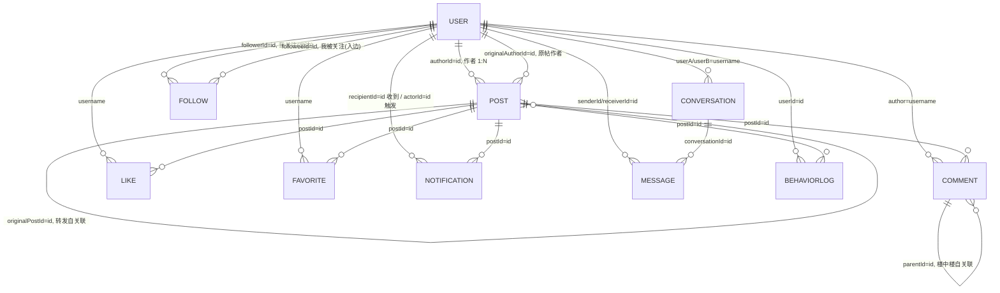

# MiniForum 业务实体与关联关系

> 本文档基于 **源码实际核验**（`forum-core/src/main/java/com/tkzou/miniforum/entity/` 与 `recommend/behavior/`），梳理 MiniForum 的全部业务实体、字段与关联关系。
> 目标读者：需要快速理解业务模型的开发者（含 LLM 编程 Agent）。
> 更新日期：2026-08-26

---

## 〇、总览：三层结构

```
实体层（entity, 纯 POJO，逻辑外键）
  ├─ 业务实体 ×10   User / Post / Comment / Like / Favorite / Follow / Notification / Conversation / Message / SearchRecord
  └─ 推荐事实源 ×1  BehaviorLog（不在 entity/ 包，在 recommend/behavior/，但属核心业务对象）

仓储层（repository, interface + InMemory 默认实现）
  每个实体对应一个 Repository 接口 + InMemory 实现（ConcurrentHashMap）
  生产 profile 有 MySql 行级表实现（demo-runner/src/prod, @Profile("prod")）

视图层（dto, 装配实体）
  PostAssembler 将 Post + Like/Comment/Favorite 计数装配成 PostVO / RecommendPostVO
```

**关联设计总原则**：所有实体之间用**逻辑外键**（`Long id` 或 `String username`）串联，**没有任何对象引用 / 没有任何 join**——查询一律走 repository。存储从内存换 MySQL 只是换 Repository 实现，实体与关联不变。

---

## 一、实体全景清单

| # | 实体 | 类 | 核心字段 | 一句话业务含义 |
|---|------|----|----------|----------------|
| 1 | 用户 | `User` | id, username, email, password, age, nickname, bio, avatar | 账号 + 资料（密码 SHA-256+盐） |
| 2 | 帖子 | `Post` | id, title, content, authorId, author, tags, topics, category, status, likeCount, viewCount, deleted/deletedAt, originalPostId/AuthorId/Author | 帖子（含草稿/回收站/转发） |
| 3 | 评论 | `Comment` | id, postId, author, content, likeCount, parentId | 评论（parentId 支持楼中楼） |
| 4 | 点赞 | `Like` | id, postId, username | 点赞去重记录 |
| 5 | 收藏 | `Favorite` | id, postId, username, createdAt | 收藏记录 |
| 6 | 关注 | `Follow` | id, followerId, followeeId, createdAt | 有向关注图的一条边 |
| 7 | 通知 | `Notification` | id, recipientId, actorId, actorUsername, type, postId, content, read, createdAt | 5 类通知：LIKE/COMMENT/FOLLOW/REPOST/MENTION |
| 8 | 会话 | `Conversation` | id, userA, userB, lastMessageAt, lastMessage, lastSender | 私信双人会话（userA/userB 配对幂等） |
| 9 | 私信 | `Message` | id, conversationId, sender/Receiver(Id), content, createdAt, read | 会话内一条消息 |
| 10 | 搜索记录 | `SearchRecord` | id, keyword, count, lastSearchedAt | 热搜榜聚合（独立聚合根，无外键） |
| ⭐ | 行为日志 | `BehaviorLog` | id, userId, postId, type, timestamp, durationSec, scene, expId | **推荐系统唯一事实源** |

### BehaviorLog 补充

`BehaviorType` 共 **14 种**行为信号（权重认知：转发 > 评论 > 收藏 > 点赞 > 点击 > 浏览 > 曝光）：

```
EXPOSE(曝光) VIEW(详情页浏览) DWELL(停留时长) CLICK(点击) LIKE(点赞) UNLIKE(取消点赞)
FAVORITE(收藏) UNFAVORITE(取消收藏) COMMENT(评论) REPOST(转发) SEARCH(搜索)
FOLLOW(关注) UNFOLLOW(取关) DISLIKE(负反馈/不感兴趣)
```

`scene` 标记来源：`POST`（业务动作）/ `TRACK`（前端上报）/ `RECOMMEND_FEED`（推荐流曝光）/ `RECOMMEND_DETAIL`（相关推荐）。`expId` 记录本次推荐所属 AB 实验组，用于离线归因。

---

## 二、关联关系图（ER）



### 数量关系速查

| 关系 | 粒度 | 说明 |
|------|------|------|
| User → Post | 1 : N | 一个作者多篇帖子；`InMemoryPostRepository` 维护 `authorId → SortedSet<Post>` 二级索引 |
| User → Follow | 1 : N×2 | 一个用户既是 follower（出边）又是 followee（入边），各 N 条 |
| Post → Comment | 1 : N | 评论贴在帖子上；`Comment.parentId` 再分一层楼中楼 |
| User → Comment | 1 : N | 通过冗余 `author`（username）连接 |
| Post ↔ User（Like/Favorite） | M : N | Like/Favorite 是中间表，`postId + username` 唯一 |
| Post → Post（转发） | 1 : N | `originalPostId` 指向原帖；转发帖本身是独立 Post 记录 |
| Conversation ↔ User | 1 : N×2 | 双人，userA/userB 固定两人 |
| Conversation → Message | 1 : N | 一个会话多条消息 |
| User → Notification | 1 : N×2 | recipientId 收、actorId 发，均指向 User |
| User/Post → BehaviorLog | 1 : N | 行为事实源，userId+postId 弱关联 |

---

## 三、按业务主题拆解

### 1️⃣ 内容生产：帖子与用户

- `Post.authorId → User.id`、`Post.author → User.username` **双字段冗余**：展示作者头像/主页免 join。
- 帖子生命周期由实体字段状态机承载：`status`（`DRAFT`/`PUBLISHED`）+ `deleted/deletedAt`（回收站软删除，30 天自动清理）+ 分类 `category`（固定 11 类，兜底"其他"）。
- **转发是"新 Post + 指针"**，不是子记录：`originalPostId != null` 即转发帖，`originalAuthorId/originalAuthor` 冗余原帖作者，`PostAssembler` 装配出"转发泡"（原帖标题+内容片段）。

### 2️⃣ 互动闭环：点赞/收藏/评论/转发 × 通知 × 行为

一次互动会**同时写多处**，是本项目数据流最强的联动：

```
用户点赞/收藏/评论/转发/@提及
  ├─▶ Like / Favorite / Comment / 转发帖       —— 写互动记录（实体）
  ├─▶ Notification                            —— 给帖子作者（recipientId=作者, actorId=互动者, type）
  └─▶ BehaviorLog                             —— 写行为事实源（expId 带 AB 归因）
```

- `Comment.parentId → Comment.id` 楼中楼（首层 parentId=null）。
- `Notification.postId → Post.id`：点赞/评论/转发类通知指向帖子；@提及/关注类可为空。

### 3️⃣ 关注图与关注流

- `Follow`：一张**有向关注图**，`followerId → User.id`（我关注谁）、`followeeId → User.id`（谁关注我）各为一条边记录。
- follow 之后经 `FollowFeedStore`（inbox 推模式）把新帖扇出到粉丝 feed；超大 V（粉丝数 ≥ 阈值）走拉模式（见 `application.yml` 的 fanout 配置项）。

### 4️⃣ 私信

- `Conversation` 固定**双人**：`userA / userB`（username）——两人配对即幂等键。
- `Message.conversationId → Conversation.id`（N:1），`Message` 冗余 `senderId/receiverId` + `sender/receiver` 双名字。

### 5️⃣ 热搜榜

- `SearchRecord` 只按 `keyword` 聚合（count、lastSearchedAt），**不关联任何用户**——词频热点独立对象。

### 6️⃣ 推荐链路：行为事实源 → 推荐

```
BehaviorLog(userId, postId, type, scene, expId)
  → 行为回流（画像 / ItemCF / 实时特征 / 冷启动反馈，见 README §3）
  → RecommendService 召回/排序/重排
  → Candidate(itemId=postId, channelScores) → RankedItem → RecommendPostVO(post + score + reason + sources)
```

- 推荐运行时对象（`Candidate` / `RankedItem` / `RecommendContext`）**不是持久化实体**，`itemId → Post.id` 弱关联到帖子。
- `RecommendPostVO` 把 `PostVO` 实体包裹进推荐视图，外面带 `score`（相关度）、`reason`（可解释理由）、`sources`（多路召回路来源）。

---

## 四、数据持久化映射

实体 → Repository → `data/*.json` 一一对应（`DataStore` 每 30s 落盘，启动加载恢复）：

| 实体 | Repository 接口 | JSON 文件 |
|------|----------------|-----------|
| User | `UserRepository` | `users.json` |
| Post | `PostRepository` | `posts.json` |
| Comment | `CommentRepository` | `comments.json` |
| Like | `LikeRepository` | `likes.json` |
| Follow | `FollowRepository` | `follows.json` |
| Notification | `NotificationRepository` | `notifications.json` |
| Favorite | `FavoriteRepository` | `favorites.json` |
| SearchRecord | `SearchRecordRepository` | `search-records.json` |
| Conversation | `ConversationRepository` | `conversations.json` |
| Message | `MessageRepository` | `messages.json` |
| BehaviorLog | `BehaviorLogRepository` | `behavior-log.json` |

> 生产模式（`-Pprod` + `@Profile("prod")`）下由 `MySqlDataStore` 快照到 MySQL `mini_store` 表替代 JSON 文件；各 Repository 有 `MySql*` 行级表实现，实体本身不变。

---

## 五、关联设计的特点（理解业务的关键）

1. **纯逻辑外键，无对象引用**：实体靠 `Long id` / `String username` 串联，查询交给 repository。存储层可整体替换（内存 ↔ MySQL），业务代码零感知。
2. **两种关联键并存（历史演进痕迹）**：
   - `username` 关联：Like / Favorite / Comment / Conversation
   - `userId` 关联：Follow / Notification / Message / BehaviorLog / Post.authorId
   - ⚠️ 一致性隐患：改用户名场景下互动匹配 username、行为/通知匹配 id，容易踩空，改动实需留意。
3. **"ID + 冗余名字"模式**：`Post.author+authorId`、`Notification.actorId+actorUsername`、`Message.senderId+sender`——展示层免 join，代价是写路径需同步维护冗余字段。
4. **计数冗余**：`Post.likeCount/viewCount`、`Comment.likeCount` 冗余在实体上（展示 O(1)），由互动写路径同步增减；`PostAssembler.toVO` 还会实时装配评论数/收藏状态/转发数。
5. **ID 自生成自洽**：每实体自带 `AtomicLong ID_GENERATOR` + `nextId()` + `resetIdGenerator(minId)`——从 JSON 恢复时推进到历史最大值避免 ID 冲突。
6. **推荐对业务侧零侵入**：推荐系统把用户行为沉淀为独立 `BehaviorLog` 实体，只通过 `userId/postId` 弱关联 User/Post，业务实体不带任何推荐字段。

---

## 六、对新增功能开发的速查

- 想给**帖子加字段** → 改 `Post.java`（实体）+ `PostCreateDTO`/`PostVO`（入参/出参）+ `PostAssembler`（装配）+ `posts.json`（持久化自动覆盖）。
- 想新增**一种互动** → 新实体 or 复用 Like/Favorite 模式（`postId + username` 唯一）+ 写 Notification + 写 BehaviorLog（三处联动）。
- 想加**通知类型** → `Notification` 加 type 常量 + `NotificationService` 生成逻辑，无需改表结构。
- 想连**另一个"帖子级"业务对象** → 一律用 `postId` 逻辑外键关联，不走对象引用。