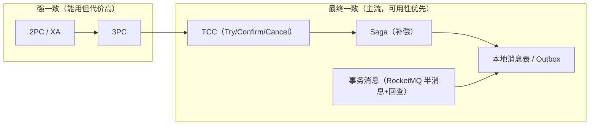

# 分布式事务 · 概念、方案与演进（讲透）

> 创建：2026-08-27
> 主题：分布式事务是什么、为什么这么难、CAP/BASE 下的取舍、从强一致（2PC/XA）到最终一致（TCC/Saga/Outbox/事务消息）的演进谱系，每个方案配实际例子。
> 风格：与《分布式系统四件套》《限流与熔断》一致——讲透机制、给实际例子、对比"没做过 vs 做过的人"。
> 配套：本项目已用 **Outbox（本地消息表）** 实现"发帖事件必达"的最终一致（`MySqlOutboxStore`）——本文会让它"有名字"。

---

## 0. 一句话全貌 + 演进谱系

> **分布式事务 = 跨多个服务 / 多个库的多个操作"要么全成、要么全败"。但分布式下没有"全局事务"，主流是"最终一致 + 补偿 + 幂等"。**



**一句话定位**：左边（强一致）性能差、可用性差、协调者单点，只在极少数场景用；右边（最终一致）是行业主流——**用"补偿 + 幂等 + 对账"换可用性**。

---

## 1. 是什么 / 为什么这么难

### 1.1 单机事务很容易，分布式就难了

**单机事务（ACID）**：一个数据库内部，靠 undo/redo log + 锁就能保证原子性、隔离性——"要么全成要么全败"由 DB 内部搞定。

**分布式事务**：跨多个服务（各自有库）、或跨多个数据库。问题来了：

```
下单要同时：①扣库存（库存服务 A 的库）②减余额（账户服务 B 的库）③建订单（订单服务 C 的库）
  → 没有"全局 undo/redo log"：A 成功了，B 失败了，怎么让 A 的也回滚？
  → 没有"全局锁"：要保证一起成功，就得跨节点协调
```

**核心矛盾**：**要"跨节点的原子性"就得协调（慢、阻塞、有协调者单点）；不协调就无法保证"一起成功"**。这两个都想要，就得在 CAP 里做取舍。

### 1.2 一个失败的直觉：把数据库事务"跨库"扩展

有人想：单机能 ACID，那把多个库"当成一个"不就行了？——2PC/XA 就是这么想的，但它引入了三个致命问题（见 §3）。这也是为什么"分布式事务"从来不是"单机事务的简单放大"。

---

## 2. CAP 与 BASE：为什么必须取舍

### 2.1 CAP 定理

分布式系统在**网络分区（P）必然发生**的前提下，只能在 **一致性（C）** 和 **可用性（A）** 之间二选一：

| 选 | 含义 | 代价 |
|---|---|---|
| **CP（一致性优先）** | 分区时拒绝服务，保证不读到旧数据 | 可用性下降（2PC 的阻塞） |
| **AP（可用性优先）** | 分区时继续服务，接受暂时不一致 | 需要最终一致 + 补偿 |

**关键**：不是"三选二"任选，而是 **P 必选**（分布式必然有分区），实际是在 C 和 A 之间选。

### 2.2 BASE（分布式事务的指导思想）

```
Basically Available  基本可用（故障时部分功能降级，但不整体不可用）
Soft state           软状态（中间状态允许存在，如"已扣款未扣库存"）
Eventually consistent 最终一致（经过一段时间后，数据最终一致）
```

**BASE 就是"分布式事务"的答案框架**：放弃强一致，接受中间状态 + 最终一致，靠**补偿 + 幂等 + 对账**兜底。

---

## 3. 强一致：2PC / XA / 3PC（为什么不是主流）

### 3.1 2PC（两阶段提交）

```
协调者 → 所有参与者：① 准备阶段：能提交吗？→ 参与者"锁住资源、写就绪日志"，回 OK
协调者 → 所有参与者：② 提交阶段：
      全部 OK → 让所有参与者 COMMIT
      任一 NO  → 让所有参与者 ROLLBACK
```

**三个致命问题**：
1. **阻塞**：准备阶段参与者锁住资源，等协调者的最终决定——协调者慢/挂，参与者就一直锁着（性能灾难）；
2. **协调者单点**：协调者挂了，没人拍板"提交还是回滚"，参与者永远等（2PC 无法从协调者故障恢复）；
3. **网络分区**：协调者发"提交"命令，命令丢了——参与者不知道提交没，只能等。

### 3.2 3PC（三阶段提交）：改进了什么

加了**超时**（参与者不再无限等）+ 加了一个 **pre-commit** 阶段。但它只能**减少阻塞**，不能彻底消除（协调者分区问题仍在），且实现复杂度高。工程上很少用。

### 3.3 XA

XA 是 2PC 的**数据库标准实现**（JTA/Atomikos 等），用于"跨数据库"强一致。但同样有 2PC 的阻塞/性能问题，**只在数据量小、强一致要求极高的场景用**（如跨库账务对账）。

**结论**：强一致事务 = 性能差 + 可用性差 + 协调者单点，**不是主流**。主流是下面的最终一致。

---

## 4. 最终一致：主流方案（逐个讲透 + 例子）

### 4.1 TCC（Try / Confirm / Cancel）——预留 + 确认/取消

把一个操作拆成三个业务动作：

```
Try：    预占资源（冻结库存、预扣余额、生成订单草稿）——不真正生效
Confirm： 确认（把冻结变成真扣）——在 Try 全部成功后才执行
Cancel：  取消（解冻/释放）——任一 Try 失败时，对已 Try 的做 Cancel
```

**例子（下单）**：
```
① Try：库存服务冻结 1 件（数量 -1 但标记"冻结"）、账户服务预扣 100 元（余额 -100 但标记"预扣"）
② 都 Try 成功 → Confirm：把冻结/预扣变成真实扣减
③ 任一 Try 失败（如库存不足）→ 对已成功的做 Cancel：解冻库存、解冻余额
```

**特点**：无中间状态暴露（资源要么"冻结"要么"释放"，没有"已扣款未扣库存"）；但**侵入强**（业务必须提供 Try/Confirm/Cancel 三个方法）。

### 4.2 Saga（编排 / 编舞 + 补偿）——最主流

把一个长事务拆成多个**本地事务**，每个都有"正向操作 + 补偿操作"；失败 → 反向补偿已完成的步骤。

```
下单 Saga：
  ① 创建订单（正向）         补偿：取消订单
  ② 扣款（正向）             补偿：退款
  ③ 扣库存（正向）           补偿：加回库存
  ③ 失败 → 反向：②退款 → ①取消订单 → 用户看到"下单失败"，数据一致
```

两种组织方式：
- **编排（Orchestration）**：一个中心（如 Saga 协调器）控制步骤，谁失败谁触发补偿——集中、好管控；
- **编舞（Choreography）**：每步完成后发事件，下一步订阅事件驱动，失败由各步自己补偿——去中心、灵活但难追踪。

**特点**：比 TCC 轻（不需要预占）；**中间状态对外可见**（订单可能停在"已扣款未扣库存"）→ 需要**查询/对账兜底**。

### 4.3 本地消息表 / Outbox（本项目用到的）——最"零依赖"

把"业务写"和"要发的事件"写在**同一个本地事务**里，然后定时补投：

```
发帖：{ 业务表：插入帖子 } + { outbox 表：插入 "post-created" 事件 }  ← 同一个事务，原子
  → 定时 Relayer 扫描 outbox 中 PENDING 的事件 → 转发到 MQ/Kafka → 标记 DONE
  → 转发失败 → 留在 PENDING → 下轮重试（至少一次）
  → 消费端幂等（按 postId 去重）
```

**本项目实例**：`MySqlOutboxStore`——发帖 + `post_outbox` 同库同事务，Relayer（1s 轮询）转发到 Kafka `post-created`，成功标 DONE、失败留 PENDING 重试。**这正是"本地消息表/Outbox"模式**——本项目 P0 已经在用最零依赖的分布式事务思想。

**特点**：不引入协调者/特殊中间件（只要"同库事务" + "定时扫描"）；保证"事件必达"（至少一次）；消费端必须幂等。

### 4.4 事务消息（RocketMQ 半消息 + 回查）——本地消息表的"中间件化"

```
① producer 发"半消息"（对消费者不可见）
② 本地事务提交 → MQ 把半消息变为可见（消费者能看到）
   本地事务回滚 → MQ 删除半消息
③ 若本地事务结果不确定（producer 崩了）→ broker 定时"回查" producer 确认
```

**特点**：比本地消息表少一张表，但**依赖 MQ 的"半消息 + 回查"能力**（RocketMQ 支持，Kafka 需自实现）。

### 4.5 四个方案的共同点

> 所有最终一致方案都依赖三件套：**幂等**（重复投递/重复执行无害）+ **补偿**（失败时回滚已做的）+ **对账/查询**（中间状态兜底）。这也是为什么"四件套"里的幂等和"分布式事务"是同一套思维。

---

## 5. 怎么选（决策表）

| 维度 | 2PC/XA | TCC | Saga | 本地消息表/Outbox | 事务消息 |
|---|---|---|---|---|---|
| 一致性 | 强一致 | 最终一致 | 最终一致 | 最终一致 | 最终一致 |
| 性能/可用性 | 差（阻塞） | 中 | 高 | 高 | 高 |
| 侵入性 | 低（框架） | 高（三个方法） | 中（补偿方法） | 低（一张表） | 低（MQ 能力） |
| 中间状态暴露 | 无 | 无 | **有**（需对账） | 无 | 无 |
| 依赖 | 数据库 XA | 业务自实现 | 业务自实现/框架 | 同库事务 + 定时 | MQ 半消息能力 |
| 典型场景 | 跨库强一致账务 | 金融/交易（需预占） | **跨服务长流程** | **事件必达/解耦** | 事件必达（有 MQ） |

**选择口诀**：
- 要**强一致**且数据量小 → 2PC/XA（极少用）；
- 要**预占资源**（防超卖）→ TCC；
- **跨服务长流程**、接受中间状态 → Saga（最主流）；
- **发事件/解耦必达**、不想引复杂框架 → 本地消息表/Outbox（本项目）；
- 已有 RocketMQ → 事务消息。

---

## 6. 具体例子串起来：下单（Saga）vs 本项目（Outbox）

### 6.1 Saga 下单（跨服务）

```
用户下单（订单/账户/库存 3 个服务）：
  ① 订单服务：创建订单（状态=待支付）      补偿：取消订单
  ② 账户服务：扣款 100 元                  补偿：退款 100 元
  ③ 库存服务：扣库存 1 件                  补偿：加回 1 件
  → ③ 失败（库存不足）→ 反向补偿：②退款 → ①取消订单
  → 用户看到"下单失败"；此时订单状态可能是"已扣款"的中间态 → 对账任务兜底
```

### 6.2 本项目 Outbox（发帖事件必达）

```
发帖（单服务内，但跨系统"MySQL→Kafka"要一致）：
  ① 业务事务：插入帖子 + 插入 post_outbox（PENDING）← 同一个事务
  ② Relayer（1s）：扫描 PENDING → 转发 Kafka post-created → 标记 DONE
  ③ 转发失败 → 留 PENDING 重试（at-least-once）
  ④ 下游（扇出/搜索/流量池）按 postId 幂等消费
  → 帖子一定落库、事件一定送达（最终一致），两者不会"一个有、一个没"
```

**这就是"本地消息表/Outbox"的实战形态**——本项目的推荐链路虽然没有跨服务强事务，但"发帖落库 → 事件必达"这件事，已经在用分布式事务里最实用的那个方案。

---

## 7. 没做过 vs 做过的人，对分布式事务的认知

| 没做过的人会想 | 做过的人会想 |
|---|---|
| "数据库有事务，分布式也搞一个全局事务不就行了" | "分布式下**没有全局事务**，2PC 阻塞/单点，是最后手段" |
| "强一致最好，尽量用 2PC/XA" | "**最终一致是主流**，用补偿+幂等+对账换可用性" |
| "分布式事务 = 一个框架/中间件" | "它是一个**取舍思想**，按业务选 TCC/Saga/Outbox/事务消息" |
| "要么全成要么全败，不许有中间状态" | "**中间状态是常态**（软状态），靠对账/查询兜底" |
| "事务和幂等是两回事" | "**最终一致方案全依赖幂等**——重复无害才能补偿/重试" |

---

## 8. 落到本项目

| 项 | 现状 |
|---|---|
| **Outbox（本地消息表）** | ✅ **已落地（P0）**：发帖 + `post_outbox` 同库，Relayer 转发 Kafka，at-least-once + 消费幂等 |
| **幂等**（最终一致的前提） | ✅ 已落地（P0）：发帖 `Idempotency-Key` + Redis SETNX + DB 唯一约束 |
| **Saga/TCC** | 未需要：推荐链路当前**不跨服务**，无分布式事务；拆服务后才需要考虑 |
| **对账/补偿** | 未落地：当前单服务，无跨服务补偿需求 |

> **结论**：本项目没有"跨服务分布式事务"的需求（推荐链路单服务内完成），但已经用上了分布式事务里**最零依赖、最常用**的 **Outbox 模式**——这是"事件必达 + 最终一致"思想在单服务内的落地。未来若拆服务（微服务拆分方案），Saga 是跨服务长流程的方向，且**先保幂等**。

---

## 附：与其它文档的关系

- `docs/分布式系统四件套-网络超时重试幂等.md`：幂等是最终一致方案的前提（同一套思维）；
- `docs/推荐系统微服务拆分方案.md`：未来拆服务后的分布式事务需求；
- `docs/高并发优化落地清单-带优先级.md`：Outbox/幂等已在 P0 落地。
