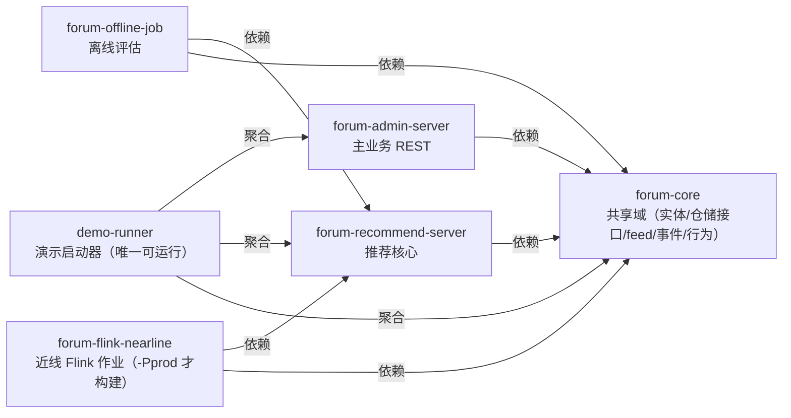
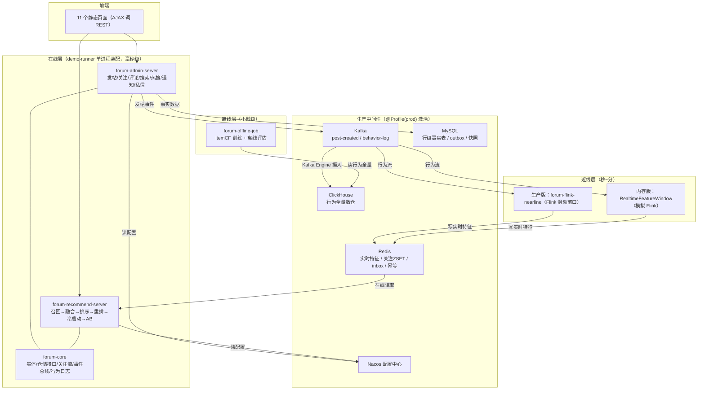
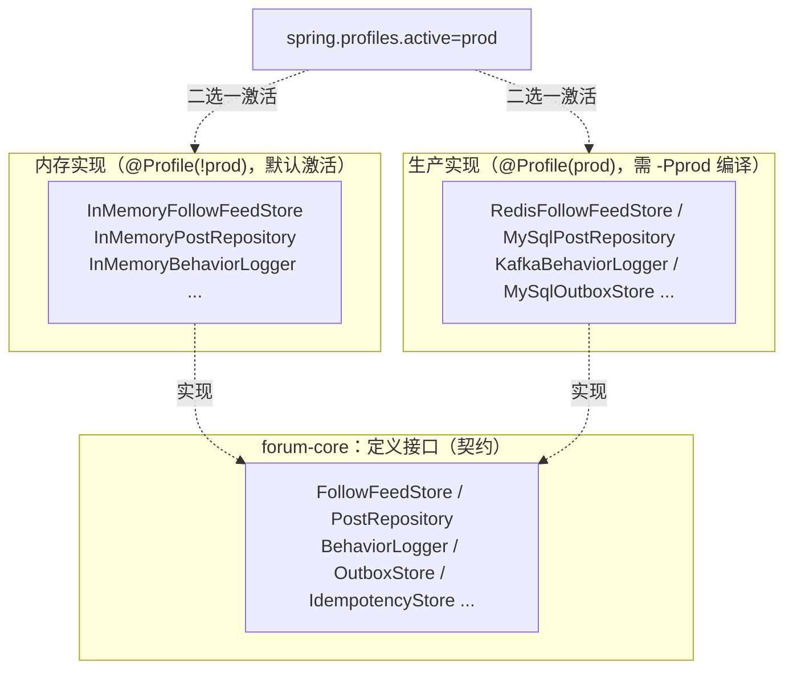
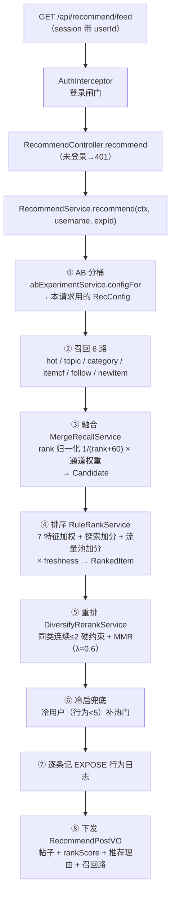
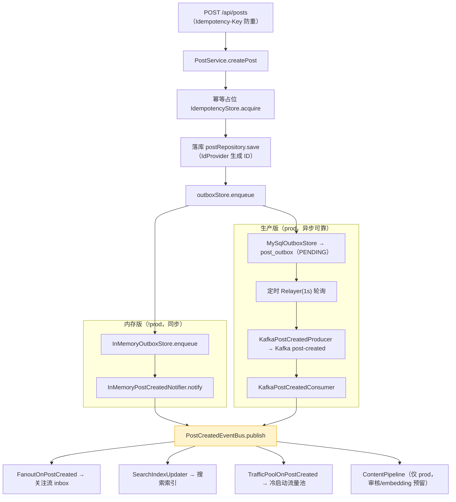
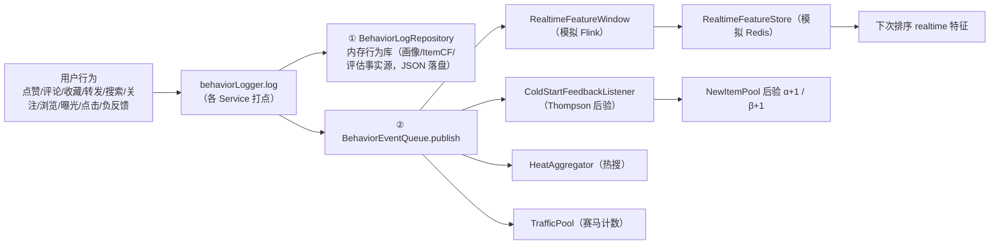
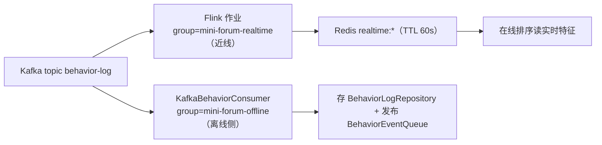
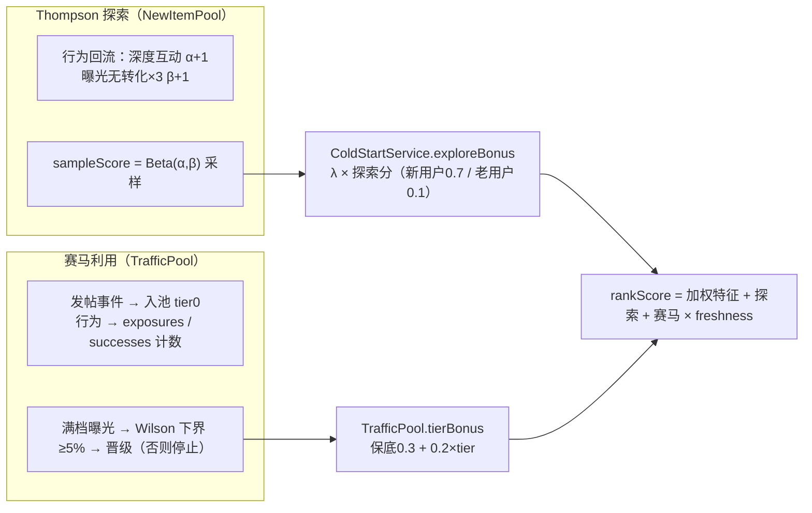
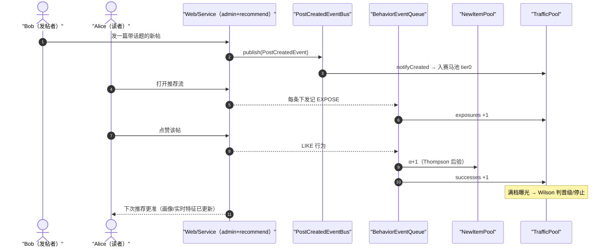

# 仿微博推荐系统 · 新手学习指南（架构设计与数据流转）

> 写给第一次接触这个项目、想把它彻底看懂的开发者。
> 这份文档**从零讲起**：先建立整体直觉，再逐层落到真实类名，最后串成完整故事。
> 已有一份很全的 [README](../README.md) 是"使用手册"，本指南是它的"伴读教材"——建议两篇搭配看。
>
> 📊 **图解说明**：本文的关键架构图与流程图用 **Mermaid** 绘制，在 GitHub / JetBrains IDE（2023.2+）/ VS Code（装 Mermaid 插件）中会渲染成图形；纯文本环境直接看代码块里的 Mermaid 源码（本身就是可读的流程描述）也一样可以理解。

---

## 第 0 章　30 秒看懂这个系统

**一句话**：这是一个**微博风格**的轻量论坛（发帖/关注/点赞/评论/热搜/私信都有），但它真正的核心是**一套生产级架构形态的推荐系统**——多路召回、排序、重排、冷启动、实时特征、AB 实验、离线评估、行为回流闭环，全都有。而且它故意做成"**接口 + 双实现**"：**默认零中间件纯内存就能跑**，切换一个 profile 就能接上 Kafka / Redis / ClickHouse / MySQL / Nacos / Flink 这些真实中间件。

**它解决的核心问题**（所有推荐系统的终极命题）：

> **用户打开推荐流，我怎么知道他喜欢什么？怎么让新内容有机会被看见？怎么让系统越用越准？**

回答藏在四条链路上：

```
① 读路径：用户请求 → 召回候选 → 排序 → 打散 → 下发推荐（毫秒级，在线）
② 写路径：有人发帖 → 广播给"关注流 / 搜索 / 冷启动池 / 内容管道"多路消费（事件驱动）
③ 近线路径：用户点赞/评论/浏览 → 行为回流 → 更新画像与实时特征（秒级，越用越准）
④ 离线路径：行为全量 → 训练 ItemCF + 离线评估（小时级，观察质量趋势）
```

下文第 3 章把这四条链路一条条讲透。

---

## 第 1 章　模块地图：6 个模块各自负责什么

整个工程是 Maven 多模块（父 POM `forum-parent`，Java 17 + Spring Boot 2.7）。

| 模块 | 一句话职责 | 有没有启动类 | 依赖谁 |
|---|---|---|---|
| **forum-core** | **共享域**：实体、仓储接口、关注流、搜索索引、行为日志、事件接口、幂等、工具类。是全项目唯一被大家依赖的"叶子"。 | 无 | — |
| **forum-admin-server** | **主业务**：发帖/评论/关注/feed/搜索/热搜/通知/私信/用户/鉴权。面向用户的 REST 接口都在这。 | 无 | forum-core |
| **forum-recommend-server** | **推荐核心**：召回→融合→排序→重排→冷启动→画像→实时特征→AB→配置，以及 Kafka/Redis/ClickHouse/Nacos 生产适配。 | 无 | forum-core |
| **forum-offline-job** | **离线评估**：定时时间切分 + 跑 7 项指标，落盘趋势报告。 | 有（`OfflineJobApplication`，纯批处理无 web） | forum-core + forum-recommend-server |
| **forum-flink-nearline** | **近线实时特征作业**：Kafka 行为 → Flink 滑动窗口 → Redis（独立进程）。**只有 `-Pprod` 构建才包含**。 | 有（`FlinkRealtimeWindow.main`） | forum-core + forum-recommend-server |
| **demo-runner** | **演示启动器**：唯一可直接 `spring-boot:run` 的应用，把 admin + recommend 聚合进单进程，附带 JSON 持久化、推荐 web 接口、静态页面、MySQL 生产实现（`src/prod`）。 | **有**（`MiniForumApplication`） | core + admin + recommend（offline-job 仅 test 用） |

### 新手最容易困惑的点：demo-runner 是怎么"装下"所有模块的？

**靠统一根包名**。所有模块的类都在同一个根包 `com.tkzou.miniforum` 下，所以 demo-runner 里 `MiniForumApplication` 只要一个普通 `@SpringBootApplication`（默认组件扫描 `com.tkzou.miniforum`），就能把其它模块 jar 里的 `@Component/@Service/@Controller/@Repository` **全部扫进来装配成一个进程**。不需要任何 `scanBasePackages` 配置。

依赖方向是无环的：`forum-core` ← admin / recommend / offline-job / flink；demo-runner 聚合。



> 箭头指向"被依赖的模块"：`forum-admin-server → forum-core` 表示 admin 依赖 core。

### 1.1 全景架构图：三层 + 中间件一个图看懂



> 三个横框对应三种时间尺度：**在线（毫秒）** 直接服务请求；**近线（秒~分）** 把行为折成实时特征；**离线（小时）** 训练与评估。中间件只在 `prod` 激活——默认演示跑在在线层（全内存），最下面一排完全不用启动。

---

## 第 2 章　最重要的设计哲学：双实现架构

> 这是理解全项目的钥匙。记住它，后面所有内容都会自然串起来。

### 为什么有两套实现

项目想证明两件事，于是做了两套：
1. **零依赖也能跑**（演示/教学）：所有组件用内存 `ConcurrentHashMap` + JSON 文件实现，开箱即用；
2. **生产形态该长什么样**（生产）：同一个接口，给出 Kafka / Redis / ClickHouse / MySQL / Nacos / Flink 的真实现。

做法很朴素：**接口定义在 forum-core，实现分两批，用 Spring Profile 二选一**。

```java
// 接口（forum-core）
public interface FollowFeedStore { ... }

// 内存实现（默认，@Profile("!prod")）
@Component @Profile("!prod") public class InMemoryFollowFeedStore implements FollowFeedStore { ... }

// 生产实现（@Profile("prod")）
@Component @Profile("prod") public class RedisFollowFeedStore implements FollowFeedStore { ... }
```

**切换开关**：运行时 `SPRING_PROFILES_ACTIVE=prod`（配合 `-Pprod` 构建把生产源码编进去）→ 生产实现激活、内存实现不加载；不带则全内存。**同一接口同一时刻只有一个实现活着**，不会冲突。

### 接口 → 内存实现 → 生产实现：一张大对照表（核心中的核心）

| 接口/能力 | 内存实现（`!prod`，默认） | 生产实现（`prod`） |
|---|---|---|
| 帖子仓储 `PostRepository` | `InMemoryPostRepository`（含按作者分桶二级索引） | `MySqlPostRepository`（MySQL `posts` 行级表，`src/prod`） |
| 用户/评论/点赞/收藏仓储 | `InMemory{User,Comment,Like,Favorite}Repository` | `MySql{User,Comment,Like,Favorite}Repository`（行级表 + 唯一约束） |
| 关注关系 `FollowRepository` | `InMemoryFollowRepository` | `MySqlFollowRepository` = **MySQL 事实表 `user_follow` + Redis ZSET 缓存**（计数走 ZCARD 扛高频） |
| 发帖事件发布 `PostCreatedNotifier` | `InMemoryPostCreatedNotifier` → 进程内总线 | `KafkaPostCreatedProducer` → Kafka topic `post-created` |
| 发帖事件消费 | 内存总线直接广播 | `KafkaPostCreatedConsumer` 消费后**同样 publish 到内存总线** |
| Outbox `OutboxStore` | `InMemoryOutboxStore`（同步委托 notifier） | `MySqlOutboxStore`（`post_outbox` 表 + 定时 Relayer，`src/prod`） |
| 行为采集 `BehaviorLogger` | `InMemoryBehaviorLogger`（存内存库 + 发布事件队列） | `KafkaBehaviorLogger` → Kafka topic `behavior-log` |
| 行为消费 | `RealtimeFeatureWindow`（模拟 Flink） | `KafkaBehaviorConsumer`（离线落库）+ `FlinkRealtimeWindow`（独立 Flink 作业） |
| 实时特征存储 `RealtimeFeatureStore` | `InMemoryRealtimeFeatureStore`（模拟 Redis） | `RedisRealtimeFeatureStore`（TTL 60s） |
| 用户画像存储 | 内存实时聚合（`UserProfileAggregator`） | `RedisUserProfileStore` |
| 配置 `ConfigService` | `InMemoryConfigService`（`app.rec.*` + 热更新） | `NacosConfigService`（配置中心下发） |
| 幂等 `IdempotencyStore` | `InMemoryIdempotencyStore`（ConcurrentHashMap） | `RedisIdempotencyStore`（`SET NX EX` 原子占位） |
| ID 生成 `IdProvider` | `EntityIdProvider`（各实体静态 AtomicLong） | `SnowflakeIdProvider`（41ms 时间戳 + 10 workerId + 12 序列） |
| 关注流 inbox `FollowFeedStore` | `InMemoryFollowFeedStore`（SkipListSet，cap=500） | `RedisFollowFeedStore`（ZSet，pipeline 批量扇出） |
| 持久化 | `DataStore`（`data/*.json`，每 30s 落盘） | `MySqlDataStore`（`mini_store` JSON 快照表，`src/prod`） |
| 行为全量数仓 | —（内存 `BehaviorLogRepository`） | `ClickHouseBehaviorStore`（Kafka Engine → MergeTree） |

> 生产实现的位置也分两处：**仓储/Outbox/持久化**在 `demo-runner/src/prod/java/`（要 `-Pprod` 编译才进源码集）；**Kafka/Redis/ClickHouse/Nacos** 适配在 `forum-recommend-server/.../prod/`。

一张图看懂这个"双实现"机制：



> 同一接口同一时刻只有一个实现被激活；业务代码只面向接口，不知道也无需关心当前跑的是哪一套。

### 新手易踩的坑

- **裸 `new` 不触发 `@Value`**：很多配置（如 `TrafficPool.enabled`）是字段 `@Value` 注入的。脱离 Spring 手 `new` 时注解不生效，字段落在 Java 默认值（如 `boolean` → `false`），行为会"静默不对"。测试里要用 `ReflectionTestUtils.setField(...)` 注入。
- **"无 profile"组件是两套通吃的**：`PostCreatedEventBus`、`BehaviorEventQueue`、总线订阅者（扇出/搜索索引/流量池）都不带 `@Profile`，所以内存发帖和生产 Kafka 消费汇入同一总线后，它们**一套代码两边都生效**——这正是"一份事件多路消费"的设计目的。

---

## 第 3 章　三条主线数据流（最重要）

下面每一条都给出**真实类名 + 调用顺序**。建议对照源码逐行看。

### 3.1 读路径：一次个性化推荐怎么产生（在线，毫秒级）

```
浏览器 → GET /api/recommend/feed?size=20   (session 里有 userId)
  │
  ▼ AuthInterceptor 拦截器（只做"登录了没"的闸门）
  ▼ RecommendController.recommend（demo-runner，额外守卫未登录→401）
  ▼ RecommendService.recommend(ctx, username, expId)
  │
  ├─ 0) AB 分桶：abExperimentService.configFor(expId, userId)
  │        → 拿到这份请求用的 RecConfig（对照组 A / 实验组 B 配置不同）
  │
  ├─ 1) 召回：recallService.recall(ctx)                 ← 把"可能感兴趣的"捞出来
  │        6 路 RecallChannel 各自取 top100
  │        → MergeRecallService 归一化+加权+去重 → List<Candidate>
  │
  ├─ 2) 排序：rankService.rank(ctx, candidates)          ← 打精排分
  │        RuleRankService：7 个特征加权 + 冷启动加分 + 流量池加分，再乘时效
  │        → List<RankedItem>（带特征分构成 + 推荐理由）
  │
  ├─ 3) 重排：rerankService.rerank(ctx, ranked, topN)    ← 列表级打散
  │        DiversifyRerankService：同类目连续≤2 硬约束 + MMR 贪心
  │
  ├─ 4) 冷启兜底：冷用户(行为<5) → 补热门帖直到够数
  │
  ├─ 5) 曝光打点：每条下发的帖子记一条 EXPOSE 行为日志（服务端记，前端不用管）
  │
  └─ 6) 下发：组装成 RecommendPostVO（帖子 + rankScore + 推荐理由 + 命中的召回路）
```

**▶ 可视化版（Mermaid 流程图）**：



### 3.2 写路径：一次发帖怎么被"多路消费"（事件驱动）

发帖的 HTTP 请求在 **admin 模块**处理，但发帖成功后的"余波"靠 **事件总线** 广播给多路下游：

```
POST /api/posts  (带可选 Idempotency-Key 请求头防重)
  ▼ PostController → PostService.createPost
      ├─ 组装 Post：标题/正文/分类/标签/topics(#话题#提取)/状态(PUBLISHED or DRAFT)
      ├─ 幂等：IdempotencyStore.acquire(key) 原子占位（防双击发重）
      ├─ 落库：postRepository.save(post)（内部用 IdProvider 生成 ID）
      ├─ 通知：提取 @提及 的用户，发通知
      └─ 事件必达：outboxStore.enqueue(toPostCreatedEvent(post))
            │
            │  ┌─────────── 内存版（!prod，演示）───────────┐
            │  ▼ InMemoryOutboxStore.enqueue（同步）
            │      ▼ InMemoryPostCreatedNotifier.notify
            │          ▼ PostCreatedEventBus.publish ──广播──┐
            │            ├─ FanoutOnPostCreated   → 关注流扇出（写粉丝 inbox）
            │            ├─ SearchIndexUpdater    → 搜索索引增量
            │            ├─ TrafficPoolOnPostCreated → 冷启动流量池入池
            │            └─ ContentPipeline（仅 prod，审核预留）
            │
            │  ┌─────────── 生产版（prod）─────────────────┐
            │  ▼ MySqlOutboxStore.enqueue → 写 post_outbox(status=PENDING)
            │      ▼ 定时 Relayer(1s) 轮询 PENDING → KafkaPostCreatedProducer
            │          ▼ Kafka topic "post-created"
            │              ▼ KafkaPostCreatedConsumer → PostCreatedEventBus.publish（同上）
            │                  ★ 关键：两条路径最终汇入同一个总线，下游一份代码通吃
```

**▶ 可视化版（Mermaid 流程图）**——两条路径最终汇入同一个总线，下游一份代码通吃：



**为什么发帖要套 Outbox？** 因为"帖子落库"和"通知下游"不是原子操作。Outbox 模式保证：**先保证事件进库（同一事务视角），再异步可靠转发**。内存版为了演示简单是"同步委托"（`enqueue` 内部直接调 notifier）；生产版落到 `post_outbox` 表，Relayer 转发成功后标记 `DONE`，失败留 `PENDING` 重试——这就是 at-least-once（至少一次），下游按 postId 幂等兜底。

### 3.3 近线路径：行为怎么回流、系统怎么变准

用户每次点赞/评论/浏览/曝光，都有一条行为日志，它同时喂给"**事实源**"和"**实时消费者**"：

```
用户行为（点赞/评论/收藏/转发/搜索/关注/浏览/曝光/点击/负反馈）
  ▼ 各 Service 打点：behaviorLogger.log(userId, postId, type, scene, expId)
  ▼ InMemoryBehaviorLogger（!prod）
      ├─① BehaviorLogRepository.save   → 内存行为库（画像/ItemCF/评估的事实源，JSON 落盘）
      └─② BehaviorEventQueue.publish   → 广播给 4 个近线消费者：
             ├─ RealtimeFeatureWindow  （模拟 Flink）→ RealtimeFeatureStore（模拟 Redis）
             │     → 下次排序的 realtime 特征（用户话题投影 + 帖子热度爆发）
             ├─ ColdStartFeedbackListener → 更新 NewItemPool 的 Thompson 后验（点击 α+1 / 曝光无转化 β+1）
             ├─ HeatAggregator           → 热搜热度聚合
             └─ TrafficPool              → 赛马曝光/互动计数
```

**▶ 可视化版（Mermaid）**：



**生产版**：`KafkaBehaviorLogger` 把行为发到 Kafka topic `behavior-log`，然后**一份行为、两个独立消费组**：

```
Kafka "behavior-log"
  ├─▶ [Flink 作业, group=mini-forum-realtime]   ← 近线
  │      KafkaSource → 滑动窗口(5min) → Redis "realtime:*"(TTL 60s) → 在线排序读
  └─▶ [KafkaBehaviorConsumer, group=mini-forum-offline]  ← 离线侧
         → 存 BehaviorLogRepository（喂画像/ItemCF/评估）+ 发布 BehaviorEventQueue（喂近线）
```

**▶ 可视化版（Mermaid）**：



> **两个"模拟 Kafka"别搞混**（新手高频困惑点）：
> - `PostCreatedEventBus` —— 承载 **发帖事件**（`PostCreatedEvent`），下游是扇出/搜索/流量池/内容管道；
> - `BehaviorEventQueue` —— 承载 **行为日志**（`BehaviorLog`），下游是实时特征/冷启动反馈/热搜/流量池。
> 一个管"发帖了"，一个管"有人互动了"。

---

## 第 4 章　推荐链路逐层拆解（读路径的显微镜）

### 4.1 画像与特征：一切的输入

**用户画像** `UserProfileAggregator.build(userId)`：把该用户所有历史行为按"权重 × 时间衰减"聚合成兴趣。

- 行为权重（从重到轻）：转发 3 > 评论 2 > 收藏 1.5 > 点赞 1 > 点击 1 > 搜索 0.5 > 浏览 0.02（DWELL 阅读时长另乘时长系数）；
- **时间衰减** `0.7^天数`：近 7 天的兴趣衰减到约 8%，确保画像反映"最近喜欢什么"；
- 按帖子的**话题/类目**累加并归一化（Σ=1）——**话题是本项目的主兴趣载体**（微博式）；
- 附带最近交互序列（去重、≤50 条，供 ItemCF 用）和活跃度。

**物品特征** `ItemFeature`（`InMemoryFeatureService.itemFeature(postId)` 每次现算聚合）：
- `hotScore` = `3·转发 + 2·评论 + 1·点赞 + 1.5·收藏 + 0.02·浏览 + 0.05·阅读时长`（微博式热度）；
- `freshness` = `exp(-ln2·ageHours/半衰期)`（默认半衰期 4 小时，越新越新鲜）；
- `inNewPool`（冷启标记）= 发布 <48 小时 **或** 深度互动 <5 次——**凡是新帖或"没被验证过"的帖都算冷启内容**。

**实时特征** `RealtimeFeatureWindow`（内存模拟 Flink）：订阅行为队列，近 5 分钟窗口聚合出 `user:{id}`（话题点击分布）和 `post:{id}`（互动/曝光），写进 `RealtimeFeatureStore`（内存模拟 Redis）。排序时 `realtimeMatch` 读它：`Σ 用户话题点击×帖子话题 + log1p(帖子点击爆发)`。

### 4.2 召回：6 路通道把"可能的候选"捞出来

| 通道 `RecallChannel` | 逻辑（source） | 数据来源 | 打分 |
|---|---|---|---|
| `HotRecall` | 热门（`hot`） | 全站可见帖 | `ItemFeature.hotScore` |
| `TopicRecall` | 兴趣话题（`topic`） | 画像 `topTopics(2)` × 帖子 `topics` | 命中话题累加权重 |
| `CategoryRecall` | 兴趣类目（`category`） | 画像 `topCategories(2)` × 帖子 `category` | 类目权重 |
| `ItemCfRecall` | 相似物品（`itemcf`） | 用户历史交互物品 → `ItemCfModel.topSimilar` | 累加相似度 |
| `FollowRecall` | 关注（`follow`） | 关注列表 × 作者/originalAuthorId | 按发布时间倒序 |
| `NewItemRecall` | 新内容（`newitem`） | 可见帖中 `isInNewPool` | `freshness` |

每路各自取 top100（`recall-per-channel`）。**跨通道的原始分不能直接比**（热度的分和相似度的分量纲不同），所以交给融合层。

### 4.3 融合：把 6 路候选并成一份

`MergeRecallService.merge(hits, cfg, 200)`：
1. 通道内按分降序，给每个候选算 **rank 归一化分** `norm = 1/(通道内名次 + 60)`（避免第一名碾压第二名）；
2. 同一个 postId 被多路命中时，融合分 `mergeScore = Σ(通道权重 × norm)`；
3. 保留 `channelScores`（每路的分）——**这就是"推荐理由"的原料**；
4. 降序截断到 200（`merge-top-n`）。

通道权重（`channelWeight`）：itemcf 1.2 > hot/topic 1.0 > follow 0.8 > category 0.6 > newitem 0.5。

### 4.4 排序：打精排分 + 生成推荐理由

`RuleRankService.rank` 对每个候选算 7 个特征分：

| 特征 | 含义 |
|---|---|
| `interact` | `log1p(hotScore)` 互动热度 |
| `quality` | `log1p(深度互动/曝光)` 互动率（防大 V 马太效应） |
| `interest` | `0.6×话题重叠 + 0.4×ItemCF相似度` 个性化匹配 |
| `social` | 基础 1.0 + 作者被关注 +1.0 + 关注的人转发过 +0.5（二度社交） |
| `author` | `log1p(作者粉丝数)` 作者权重 |
| `hot` | 热度归一化（候选内最大为 1） |
| `realtime` | 实时兴趣投影 + 帖子热度爆发 |

最终分：

```
rankScore = ( Σ(rankWeight × 特征) + exploreBonus(Thompson探索) + tierBonus(赛马档位) ) × freshness
```

- 权重默认：interest 0.30、interact 0.30、quality 0.20、social 0.15、author 0.10、hot 0.10、realtime 0.05；
- **`freshness` 是 recency 乘子**：即使分很高，过老的内容也会被压下去；
- 冷启动两股加分在这里注入（第 5 章细讲）。

**推荐理由** `buildExplain(...)` 按优先级：关注的人发了/转了 → 因为你看过 #话题# → 和你互动过的帖子相似 → 大家都在看 → 新内容推荐 → 为你精选。前端每条推荐都能看到理由，这是可解释性的落地。

### 4.5 重排：列表级打散（MMR）

精排是"单看每一条"，重排看"整份列表"（避免同质化）：

`DiversifyRerankService`：
1. **硬约束**：同类目**连续**出现 ≥2 条（`categoryMaxCount=2`）就跳过；
2. **MMR 贪心**：每步选 `mmr = λ·rankScore − (1−λ)·maxSim(和已选最近10条的相似度)` 最大者。`λ=0.6` 偏重"保留高分"、`0.3` 偏重"多样性"（AB 变体可调）。相似 = 同类目或共享话题。

### 4.6 冷启动兜底 + AB 实验

- **冷用户兜底**：行为数 < 5 的用户（`isCold`）可能候选太少，从全站热门帖补到 topN，理由写"新用户热门推荐"；
- **AB 实验** `AbExperimentService`：`hash(userId:salt) % 100` 分桶（同一用户稳定同桶）。实验 `rec-v1` 占 50% 流量：对照组 A 用全局配置，实验组 B 用变体配置（MMR 更分散 `mmrLambda=0.3`、兴趣权重提高）。**每次请求的配置由分桶决定**，行为日志带 `expId` 供离线归因。

---

## 第 5 章　冷启动的两套机制（最容易混，单独讲）

**为什么要做冷启动**：新帖没人互动 → 热门排序永远轮不到它 → 石沉大海 → 平台失去新鲜内容。所以必须给"没被验证过"的内容**探索机会**。本项目用**两个互补机制**：

| | NewItemPool（Thompson 贝叶斯） | TrafficPool（赛马 / Wilson） |
|---|---|---|
| 本质 | **不确定性探索**：新内容可能爆，按后验概率试探 | **曝光配额+利用**：给渐进曝光档位，按表现晋级/淘汰 |
| 数据 | 每帖 `[α, β]`，深度互动 α+1、曝光无转化（连续 3 次）β+1 | 每帖 `{tier, exposures, successes, stopped}` |
| 探索分 | `ThompsonBandit.sampleBeta(α,β)` 采样 | 档位分 `baseBoost(0.3) + tierStep(0.2)×tier` |
| 进排序 | `ColdStartService.exploreBonus`（新用户 λ=0.7 / 老用户 λ=0.1 加权） | `TrafficPool.tierBonus`（试探期保底，晋级越高加分越多；被淘汰=0） |
| 驱动 | `ColdStartFeedbackListener` 订阅行为队列回灌后验 | 订阅行为队列计数 + `TrafficPoolOnPostCreated` 订阅发帖事件入池 |
| 晋级判据 | 无（纯探索分） | **Wilson 置信区间下界** ≥ 基线(0.05) → 晋级下一档，否则停止探索 |

两股加分如何汇入排序：



**一句话区分**：Thompson 管"**我不知道这帖行不行，给点探索分试试**"；赛马管"**给了曝光配额，看真实数据，表现好晋级放大曝光、表现差停止**"。两者都通过排序层的加分起作用，共同构成"探索-利用"平衡。

> Wilson 小样本防抖：样本小的时候置信区间宽、下界低，不容易把"运气好的几条"误判成爆款——这正是 `TrafficPoolTest` 里那条"小样本下界更保守"的用意。

---

## 第 6 章　离线：训练与评估

### ItemCF：弱训练侧的协同过滤

- **训练** `ItemCfBuilder.build(行为日志, 50)`：把深度互动（转发/评论/收藏/点赞/点击/阅读）变成"用户→物品"隐式矩阵，算共现相似度 `sim(a,b) = co[a][b] / √(N(a)·N(b))`，每物品保留 Top50 相似物 → `ItemCfModel`。
- **在线怎么用**（三个消费方）：
  1. `ItemCfRecall` 召回通道：用户历史物品的相似物累加；
  2. `RuleRankService` 的 `interest` 特征（`0.4×ItemCF相似度`）；
  3. 详情页"看过这篇的人还看"（`RecommendService.related` → `topSimilar`）。
- **模型谁维护**：`ItemCfModelStore`（内存，在线进程内）——**行为数一变就自动重建**。不用手动触发，也正因如此它**当前不落盘、不发布**。

### 离线评估：给推荐质量"打分"

- 调度：`OfflineEvalScheduler` 每 30 分钟跑一次（行为数 <50 跳过）；
- 流程：行为全量 → 过滤掉曝光/负反馈等非反馈信号 → **按时间切分**（前 80% 训练 / 后 20% 测试，**严禁随机切分**，否则时间泄漏）→ 训练集构建 ItemCF + 热门兜底 → 给测试用户生成 TopK → 对比真实互动 → 算 7 项指标；
- 指标：`AUC / GAUC / Recall@K / NDCG@K / Coverage / Diversity / Freshness`；
- 产出：一行日志 + 追加 `data/eval-report.json`（累积趋势，观察推荐质量随数据积累的变化）。

### 诚实说明：离线→在线目前"只观察、不自动回灌"

- 离线评估用 `new ItemCfBuilder().build(...)` 的是**一次性评估模型**，不会写回在线 `ItemCfModelStore`；
- 生产设计意图是"offline-job 构建模型后发布"，但**代码里发布动作尚未落地**（没有模型序列化/写 Redis）；
- 指标只落日志和 json，不会自动调参或切 AB。
- 结论与 README 一致：**离线只做初筛，最终以线上 AB 为准**。

---

## 第 7 章　生产形态：每个中间件到底干什么

| 中间件 | 数据/职责 | 生产者 | 消费者 |
|---|---|---|---|
| **Kafka** | topic `post-created`：发帖事件 | `KafkaPostCreatedProducer` | `KafkaPostCreatedConsumer` → 内存总线 |
| | topic `behavior-log`：行为事件 | `KafkaBehaviorLogger` | `KafkaBehaviorConsumer`（离线落库）+ Flink 作业（近线特征） |
| **Flink** | 行为滑动窗口(5min) → 实时特征 | — | `FlinkRealtimeWindow`（独立进程，group=mini-forum-realtime） |
| **Redis** | `realtime:*` 实时特征（TTL 60s） | Flink 作业 | `RedisRealtimeFeatureStore`（在线排序读） |
| | `follow:*` 关注关系 ZSET 缓存 + `feed:inbox:*` 关注流 inbox | `MySqlFollowRepository` 写双写 / 扇出 | 计数 ZCARD / feed 读取 |
| | `idempotency:*` 发帖幂等（NX EX） | 发帖请求 | `RedisIdempotencyStore` |
| **ClickHouse** | 行为全量数仓 `behavior_log`（Kafka Engine 摄入） | Kafka | `ClickHouseBehaviorStore`（离线画像/ItemCF/评估事实源） |
| **MySQL** | 行级事实表 `posts/users/comments/likes/favorites/user_follow` | `MySql*Repository` | 在线业务读 |
| | `post_outbox` Outbox 表 | 发帖 | Relayer |
| | `mini_store` 快照表（未行级化数据） | `MySqlDataStore` | 启动恢复 |
| **Nacos** | 推荐配置中心 `rec-config` | — | `NacosConfigService`（监听热更新） |

> 存储放置哲学（详见 `docs/数据存储矩阵.md`）：**MySQL=事实、Redis=热数据、Kafka=事件、ClickHouse=行为全量**。

### 已知取舍（新手看真实生产架构前先知道这些"边界"）

1. **离线→在线模型发布未落地**（见第 6 章）；
2. **单实例假设**：多实例部署时各实例内存库独立，画像/ItemCF 不共享；
3. **≤30s 数据丢失窗口**：行为先入内存每 30s 落库，崩溃丢窗口内数据（可调 `app.persistence.interval-ms`）；
4. **Kafka 自动提交 offset** + 崩溃重放可能重复计数（可加幂等去重）；
5. **大 V 分流是预留开关**：`shouldSkipFanout` 触发前需先实现读侧 pull 合并（否则大 V 新帖不进粉丝 inbox）；
6. **帖子审核状态未落地**：`ContentPipeline` 只有预留注释（`auditStatus` 字段）；
7. `/api/favorites/**` 不在鉴权拦截路径里（与注释"需登录"轻微不一致）。

---

## 第 8 章　一个端到端的故事（把全部概念串起来）

**场景**：用户 Alice 关注了 Bob。Bob 发了一篇带 `#AI#` 话题的新帖。

```
t0   Bob POST /api/posts
     ├─ 幂等占位 → Post 落库（Snowflake ID）→ @提及通知
     └─ Outbox.enqueue → PostCreatedEventBus.publish
          ├─ FanoutOnPostCreated  → Alice 的 inbox 多了一条 postId
          ├─ SearchIndexUpdater   → 倒排索引加词条
          └─ TrafficPoolOnPostCreated → 新帖进赛马池 tier0（保底加分 0.3）

t1   Alice 打开关注流 → inbox 拉到该帖 → 展示（记 VIEW 行为）

t2   推荐流把该帖（也可能是新帖）召回进候选
     ├─ 新帖由 NewItemRecall/赛马加分保证"有机会被看到"
     └─ 排序：如果 Alice 看过 #AI# → interest 话题重叠加分 → 推荐理由"因为你看过 #AI#"
     └─ 每条下发记 EXPOSE 行为 → 赛马池 exposures+1

t3   Alice 点赞 → LIKE 行为 → BehaviorEventQueue
     ├─ RealtimeFeatureWindow → 实时特征更新（#AI# 话题权重上升）
     ├─ ColdStartFeedbackListener → NewItemPool 该帖 α+1
     └─ TrafficPool successes+1 → 满 50 曝光后 Wilson 下界 ≥5% → 晋级 tier1（加分更多）

t4   下次推荐：Alice 的画像里 #AI# 权重更高 → 更多 AI 内容进候选 → 越来越准
     而 Bob 的帖子若 50 曝光后互动率不达标 → 赛马停止探索 → 回正常热度排序
```

**▶ 同一场景的时序图（Mermaid）**：



**这就是"数据闭环"**：行为 → 特征 → 排序 → 展示 → 更多行为……系统在循环里自我进化。

---

## 第 9 章　动手：怎么跑起来、怎么观察每条链路

### 运行（需 JDK 17）

```bash
# 启动演示（默认：全内存 + JSON 持久化，端口 8090）
JAVA_HOME='D:\devSoftWare\jdk17\jdk-17.0.19+10' mvn -pl demo-runner spring-boot:run
```

### 造数据 & 观察

```bash
python scripts/seed_recsys_data.py        # 30 用户 / 150 帖 / 大量互动（密码统一 admin123）
# 浏览器登录 user01/admin123 → 首页切"✨推荐"Tab，看每条推荐的理由
```

| 想观察什么 | 去哪看 |
|---|---|
| 行为回流落盘 | `data/behavior-log.json`（每次点赞/曝光追加） |
| 离线评估趋势 | `data/eval-report.json`（每 30 分钟追加一行 7 指标） |
| 持久化数据 | `data/*.json`（帖子/用户/关注/通知…） |
| 发帖事件→多路消费 | 日志里的扇出/索引/流量池 debug 行 |
| 热搜/实时特征 | 首页右栏热搜 + 排序实时分（代码日志） |

### 进阶：接真实中间件

```bash
mvn -Pprod clean package                                   # 编译生产实现（含 Flink 作业）
SPRING_PROFILES_ACTIVE=prod java -jar demo-runner/target/demo-runner-1.0.0.jar
# 需要本机有 Kafka/Redis/ClickHouse/MySQL/Nacos（地址在代码 @Value 默认值里）
```

### 测试（共 87 个）

```bash
JAVA_HOME='D:\devSoftWare\jdk17\jdk-17.0.19+10' mvn test
```

重点推荐读 `demo-runner/src/test/.../RecommendFlowIntegrationTest.java`——它是整个推荐漏斗的端到端演示（发帖→造行为→推荐→断言 EXPOSE→离线评估），把第 3~6 章串了一遍。

---

## 第 10 章　术语速查表

| 术语 | 一句话 |
|---|---|
| 召回（Recall） | 从全量物品里粗筛出"可能感兴趣"的候选池 |
| 排序（Rank） | 对候选池精打分、排序（本项目的 RuleRankService 是规则加权，生产可用 LR/双塔） |
| 重排（Rerank） | 列表级优化：去重/打散/多样性（MMR），精排是 point-wise、重排是 list-wise |
| MMR | 最大边际相关：在"高相关"和"与已选差异大"之间取平衡 |
| ItemCF | 物品协同过滤：一起被同一个人互动过的物品算相似 |
| Thompson Sampling | 贝叶斯探索：按"当前成功率"的后验概率随机采样，越不确定越值得试 |
| 赛马 / 渐进曝光 | 新内容按曝光档位逐级放量，表现好晋级、差淘汰（仿抖音） |
| Wilson 下界 | 互动率的置信区间下界，小样本更保守，用于防误判 |
| 画像（User Profile） | 从历史行为聚合出的用户兴趣（话题权重/类目权重/活跃度） |
| 实时特征 | 近几分钟的行为聚合（Flink 窗口），供排序实时加权 |
| 行为回流 | 用户行为写回特征/模型/评估的过程，是"越用越准"的引擎 |
| 曝光（EXPOSE） | 推荐里展示给用户的次数；曝光无转化会被记录为负信号 |
| Outbox 模式 | 业务写库时顺手把事件写入 outbox 表，再异步可靠转发，保证事件必达 |
| 幂等 | 同一请求重复提交只生效一次（发帖用 Idempotency-Key） |
| 推模式 vs 拉模式 | 关注流两种形态：推=发帖时写粉丝 inbox；拉=读时合并关注列表 |
| 游标分页 | 用上次最后一条的 ID（max_id/since_id）翻页，替代 offset（数据变动下更稳） |
| AB 分层正交 | 同一用户可同时参与多个层实验且互不干扰（不同 salt 分桶） |
| GAUC | 按用户分组算 AUC 再加权平均（阿里 DIN 常用） |
| NDCG@K | 排序质量指标：越靠前的相关结果得分越高，做归一化 |
| 时间泄漏 | 用未来数据训练导致评估虚高；本项目按时间切分规避 |

---

## 结尾　进一步阅读

- **README.md**：使用手册（功能清单/配置表/API/构建），和本指南互补；
- **docs/ 下**：
  - `数据存储矩阵.md` —— MySQL/Redis/Kafka/ClickHouse 放置决策的 WHY；
  - `生产化落地开发清单.md` —— P0 幂等+Outbox → P1 中间件化 → P2 分发增强 → P3 加固编排的演进史；
  - `推荐系统设计方案.md`、`微博推荐调研.md`、`推荐系统深度调研报告-抖音版.md` —— 设计依据与行业对标；
  - `推荐系统微服务拆分方案.md` —— 如果未来拆成独立在线/离线/近线微服务怎么拆；
  - `feed流架构调研与对比.md`、`内容生产系统架构调研与对比.md`、`内容分发系统架构调研与对比.md` —— 各子系统的深入对比。

**推荐的阅读顺序**：先跑起来（第 9 章）→ 读本指南第 3 章跟着代码走一遍 → 再回头看 README 的架构段落 → 按需翻 docs/。
