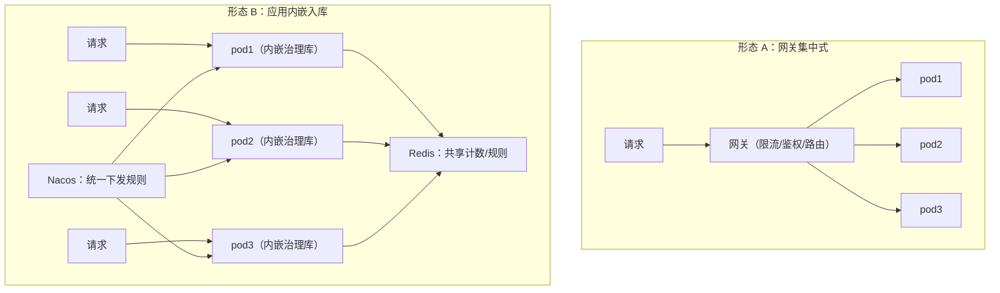
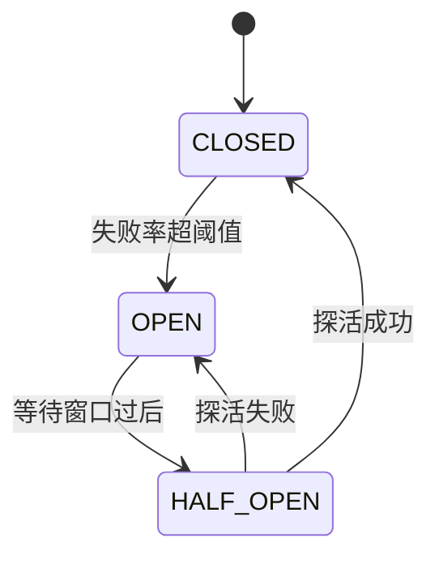
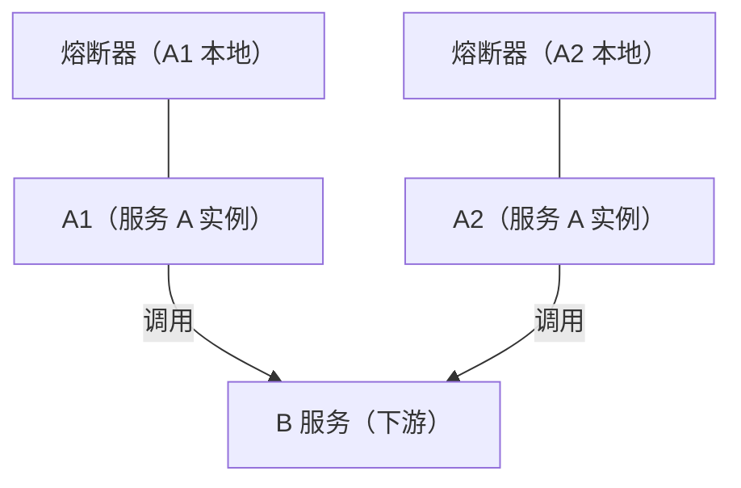
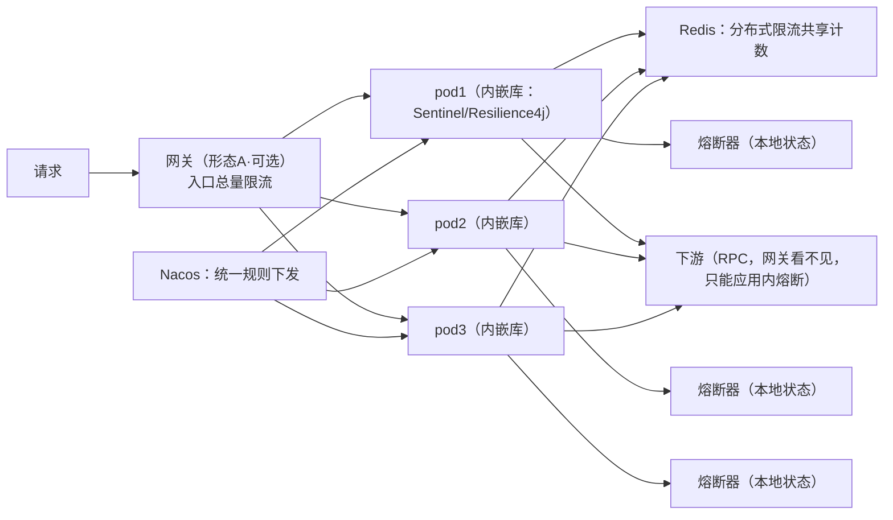

# 限流与熔断 · 分布式治理概念澄清（形态 / 分布式 / 落在哪一层）

> 创建：2026-08-27
> 主题：把"形态 A（网关）/ 形态 B（应用内嵌入）、分布式限流、熔断落点、网关 vs 应用内覆盖范围"这些概念讲透——它们为什么这么设计、业界怎么组合、落到本项目（P3）怎么落地。
> 配套：与《大厂官方技术博客-高并发应对与治理方法论》《高并发优化落地清单-带优先级》衔接。

---

## 0. 为什么要写这份文档

讨论中发现几个高频概念坑，先立个目标：读完后能清楚回答
1. 分布式限流是不是"用一个网关服务接管所有后端"？（**不是**）
2. Sentinel 是网关还是库？（**库，嵌在每个应用里**）
3. 熔断为什么不能放网关？（**网关看不见服务间 RPC**）
4. 网关限流和应用内限流都能限单个服务，区别在哪？（**覆盖范围**）
5. 熔断是每 pod 独立还是全局共享？（**每 pod 本地、不共享、不需要 Redis**）

---

## 1. 先拆三个正交维度（避免"分布式"一词一锅煮）

很多混淆源于把三个独立维度混在一个词里。看任何限流/熔断方案，先问这三个问题：

| 维度 | 取值 | 一句话 |
|---|---|---|
| **① 执行位置** | 形态 A：集中式网关 / 形态 B：应用内每个 pod | 限流/熔断的"判断"在哪做 |
| **② 状态位置** | 本地内存 / **共享（Redis / DB / Nacos）** | 计数/配额/规则记在哪 |
| **③ 粒度** | 入口总量（整个系统/route）/ 单服务（该服务全部 pod 合计）/ 更细（用户×接口×下游） | 限制什么范围 |

**关键认知**："**分布式限流**"描述的是 **②（计数共享在 Redis）**，**不限定 ① 和 ③**。所以：

```
Spring Cloud Gateway + Redis = ①形态A(网关执行) + ②Redis共享 + ③入口总量
   → 网关形态的全局限流，同时也是分布式限流（网关多副本共享计数）

Sentinel 集群流控 / 应用内 Redis 限流 = ①形态B(应用内执行) + ②Redis共享 + ③单服务
   → 应用内形态的分布式限流，同样是分布式限流
```

**"分布式限流"横跨形态 A 和 B**——它说的是状态共享，不是"有一个专门服务"。

---

## 2. 形态 A vs 形态 B：两种部署形态



| | 形态 A（网关） | 形态 B（应用内嵌入库） |
|---|---|---|
| 代表 | Spring Cloud Gateway / Nginx + Lua / Kong | Sentinel / Resilience4j（jar 嵌入每个服务） |
| 执行位置 | 一个集中的入口 | 每个 pod 内 |
| 对后端 | 透明（后端无感知） | 后端自己接库 |
| 优点 | 单一控制点、接入成本低、天然拦"总入口" | 无单点、随服务扩展、能做业务级细粒度、能覆盖不经网关的 RPC 调用 |
| 缺点 | 网关是性能瓶颈/单点、限不到服务间 RPC、只能按入口粗粒度 | 每个服务都要接库、分布式计数有网络开销 |
| 限流粒度 | IP / route / 用户 | 用户×接口×下游依赖，任意业务维度 |

**业界通常两个都配**：网关做入口总量保护，应用内做单服务容量 + 细粒度（见 §9）。

---

## 3. 什么是分布式限流（讲透）

**定义**：多个实例共享同一个限流状态，让 "N 个 pod" 像一个整体被限流。解决的正是"多实例下单机限流形同虚设"的问题。

```
单机限流：每个 pod 自己计数
  推荐服务 10 个 pod × 每个限 100 QPS → 全局实际能到 1000 QPS
  → 想限 300？做不到（除非配成每 pod 30，但实例数一变就失效）

分布式限流：所有 pod 写同一个 Redis 计数器（INCR/Lua 原子）
  合计累计到 300 → 第 301 个请求无论打到哪个 pod 都被拒
  → 全局精确限制 300 QPS，实例扩缩容不影响
```

**形态 B + Redis 是对"整个服务（所有 pod 合计）"限流，不是 per-pod**——这是"分布式"的本质。`pod1 处理 300 + pod2 处理 300...` 共享一个计数，限制落在服务总容量上。

### 3.1 限流挡的是"处理"而非"到达"（一个高频困惑）

请求确实能到达 pod，但限流挡的是"昂贵的处理"，不是"到达"。看请求在 pod 内的旅程：

```
请求 → 网络/负载均衡 → 容器(TCP连接) → Tomcat线程池 → 业务逻辑 → 下游调用 → 响应
                                                  ↑
                                            限流判断在这里（业务逻辑之前）
```

限流器放在"拿到处理线程之后、执行业务逻辑之前"。所以请求**到达**了 pod（网络/容器层放行），但**不执行业务、不调下游**，只做微秒级计数判断后放行或拒绝（429）。

**限的到底是什么——线程的"长期占用"**：

| | 线程占用时长 | 200 个线程能撑多久 |
|---|---|---|
| 无限流 | 50ms~2s（执行业务 + 调下游） | 很快占满 → 排队 → 雪崩 |
| 有限流 | ~1µs（只做计数判断） | 持续可用，处理能力不降 |

> **线程耗尽的致命原因不是"请求进来"，而是"线程被长期占住"**。限流把每个请求占线程的时长从毫秒/秒级压到微秒级——保护线程池/连接池不被耗尽。好比门口保安：访客到门口（请求到 pod），保安 1µs 检查完立即打发走（429），不让访客进办公区占用工位（业务线程）。

**限流放得越早越好（分层防线）**：
- ① 网关/Nginx（pod 之外）→ 请求根本不进 pod，连线程都不占；
- ② pod 内 Filter（本项目 P1-4 `RateLimitFilter`）→ 请求已进 pod、占一下线程，但 µs 级快速拒绝、不执行业务；
- ③ 连接层（TCP accept）→ 连请求处理都不给。

本项目 `RateLimitFilter` 是 ②（Servlet Filter）：它确实占一下 Tomcat 线程，但只做计数判断就放行/拒绝——是"挡业务逻辑"的最后防线；要更彻底（连线程都不占）需网关层（见 §7）。

---

## 4. Sentinel 是形态 B（嵌入库），不是网关

Sentinel 的设计根基是 `sentinel-core` 这个 **jar**，**嵌进每个应用**，限流/熔断/降级的判断就在**每个 pod 里**执行。它不是一个网关，不接管流量。

Sentinel 还有两个附加件，但都不是"流量面"：

| 组件 | 是什么 | 是否接管流量 |
|---|---|---|
| `sentinel-core` / transport | 嵌入库，执行限流判断 | 否（就是库） |
| **Dashboard 控制台** | 独立 web 应用，**下发规则 + 展示监控** | 否（管理面，不转发请求） |
| **集群流控 token-server** | 可选组件，**只管发 token（配额）** | 否（只发 token，不转发请求） |

集群流控是"半集中"变体：判断配额集中到 token-server 发 token，但客户端仍嵌在各 pod，且 token-server 不转发请求——**仍然不是"网关接管流量"**。

---

## 5. 熔断：核心机制、状态机、为什么 per-pod 本地（讲透）

### 5.1 核心思想：仿生"电路断路器"

灵感就是家里的空气开关：电流过大 → 自动跳闸 → 电路断开，保护线路不被烧毁。软件里同理：

> **下游依赖故障时，上游主动"断开"对它的调用，快速失败，保护自己的线程/资源不被耗尽，同时给下游喘息恢复的时间。**

关键词是"**主动断开**"——不是被动等超时，而是检测到下游不行了，直接不调它。

### 5.2 三状态状态机（熔断的灵魂）



| 状态 | 含义 | 行为 |
|---|---|---|
| **CLOSED（关闭）** | 正常 | 正常调用下游，**持续统计失败率** |
| **OPEN（打开）** | 已熔断 | **直接快速失败**（不调用下游），持续一个等待窗口 |
| **HALF_OPEN（半开）** | 试探 | 放**少量探活请求**：成功→回 CLOSED；失败→回 OPEN |

### 5.3 核心机制：滑动窗口统计 + 阈值判定

熔断器内部维护一个**滑动窗口**（最近 N 秒 / N 个请求的调用结果），每次调用后记录成功/失败/慢调用，然后按阈值判定：

```
CLOSED 状态：
  每次调用下游 → 记入滑动窗口
  若 窗口内 失败率 > 阈值(50%) 且 调用数 ≥ 最小样本(10)
    → OPEN（熔断打开）—— 样本太少不算，避免一两个失败就误判

OPEN 状态：
  对下游的调用全部快速失败（不占线程）
  等待窗口(5s)过后 → HALF_OPEN

HALF_OPEN 状态：
  放 1~N 个探活请求
    成功 → CLOSED（恢复正常）
    失败 → OPEN（继续熔断，再等一个窗口）
```

### 5.4 为什么能防雪崩（核心价值）

**没有熔断**时的雪崩链路：

```
画像服务 B 变慢（RT 从 5ms 变 2s）
  → 推荐服务 A 的每个请求线程阻塞在等 B（2s）
  → A 的 200 个线程全被占满
  → 新请求排队 → A 也挂
  → 上游/网关发现 A 也慢 → 线程也占住 → 雪崩往上蔓延
```

**有熔断**时：

```
B 变慢 → A 的熔断器统计窗口内失败率/慢调用率
  → 达到阈值 → 熔断 OPEN
  → 对 B 的调用直接快速失败（返回兜底），不占线程
  → A 的线程空闲 → A 保持可用，雪崩在 A 这一层被切断
```

核心：**熔断本身是一种"有损降级"**——牺牲对故障下游的调用，保住自身和整个调用链不崩。

### 5.5 具体场景例子（带完整时间线）

**场景**：推荐服务（A）依赖"用户画像服务"（B）做个性化。某次 B 的缓存失效、DB 被打爆，B 开始大量超时。

**参数**：滑动窗口 10 秒、最小调用数 10、失败率阈值 50%、等待窗口 5 秒、半开探活 1 个请求。

```
t0          B 开始变慢（RT 5ms → 2s，部分超时）
t0~t10      A 的请求调 B，大量超时。窗口内 10 个调用有 6 个失败（60% > 50%）→ 熔断 OPEN
t10~t15     A 对 B 的调用全部快速失败 → 直接返回兜底（如热门推荐，不调 B）
            → A 的线程不再被占住，A 保持可用，推荐接口还能响应（只是不个性化）
t15         5 秒等待窗口到 → HALF_OPEN，放 1 个探活请求试 B
            ├─ B 已恢复 → 探活成功 → CLOSED，恢复正常个性化
            └─ B 还挂   → 探活失败 → 回 OPEN，再等 5 秒再试
```

**关键体验**：B 故障期间，A 从"每个请求卡 2 秒、最终超时"变成"**立即返回兜底**"——用户看到推荐流（可能没那么个性，但能正常刷），系统不雪崩。B 恢复后，探活自动发现并平滑恢复，**全程无需人工干预**。

### 5.6 关键参数（每个都有讲究）

| 参数 | 默认（Resilience4j） | 意义 |
|---|---|---|
| `failureRateThreshold` | 50% | 失败率超此值触发熔断 |
| `slowCallRateThreshold` | 100% | 慢调用（RT 超阈值）比例，也是故障信号 |
| `slidingWindowSize` | 100 | 滑动窗口请求数 |
| `minimumNumberOfCalls` | 100 | 最小样本，防误判 |
| `waitDurationInOpenState` | 60s | 打开后多久进入半开试探 |
| `permittedNumberOfCallsInHalfOpenState` | 10 | 半开探活请求数 |

### 5.7 熔断是 per-pod 本地状态（不共享、不需要 Redis）

用服务 A 的两个实例 A1、A2（都调用下游 B）说明：



- **A1 熔断时，A2 还在正常调 B**——直到 A2 自己的窗口也观察到失败率升高 → A2 的熔断也打开。这个"不同步"是**设计使然**：B 真挂了，A1 和 A2 都在各自的 10 秒窗口内观察到同样的失败率，几乎同时切断，时间差很小；
- **各实例不共享熔断状态**、**不需要 Redis**。

**为什么不共享**（对比限流）：

| | 限流 | 熔断 |
|---|---|---|
| 目标 | **总量限制**（全局一致才有效） | **快速切断**（各实例独立反应就够） |
| 各实例独立会怎样 | ❌ 失效（10 pod × 100 = 1000，超了） | ✅ 仍然有效（各实例都观察到失败 → 各自切） |
| 共享状态的收益 | 必须有共享计数才有"全局限制" | **几乎没有**（B 挂了所有实例的信号一致，独立反应结果也一致） |
| 共享的代价 | Redis 查询开销（可接受） | 网络开销 + Redis 单点风险 + 判断延迟（不可接受） |

**一句话**：限流共享是为了"全局总量"，熔断独立是为了"快速反应 + 零依赖"。

> 进阶 nuance：个别系统会共享熔断状态，目的是避免"B 恢复后所有实例同时半开探活打爆 B"（半开惊群）。这属于优化项，默认业界（Hystrix/Resilience4j/Sentinel）都是本地状态——先接受"各实例独立"，遇到真实半开惊群再考虑共享。

### 5.8 熔断 vs 限流 vs 降级（三兄弟关系）

| | 防什么 | 动作 | 类比 |
|---|---|---|---|
| **限流** | 来的太多打爆自己 | 拒绝新请求（入口控制） | 大门限流 |
| **熔断** | 下游故障拖垮自己 | 断开对故障下游的调用 | 电路跳闸 |
| **降级** | 故障时怎么响应 | 返回兜底（热门推荐/缓存/默认值） | 备用电源 |

三者配合：**限流超限 → 拒绝；熔断打开 → 降级返回兜底**。熔断管"对下游"、限流管"对入口"、降级是两者触发后的"响应内容"。本项目 P0-3 的"推荐失败热门兜底"就是降级（还只是手工 try-catch 版）；P3-2 是给它套上熔断器状态机。

### 5.9 降级：核心思想、两种形态、多级降级

**是什么 / 解决什么**：在系统资源紧张或依赖故障时，**主动牺牲一部分功能 / 数据质量，保证核心功能可用**。本质是"取舍"——两害相权取其轻。大厂一句话："**降级牺牲功能、限流牺牲流量**"（腾讯）。

解决的问题：
- **资源不足**（CPU / 线程 / 连接打满）→ 保核心、舍次要，把资源让给核心链路；
- **依赖故障** → 用兜底数据替代，主流程不挂；
- **峰值流量** → 主动关掉非核心功能，撑住核心。

关键：降级是"**预先设计好的次优方案**"，不是"出事了再想办法"——设计时就准备好"如果 X 不行，就返回 Y"。

**两种形态**：

| 形态 | 是什么 | 例子 |
|---|---|---|
| **功能降级**（关功能） | 关闭非核心功能，资源让路 | 推荐去掉某路召回、关闭个性化只给热门、关评论实时通知 |
| **数据降级**（兜底数据） | 返回替代数据，主流程不挂 | 推荐失败回热门榜、热搜降级为静态榜、画像失败用默认画像 |

**多级降级**（腾讯方法论，按资源水位逐级）：

```
1 级：CPU > 90%          → 只返回推模式内容（关功能）
2 级：CPU > 95% / MQ 积压  → 全走静态缓存（5 分钟前数据）
3 级：错误率 > 20%        → 返回"服务繁忙"静态页
```

每级更"损"，但保证不雪崩——**降级顺序本身要设计**（防止雪崩正循环）。

### 5.10 降级 vs 熔断：接力关系 + 主动 / 被动触发

**区别**：

| | 熔断 | 降级 |
|---|---|---|
| 回答的问题 | "**要不要调 B？**"（不调了） | "**B 调不了，返回什么？**"（兜底） |
| 对象 | 一个**具体的下游依赖** | 一个**功能 / 业务链路** |
| 触发 | 自动：该下游失败率 / 慢调用超阈值 | 资源不足、依赖故障（可自动可人工） |
| 动作 | 切断对故障下游的调用 | 返回兜底 / 关闭非核心功能 |
| 形态 | 状态机（CLOSED/OPEN/HALF_OPEN） | 开关式（无状态机） |

**关系（接力，不互斥）**：熔断 = "断"，降级 = "补"。**熔断打开是降级的触发条件之一**——熔断切断对 B 的调用，降级决定"切断后返回什么"。没有降级的熔断 → 快速失败但抛异常 → 用户看到 500。所以**熔断 + 降级必须成对**：熔断负责"别拖垮自己"，降级负责"别让用户看到错误"。

**主动降级 vs 被动降级**（按触发时机，这是"降级"最容易混的点）：

| | 主动降级（预防性） | 被动降级（故障后） |
|---|---|---|
| 触发 | 资源水位、人工预案（**事前**） | 依赖故障（熔断打开）等（**事后**） |
| 时机 | 故障前 / 中，预判式 | 故障发生后 |
| 例子 | CPU>90% 关非核心；大促前关评论通知 | 画像挂了 → 返回默认画像 |
| 动作 | 主动关掉本系统非核心功能 / 依赖，资源让路 | 返回兜底数据 |

> 注意：主动降级牺牲的是"**本系统的非核心功能 / 非必要依赖**"，把资源让给核心——不是"让别的服务降级"。

**主动降级的四种触发（不止熔断）**：

| 触发 | 说明 | 例子 |
|---|---|---|
| ① **资源水位**（最常见） | 按系统健康度自动：CPU / 内存 / 线程 / 连接 / MQ 积压超阈值 | 腾讯多级降级 |
| ② **人工预案**（大促标配） | 运营 / 运维预设降级开关，一键触发 | 京东 / 阿里"预案一键降级"、技术封版 |
| ③ **流量 / 业务触发** | 超高峰主动降级，配合限流 | 秒杀时关非核心，资源让给核心 |
| ④ **依赖故障（被动）** | 熔断打开 / 异常 → 返回兜底 | 画像挂了 → 默认画像 |

**结论**：主动降级靠 ①资源水位（自动）+ ②人工预案（手动）触发，**不依赖熔断**；熔断只触发"被动降级"（④）。**熔断 ≠ 降级的唯一触发源**。

**完整场景**（把限流 / 熔断 / 主动 + 被动降级串起来）：

```
秒杀开始，100w 请求：
  ① 限流：超配额拒绝（429）
  ② 主动降级（资源水位）：CPU 90% → 自动关评论 / 个性化 → 资源让给下单核心
  ③ 熔断（被动）：下单依赖的"库存服务"故障 → 熔断 OPEN → 切断对库存的调用
  ④ 被动降级（熔断触发）：被切断的请求 → 返回"稍后再试 / 已售罄"兜底
```

---

## 6. 网关 route 限流 vs 应用内分布式限流：都能限单个服务，区别在覆盖范围

Spring Cloud Gateway 用 `key-resolver` + 路由级配置，能按单个服务（route）限流。所以两者**都能限单个服务**。区别：

| | 网关 route 限流 | 应用内分布式限流 |
|---|---|---|
| 执行位置 | 网关（集中） | 每个 pod 内（共享 Redis 计数） |
| 限的是什么 | **该服务的入口流量**（只覆盖经过网关的 HTTP 请求） | **该服务的整体处理容量**（一切请求 + 服务间 RPC 触发的内部处理） |
| 能否限到不经网关的调用 | ❌ 限不到（服务间内部 RPC 不经过网关） | ✅ 能限（RPC 触发的处理也走同一个计数） |
| 粒度细度 | 粗（IP/route/用户） | 细（用户×接口×下游依赖） |

**关键：覆盖范围**。网关是"被动挡在入口"——只能限制经过它的那部分流量；应用内限流"长在每个 pod 里"，该服务**处理的一切**（不管从网关来，还是被别的服务 RPC 触发）都经过计数。

---

## 7. Nginx 层限流（入口最外层）

### 7.1 两个模块

| 模块 | 限什么 | 算法 | 场景 |
|---|---|---|---|
| `limit_req`（ngx_http_limit_req_module） | 请求**速率**（每秒 N 个） | **漏桶** | 防爬虫、接口速率限制 |
| `limit_conn`（ngx_http_limit_conn_module） | **并发连接数** | 连接计数 | 防连接耗尽、下载限速 |

### 7.2 limit_req 机制讲透

```nginx
http {
    # 限流区：key 按客户端 IP，共享内存 10m，速率 10 请求/秒
    limit_req_zone $binary_remote_addr zone=req_zone:10m rate=10r/s;
    server {
        location /api/ {
            limit_req zone=req_zone burst=20 nodelay;
        }
    }
}
```

- **漏桶算法**：恒定速率 `rate=10r/s` 处理，超出的进桶排队（`burst` 是桶容量）；
- **`nodelay` 语义**：加 → 超出 burst 立即拒绝（防刷，宁可拒绝不延迟）；不加 → 按漏桶速率平滑输出（有排队延迟，削峰）；
- **`zone` 共享内存**：计数存在共享内存，**跨该台 Nginx 的多个 worker 进程一致**（单机内部全局一致）。

### 7.3 定位：最外层，请求根本不进后端

```
请求 → [Nginx：IP级限流/防爬] → [网关：route/用户级] → [pod内 Filter：业务级] → 业务
          ↑ 在这层拒绝，后端 pod 完全不知道、不占任何线程
```

| | Nginx | 应用内（Sentinel/自研 Filter） |
|---|---|---|
| 请求是否进后端 pod | ❌ 不进 | ✅ 进 pod（但挡业务） |
| 粒度 | IP / 连接 / URI | 任意业务维度 |
| 防什么 | 防爬虫、防 DDoS、入口总量 | 单服务容量、业务级细粒度 |
| 分布式（多实例全局一致） | ❌ 默认单机（每台 Nginx 独立计数） | ✅ 可上 Redis |

### 7.4 关键点/坑

1. **默认单机限流**：共享内存只跨本机 worker，不跨多台 Nginx；负载均衡分散后各自计数会超总量——要全局一致需 Lua + Redis（OpenResty 生态）；
2. **漏桶 vs 令牌桶**：`limit_req` 是漏桶（恒定速率）；令牌桶（允许突发）要自研或网关 Redis 版；
3. **`burst` 语义**：不加 `nodelay` 排队延迟（削峰）、加 `nodelay` 直接拒绝（防刷），选错会让"该拒绝的被延迟"或"该平滑的被拒绝"；
4. **key 选择**：`$binary_remote_addr`（IP）最常见，但 NAT/多用户同 IP 会误伤；用用户 ID 更准但复杂；
5. **Nginx 扛得住高 QPS**：事件驱动、单进程多 worker，比后端更抗造，适合挡最外层。

---

## 8. 高并发流量漏斗与应对策略（生产级数据）

### 8.1 核心认知：流量漏斗 = "每层只放行下游能扛的量"

```
原始流量（100w）
  → ① Nginx 接入层：静态/缓存拦 + IP限流 + 入口总量 → 剩 10~20w
  → ② 网关层：用户级限频 + 幂等/防重放 → 剩 1~3w
  → ③ 应用层：业务级限流 + Redis 预扣 + MQ 削峰 → 剩 千级
  → ④ 数据层：几百~几千 QPS（扛得住）
```

**公理**：每层限流值 ≈ 下游容量的安全余量（一般留 50~70% 冗余）。秒杀 100w 请求 → 成功只有 1 万（库存）——**99.99% 被拦/排队/失败是设计目标，不是事故**。

### 8.2 秒杀场景：100w QPS 的完整流量漏斗

（假设 100 万用户抢 1 万件商品）

| 层 | 手段 | 到下一层 QPS | 依据 |
|---|---|---|---|
| **原始流量** | 用户疯狂刷新/点击 | **100w** | 秒杀峰值 |
| **① Nginx 接入层** | CDN/静态拦 60~70%；IP 限流（单 IP 5~10 QPS 防脚本）；**入口总量限流 20w** | **10~20w** | 微信红包：接入层限频 1400 万 → 万级 |
| **② 网关层** | **用户级限频**（每用户 1 秒 N 次）；幂等/防重放；客户端预热限频 | **1~3w** | 单用户刷得再快只算几次 |
| **③ 应用层** | 业务级限流；**Redis 预扣库存**（Lua 原子，只有 1 万成功）；下单进 MQ | **~1w 进流程，几千落库** | 预扣把"抢的流量"转化为"实际成功数" |
| **④ 数据层** | DB 只扛真正下单 | **几百~几千 QPS** | 1 万库存分摊到秒杀窗口，DB 稳 |

**漏斗数学**：100w → 20w → 3w → 1w → 千级，**每一层砍掉一个数量级左右**，到 DB 时已远低于其容量。

### 8.3 微博热搜/极端热点场景（千万级瞬时）

- **微信红包 2015 除夕**：摇一摇总次数 110 亿次、峰值 **1400 万次/秒**；接入层置入"摇红包逻辑"限频 → 每秒千万级降到**万级**传到后台（约 **1000 倍削减**）；靠"有损服务"（验证通过即返回成功、入账异步）+ 支付分组 set 化兜住；
- **微博热搜**：流量 3 分钟翻 5~10 倍，Feed 接口最坏热点 100w QPS 量级；热搜榜 Top50 **一分钟一快照存 Redis**（读缓存不落库）+ 降级为静态榜 + **热点联动**（检测到阈值 → 广播 → 各服务扩容/降级，2 分钟内应对）。

热点场景要点：**90%+ 流量是"读榜单"**——预计算 + 缓存把读流量在缓存层消化，只有小部分写进 DB。

### 8.4 应对策略：削减 + 异步填谷（组合拳）

高并发下后端**不可能硬抗**——两条路缺一不可：

```
高并发流量（100w）
  ├─ ① 能拦的拦住（削减）：限流/缓存/静态/降级 → 到达业务前拒绝或返回缓存
  └─ ② 必须处理的异步化（填谷）：MQ/Kafka 缓冲 → 后端按自己的吞吐消费
```

**为什么异步 = 削峰填谷**：1 秒涌进 100w 下单 → 全部进 Kafka（生产者高吞吐、顺序写）→ 消费者每秒 5000 → DB 每秒只扛 5000，永不超。**把"1 秒的 100w"摊成"20 秒的 5w/s"**——后端不需要按峰值设计容量，只按平均量 + 积压兜底。

**异步的前提**（不是万能）：
1. 业务语义允许**最终一致/延迟处理**（下单可排队异步，强一致事务不能）；
2. **MQ 生产端不能被堵死**——先削够量，异步才扛得住（这正是漏斗第①条的意义）；
3. 监控**消费积压**（积压 = 处理不过来，需扩容/降级）。

**完整闭环（秒杀下单）**：
```
100w 请求 → ① Nginx 总量限流 20w → ② 网关用户限频 3w → ③ Redis 预扣库存（Lua 原子）
   → 只有 ~1w 扣成功的下单进 Kafka
   → ④ 消费者每秒 5000 消费 → 异步落库、发通知 → DB 永不超
```

**同步的只有"校验 + Redis 预扣"**（微秒级、不落 DB）；真正要落库的"下单"全走异步——这就是"即使抗也基本都是异步"的准确含义。

### 8.5 生产级数据参考（真实出处）

| 数据 | 值 | 出处 |
|---|---|---|
| 微博热搜 | 3 分钟流量翻 5~10 倍 | 微博极端热点 InfoQ 采访 |
| 微博 Feed 接口 | 最坏热点 100w QPS 量级 | 行业口径 |
| 微信红包 | 摇一摇峰值 1400 万次/秒，接入层降到万级（约 1000 倍削减） | 腾讯官方（本项目调研收录） |
| 双 11 | 订单峰值 58.3 万笔/秒 | 阿里云公开 |
| 美团大促 | 瞬时高峰为平时 33 倍 | 美团技术团队 |

> 漏斗里 100w→20w→3w→1w→千级是**数量级示意**（基于真实出处 + 秒杀行业惯例）；各层具体数值要用 P3-4 全链路压测摸清自己每层容量后定，不拍脑袋。

---

## 9. 业界组合：网关粗入口 + 应用内细粒度（为什么两个都配）

场景：系统 100 个 pod（订单 30 / 推荐 30 / **支付 30** / 其它 10），秒杀来了。

```
网关限流（①A + ③入口总量）：总入口限 10 万 QPS → 保护"系统不被整体打爆"
  但热点可能集中在支付 → 支付被 5 万 QPS 打爆，其它服务才用 1 万 → 支付先挂

应用内分布式限流（①B + ③单服务）：给"支付服务"单独限 2 万 QPS
  （30 个支付 pod 共享 Redis 计数）→ 保护单个服务容量，其它服务不被误伤
```

**为什么都配**：网关管"系统总入口不被打爆"（粗、对后端透明）；应用内管"单个服务容量 + 业务级细粒度"（细、覆盖 RPC）。两者互补，不是二选一。

---

## 10. 常用组件对照

| 组件 | 形态 | 作用 | 状态/规则放哪 |
|---|---|---|---|
| **Spring Cloud Gateway** | 形态 A（网关） | 入口限流/鉴权/路由 | 计数可 Redis（RequestRateLimiter）；规则在代码/配置中心 |
| **Sentinel** | 形态 B（嵌入库）+ 可选 Dashboard/token-server | 限流/熔断/降级/热点 | 计数：单机本地 / 集群 Redis；规则：Nacos 下发 |
| **Resilience4j** | 形态 B（轻量纯库） | 熔断/限流/重试/隔离 | 熔断状态本地内存；规则在代码/配置 |
| **Nacos** | 配置中心（管理面） | 统一下发限流/熔断规则到所有 pod | 规则本身 |
| **Redis** | 数据层 | 共享计数（分布式限流）、热点缓存、模型发布 | 计数/缓存 |
| **Hystrix**（已停新特性） | 形态 B | 熔断 + 线程池隔离（历史标准） | 熔断状态本地 |

> **Sentinel 定位**：不是"只做熔断"——它是**流量治理全家桶**，**限流（流量控制）是它的核心/起源**（2012 年做入口流量控制起步），熔断降级是后来对标 Hystrix 补齐的能力；此外还有系统自适应保护（类 BBR）、热点参数限流、流量整形、授权黑白名单。核心抽象是"资源 + 规则"，同一套机制承载流控/熔断/系统保护。
>
> **选型含义**：想"限流+熔断一个库搞定" → Sentinel（较重，接 Nacos/Dashboard）；只想做熔断、求轻 → Resilience4j（纯库、本地状态）；本项目 P3 倾向"自研限流升级 Redis + Resilience4j 做熔断"（贴合零重型中间件风格）。

---

## 11. 落到本项目（P3 怎么落地）

本项目走**形态 B**（贴合"生产适配齐备、演示零中间件"哲学），不引入网关：

| 项 | 做法 | 执行/状态位置 |
|---|---|---|
| **P3-1 分布式限流** | 在 P1-4 的 `RateLimitFilter` 上加 `RedisLimiter`（复用项目 Jedis，Redis+Lua 滑动窗口），`@Profile("prod")` 激活；演示保持单机版 | 执行：每 pod；状态：**Redis 共享计数**（对整个推荐服务跨 pod 限流） |
| **P3-2 熔断/隔离** | 引 **Resilience4j**（轻量纯库），对"回源 MySQL / 推荐主链路"包 `CircuitBreaker` + `Bulkhead` | 执行：每 pod；状态：**本地内存** |
| **P3-3 热点 key** | 轻量：热门帖详情上本地缓存（`TtlCache`）+ key 复制；JD-hotkey worker 集群留给真热点量级 | 缓存层 + 本地 |
| **P3-4 全链路压测** | 先 `wrk`/JMeter + traceId 做基础容量测试（摸清单机 QPS）；流量录制+影子库留给"真大促前" | 工具链（不在运行时链路） |

**与已做的衔接**：
- P1-4 单机限流 → P3-1 分布式限流（计数从本地 → Redis，执行点不变）；
- P0-3 推荐失败热门兜底 → P3-2 熔断/降级（从手工 catch → 框架熔断器状态机）；
- P1-5 traceId → P3-4 压测标识透传的基础；
- P2 状态外置/调度中心化 → P3 的前提（没有多实例，谈分布式限流/熔断没意义）。

**前提**：P3 是"**上了多实例之后**"再做的加固——单实例阶段，P1 的单机限流 + P0 的兜底已经足够。

---

## 12. 一张图总览



**读图要点**：网关（形态 A）可做但可选；限流的**计数**共享在 Redis（分布式）；熔断的**状态**在各 pod 本地；规则统一从 Nacos 下发；服务间 RPC 只有应用内的库能看到并熔断。

---

## 附：与其它文档的关系

- `docs/高并发优化落地清单-带优先级.md`：P3 的实施清单（本概念的落地动作）；
- `docs/大厂官方技术博客-高并发应对与治理方法论.md`：Sentinel/网关限流/熔断降级的大厂做法；
- `docs/单Pod到多Pod高并发演进-典型问题与主流解法.md`：单机限流失效、分布式锁/熔断的根因背景。
