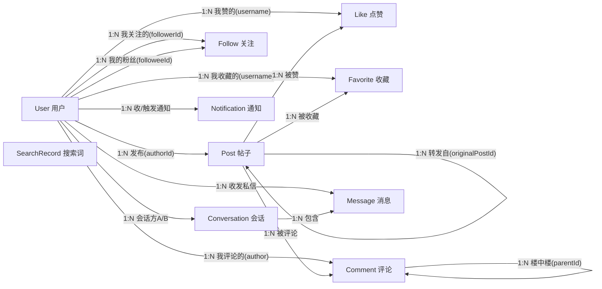

# 领域模型与实体关系（微博业务的数据底座）

> 创建：2026-08-28 ｜ 深度合并：2026-08-31（融合《业务实体与关联关系》实体/存储细节，修正至最新代码）
> 主题：梳理 MiniForum 的 10 个核心领域实体、支撑领域对象、它们之间的关系与业务含义——**理解微博业务本身，从数据模型开始**。
> 风格：实体一览 → 关系图 → 关系明细 → 支撑对象 → 业务闭环 → 存储落点矩阵（demo/prod + JSON）→ 认知对照 → 开发速查。
> 基于源码核验：`forum-core/entity` + `forum-core/repository`（接口 + `impl/` 内存默认）+ `recommend/behavior` + demo-runner `src/prod`（MySql 行级）。
> 核心一句话：**微博 = User 生产 Post + Follow 构建社交图 + Like/Favorite/Comment/转发做互动 + Notification/私信做触达 + 行为回流驱动推荐**——这 10 个实体就是业务的最小闭环。

---

## 0. 一句话全貌

```
10 个存储实体 + 几个支撑对象，构成微博业务闭环：
  内容(User→Post) × 社交图(Follow) × 互动(Like/Favorite/Comment/转发) × 触达(Notification/私信) × 搜索(SearchRecord)
  → 一切互动沉淀为 BehaviorLog → 画像/特征 → 推荐
```

**关键认知**：微博不是"一张帖子表"那么简单——它的复杂度在**实体之间的关系**（转发自关联、楼中楼自关联、关注图连接表、会话去重），这些关系就是业务规则本身。

**三个层面看这个模型**（对应 `forum-core` 分包）：

```
实体层（entity, 纯 POJO，逻辑外键）→ 仓储层（repository 接口 + repository/impl 内存默认 / MySql prod 在 demo-runner src/prod）→ 视图层（dto/request|response|common, PostAssembler 装配）
```

关联设计总原则：实体之间全部用**逻辑外键**（`Long id` 或 `String username`）串联，**无对象引用、无 join**——查询一律走 repository；存储从内存换 MySQL 只换 Repository 实现，实体与关联不变。

---

## 1. 核心实体一览（10 个）

| 实体 | 一句话职责 | 关键字段 |
|---|---|---|
| **User** 用户 | 账号主体：登录 + 个人资料 | id, username, email, password, nickname, bio, avatar |
| **Post** 帖子/微博 | 内容单元：发布/草稿/回收站，可被转发 | id, title, content, authorId, tags[], topics[], category, status, likeCount, viewCount, deleted, **originalPostId**(转发), originalAuthorId/Author(转发来源) |
| **Follow** 关注关系 | 一条"某人关注了某人"的有向边 | id, **followerId**, **followeeId**, createdAt |
| **Like** 点赞 | 某用户赞了某帖（唯一约束：一人一帖一赞） | id, postId, username, createdAt |
| **Favorite** 收藏 | 某用户收藏某帖（唯一约束同上） | id, postId, username, createdAt |
| **Comment** 评论 | 挂在帖子下的评论，支持楼中楼 | id, postId, author, content, likeCount, **parentId**(父评论) |
| **Conversation** 私信会话 | 两人之间唯一会话（字典序去重） | id, userA, userB, lastMessageAt, lastMessage |
| **Message** 私信消息 | 属于某会话的单条消息 + 已读 | id, conversationId, senderId, receiverId, content, read |
| **Notification** 通知 | 被赞/被评/被关注/被转发/@时生成的站内信 | id, recipientId, actorId, actorUsername, type, postId, read, createdAt |
| **SearchRecord** 搜索记录 | 全局搜索词聚合（驱动热搜榜） | id, keyword, count, lastSearchedAt |

---

## 2. 实体关系图



> 图外还有两层投影：行为事实源 `BehaviorLog` 在 User×Post 之上（见 §4），推荐运行时对象（Candidate/RankedItem/RecommendContext）挂接在 Post 之后的漏斗链上。

---

## 3. 关系明细（基数 + 关联键 + 约束 + 业务含义）

| 关系 | 类型 | 基数 | 关联键 | 关键约束 / 业务含义 |
|---|---|---|---|---|
| User → Post | 拥有 | 1:N | `post.authorId` | 一作者多帖；转发帖也属作者 |
| User → Follow | 关注/粉丝 | 1:N（两侧） | `follow.followerId` / `followeeId` | **User 自关联多对多**，用 Follow 连接表；同一对唯一 |
| User → Like | 点赞 | 1:N | `like.username` | 一人一帖一赞（唯一约束） |
| User → Favorite | 收藏 | 1:N | `favorite.username` | 一人一帖一收藏 |
| User → Comment | 评论 | 1:N | `comment.author` | 一用户多条评论 |
| Post → Like/Favorite | 被互动 | 1:N | `postId` | 帖子侧聚合计数（likeCount） |
| Post → Comment | 被评论 | 1:N | `comment.postId` | 评论挂在帖子下 |
| **Post → Post** | 转发 | 1:N（**自关联**） | `post.originalPostId` | **微博转发的本质**：转发是"新帖指向原帖"，可无限转发链 |
| **Comment → Comment** | 楼中楼 | 1:N（**自关联**） | `comment.parentId` | 评论可回复评论（微博楼层） |
| User ↔ User | 私信 | 多对多 | Conversation + Message | **会话字典序去重**（userA<userB）保证两人唯一会话 |
| User → Notification | 通知 | 1:N | `recipientId` / `actorId` | 事件驱动生成（赞/评/关/转/@） |
| SearchRecord | 全局 | — | `keyword` | 非用户归属，按搜索词聚合 count → 热搜 |

### 设计要点（这几点最能体现微博业务）

1. **两个自关联是微博的精髓**：`Post.originalPostId`（转发链：一条微博被转发 N 次，N 个新 Post 指向同一原帖）+ `Comment.parentId`（楼中楼：评论在帖子下再分组）；
2. **Follow 是 User 的自关联连接表**——"关注"本质是图上的有向边，`graph.SocialGraphService` 就是在这张表上做图查询（followingIds / 二度转发 / 粉丝数）；
3. **Like/Favorite/Comment 用 `username` 而非 `userId` 关联用户**——业务上用户名唯一，简化了模型（"无外键、内存仓库"形态的自然选择；prod 规范化后仍可用 username 作为逻辑外键）；
4. **Conversation 用字典序保证唯一**——避免"AB"和"BA"两个会话（成熟的去重思路）。

### 补充要点（关联建模的通用原则，来自代码核验）

5. **"ID + 冗余名字"模式**：`Post.author+authorId`、`Notification.actorId+actorUsername`、`Message.senderId+sender`——展示层免 join，代价是写路径需同步维护冗余字段；
6. **计数冗余**：`Post.likeCount/viewCount`、`Comment.likeCount` 冗余在实体上（展示 O(1)），由互动写路径同步增减；`PostAssembler.toVO` 实时装配评论数/收藏状态/转发数；
7. **⚠️ 两种关联键并存（演进痕迹）**：`username`（Like/Favorite/Comment/Conversation）与 `userId`（Follow/Notification/Message/BehaviorLog/Post.authorId）混用——改用户名场景下互动匹配 username、行为/通知匹配 id，改动实需留意；
8. **ID 自生成自洽**：每实体自带 `AtomicLong ID_GENERATOR` + `nextId()` + `resetIdGenerator(minId)`，从 JSON 恢复时推进到历史最大值避免冲突；（提示：`67ee237` Lombok 重构只动了 DTO，**实体层未动**，保持自生成逻辑纯净）

---

## 4. 支撑领域对象（非存储实体，但属于领域模型）

| 对象 | 一句话职责 | 与实体的关系 |
|---|---|---|
| **BehaviorLog** 行为日志 | **14 种行为**的统一事实源 | **User×Post 之上的一层"行为时间线"**——画像/推荐/评估都从它来，是推荐系统的数据底座 |
| **PostCreatedEvent** 发帖事件 | 发帖/转发时的事件负载 | Post 的快照副本，驱动扇出（关注流）/冷启池/搜索索引（一份事件多路消费） |
| **UserProfile** 用户画像 | 话题/类目兴趣权重、最近交互序列、冷启动判定 | 由 BehaviorLog 聚合出"User 的兴趣视图"（profile 域） |
| **ItemFeature** 物品特征 | 互动计数、热度分、时效、冷启标记 | 由 Post+互动行为聚合出"Post 的受欢迎视图"（feature 域） |
| **RecommendContext/Candidate/RankedItem** | 推荐漏斗内部对象 | 请求上下文 / 召回候选(`itemId=postId`) / 排序结果（recommend 域） |

### BehaviorLog 明细（14 种行为信号）

```
EXPOSE(曝光) VIEW(详情页浏览) DWELL(停留时长) CLICK(点击) LIKE(点赞) UNLIKE(取消点赞)
FAVORITE(收藏) UNFAVORITE(取消收藏) COMMENT(评论) REPOST(转发) SEARCH(搜索)
FOLLOW(关注) UNFOLLOW(取关) DISLIKE(负反馈/不感兴趣)
```

- **权重认知**（微博场景）：转发 > 评论 > 收藏 > 点赞 > 点击 > 浏览 > 曝光；
- `durationSec`：仅 DWELL 携带（阅读停留秒，仿抖音观看时长）；
- `scene` 来源：`POST`（业务动作）/ `TRACK`（前端上报）/ `RECOMMEND_FEED`（推荐流曝光）/ `RECOMMEND_DETAIL`（相关推荐）；
- `expId`：记录本次推荐所属 AB 实验组，用于离线归因。

> BehaviorLog 与 PostCreatedEvent 是"实体 → 事件/行为"的两个关键投影：一个记录**已发生的互动**（驱动画像），一个承载**新内容的广播**（驱动扇出/冷启）。它们让实体不再只是"被读的表"，而是"业务动作的输入"。

---

## 5. 业务闭环解读：10 个实体 = 微博的最小业务

```
User 发帖 → Post（原创，或转发自原帖 → originalPostId）
  → Follow 关注 → 发帖事件扇出到粉丝 inbox → 粉丝刷 feed（关注流）
  → 互动：Like / Favorite / Comment（可楼中楼）→ 回写 Post.likeCount
  → 触发 Notification（@提及 / 点赞 / 评论 / 关注 / 转发 → 通知对方）
  → 私信 Conversation/Message（两人私下交流，唯一会话）
  → 搜索 → SearchRecord 累计 → 热搜榜
  → 以上所有互动沉淀为 BehaviorLog → UserProfile / ItemFeature → 推荐 feed
  → 推荐 / 热门 / 热搜 / 关注流 又把用户拉回发帖和互动 —— 闭环
```

**一句话**：微博 = **User 生产 Post + Follow 构建社交图 + Like/Favorite/Comment/转发做互动 + Notification/私信做触达 + 行为回流驱动推荐**。

> 一次互动同时写三处的联动（数据流最强的点）：**Like/Favorite/Comment/转发帖 → Notification（通知作者）→ BehaviorLog（行为事实源）**。

---

## 6. 存储落点矩阵（每个实体的 JSON / demo / prod 形态）

JSON 落盘文件对应 `DataStore` 每 30s 快照（`app.persistence.interval-ms`），启动加载恢复；生产（`-Pprod` + `@Profile("prod")`）由 `MySqlDataStore` 收敛 + 行级表替代。

### 主存储 10 实体（已全部 MySQL 行级化，P1.1 收官）

| 实体 | JSON 落盘 | 演示（!prod） | 生产（prod）表 |
|---|---|---|---|
| User | `users.json` | `InMemoryUserRepository` | `MySqlUserRepository` → `users` |
| Post | `posts.json` | `InMemoryPostRepository` | `MySqlPostRepository` → `posts` |
| Comment | `comments.json` | `InMemoryCommentRepository` | `MySqlCommentRepository` → `comments` |
| Like | `likes.json` | `InMemoryLikeRepository` | `MySqlLikeRepository` → `likes`（唯一约束 uk） |
| Favorite | `favorites.json` | `InMemoryFavoriteRepository` | `MySqlFavoriteRepository` → `favorites` |
| Follow | `follows.json` | `InMemoryFollowRepository` | `MySqlFollowRepository` → `user_follow` + Redis ZSET `follow:following/followers:{uid}` 缓存 |
| Message | `messages.json` | `InMemoryMessageRepository` | `MySqlMessageRepository` → `messages` |
| Conversation | `conversations.json` | `InMemoryConversationRepository` | `MySqlConversationRepository` → `conversations` |
| Notification | `notifications.json` | `InMemoryNotificationRepository` | `MySqlNotificationRepository` → `notifications` |
| SearchRecord | `search-records.json` | `InMemorySearchRecordRepository` | `MySqlSearchRecordRepository` → `search_records` |

> 十个实体接口定义在 `forum-core/repository/`（内存默认实现在 `repository/impl/`），MySQL 实现 `@Profile("prod")`（demo-runner `src/prod`）。**P1.1 已含全部 10 实体**——Message/Conversation/Notification/SearchRecord 在 `7c65574` 收官补齐。

### 支撑域 / 推荐域（状态外置，P2）

| 对象 | 演示（!prod） | 生产（prod） | 说明 |
|---|---|---|---|
| 关注流 inbox | `InMemoryFollowFeedStore` | `RedisFollowFeedStore`（ZSET `feed:inbox:{uid}`） | 推模式扇出，`feed:built:{uid}` 标记建流 |
| 行为日志 | `BehaviorLogRepository`（内存 + JSON） | `KafkaBehaviorLogger/Consumer` → ClickHouse（`ClickHouseBehaviorStore` 读） | 行为事实源 |
| 发帖事件 | `InMemoryPostCreatedNotifier` + 总线 | `KafkaPostCreatedProducer/Consumer` | 一份事件多路消费 |
| 画像 | `profile` 内存 TtlCache | `RedisUserProfileStore`（`profile:{uid}` TTL 1h） | 画像域 |
| 物品/实时特征 | `feature` 内存 + 内存实时窗口 | `RedisRealtimeFeatureStore` + `forum-flink-nearline` | 特征域 |
| ItemCF 模型 | 内存重建 | `ItemCfModelRedisStore`（`itemcf:latest`，offline-job 发布） | 离线构建 → Redis 发布 |

**要点**：
- **主存储（10 实体）已全部 MySQL 规范化**（P1.1 收官，行级表 + 快照收敛），JSON 文件仅在 `!prod` 下生效；
- **社交/推荐域走 Redis + Kafka + ClickHouse**——关注图热缓存、feed inbox、画像/特征/模型、行为事件都外置，这是"状态外置才能水平扩展"的落地（P2 批）；
- **行为走 Kafka → 双消费组**：Flink（近线实时特征）与应用内 Consumer（离线侧行为库），见 README §3-4。

---

## 7. 没做过 vs 做过的人，对领域模型的认知

| 没做过的人会想 | 做过的人会想 |
|---|---|
| "领域模型就是建几张表" | "**关系的含义才是业务**：转发自关联、楼中楼自关联、关注图、会话去重" |
| "帖子表存所有字段" | "**计数与关系分离**：likeCount 是聚合快照，Like 表是事实；计数可异步/缓存" |
| "用户之间直接建外键" | "**多对多用连接表**（Follow），社交本质是图上的边" |
| "实体就是数据库表" | "实体之上还有**事件/行为投影**（BehaviorLog/PostCreatedEvent）驱动推荐与扇出" |
| "存储一套搞定" | "**按读写特性分层存储**：主存储 MySQL、热点 Redis、行为 Kafka+ClickHouse" |

---

## 8. 对新增功能开发的速查

- 想给**帖子加字段** → 改 `Post.java`（实体）+ `PostCreateDTO`/`PostVO`（入参/出参）+ `PostAssembler`（装配）+ `posts.json`（持久化自动覆盖）；
- 想新增**一种互动** → 新实体 or 复用 Like/Favorite 模式（`postId + username` 唯一）+ 写 Notification + 写 BehaviorLog（三处联动）；
- 想加**通知类型** → `Notification` 加 type 常量 + `NotificationService` 生成逻辑，无需改表结构；
- 想连**另一个"帖子级"业务对象** → 一律用 `postId` 逻辑外键关联，不走对象引用。

---

## 附：与其它文档的关系

- `docs/推荐系统架构与数据流转-新手学习指南.md`：BehaviorLog → 画像/特征 → 推荐的数据流（本文实体是它的输入）；
- `docs/搜广推-概念与架构.md`：实体是搜广推共享底座的数据层（搜索/广告直接复用 User/Post/Follow/行为）；
- `docs/推荐系统微服务拆分方案.md`：实体按域归属（profile/feature/graph），本文是域模型的实体视图；
- `docs/高并发优化落地清单-带优先级.md`：P1.1 主存储 MySQL 规范化、P2 状态外置——本文存储矩阵即其落地结果。