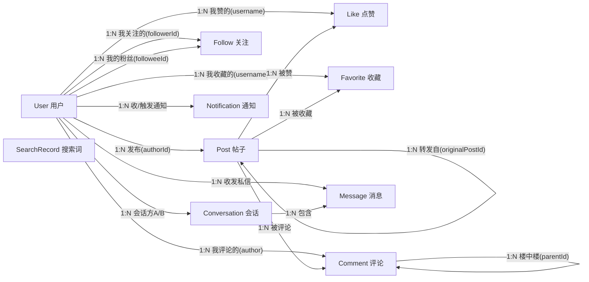

# 《从 0-1 设计和开发一个推荐系统》· 项目实战手册（基于 MiniForum）

> 合并版：README + 全 18 章在一个文档，适合整本阅读/导出。
> 这不是一本理论书，而是一本**跟着代码走一遍**的实战手册——以 MiniForum（一个微博风格的推荐系统项目）为完整教材，从领域建模讲到生产形态。
>
> **配套**：《推荐系统学习路线》（泛化概念教科书，见 `docs/推荐系统学习路线/`）讲"行业怎么做"；本手册讲"**我们怎么做**"。建议两者配合读：概念卡住了翻学习路线，动手卡住了翻本手册。

---

## 一、这本书是什么

- **读者**：有后端基础（会写代码、懂 HTTP/Java 基础）、推荐系统零基础。
- **主线**：按本项目真实开发顺序叙事——**领域建模 → 业务系统 → 引入推荐 → 逐步完善 → 工程化 → 生产形态**，读起来像"跟着做一遍"。
- **颗粒度**：每章给**设计思路 + 核心类 + 关键逻辑**，不贴全量源码（源码在项目里，随时可查）。
- **目标**：学完你能回答"一个推荐系统是怎么从无到有搭出来的"，并能在本项目里指路。

## 二、目录（18 章，5 个部分）

### Part 0 启程
- [00 这本书与项目总览]：怎么跑、整体架构、模块划分
- [01 推荐系统全景]：搜广推定位、推荐漏斗概念、本项目落点

### Part 1 领域建模（写代码前想清楚）
- [02 业务与领域实体]：10 个实体 + 关系 + 为什么这样建模
- [03 数据底座：行为日志与事件]：推荐系统的"事实源"

### Part 2 第一版业务系统（从 0 到能跑）
- [04 用户与内容]：注册/发帖/分类/标签/话题/回收站
- [05 社交与互动]：关注/关注流/点赞/评论/收藏/转发
- [06 触达与发现]：通知/私信/搜索/热搜

### Part 3 推荐系统从 0 到 1（本书核心）
- [07 推荐总览与漏斗编排]
- [08 三域底座：画像/特征/社交图谱]
- [09 多路召回与融合]
- [10 排序：规则加权 rankScore]
- [11 重排：打散与 MMR]
- [12 冷启动：Thompson 与流量池]
- [13 离线评估与 AB 实验]

### Part 4 工程化：从能跑到扛得住
- [14 缓存体系]
- [15 高并发治理：限流/熔断/降级]
- [16 存储分层与中间件适配]
- [17 生产形态与微服务蓝图]

### Part 5 进阶认知
- [18 概念串联]：搜广推/分布式治理/时序库/高并发思维
- [19 feed 流架构：推/拉/混合]：关注流的架构展开（写放大取舍 / 大V分流 / 游标分页）

## 三、怎么读

```
第一次通读：按 00 → 18 顺序，每章只看 §1 设计思路 + §2 核心类，理解主线
第二遍动手：每章 §5 动手小节，启动服务 + curl 验证，边做边看 §3 关键逻辑
进阶：配合《推荐系统学习路线》补概念、配合 README/领域模型等深度参考补细节
```

**核心信念（记住这句）**：推荐系统本质是一个**大型系统，不是模型**——本手册 80% 篇幅在讲数据、工程、模块设计，模型只有规则/ItemCF 这一小部分，但这套骨架换任意模型都成立。

---

*本手册基于 MiniForum 项目编写，源码即教材，类名/方法名可在项目中直接找到。*

---

# 第 00 章 · 这本书与项目总览

> 学习路线对应：《学习路线》README + 00 总览 · 深度参考：README.md 的项目结构与快速开始
> 本章目标：5 分钟跑起来，理解整体架构的"一张图"——这本书后面每一章都是这张图的一个局部。

---

## 1. 设计思路：为什么先看"一张图"

写任何系统之前，先立住"这系统长什么样、分几块、数据怎么流"。MiniForum 的整体架构一句话：

> **一个微博风格的前后端闭环应用，以"生产级推荐系统"为核心；业务侧（发帖/关注/互动）喂数据给推荐侧（画像/召回/排序/下发），推荐结果再引导用户互动——形成数据闭环。**

拆开看是三件事：
1. **业务系统**：用户能发帖、关注、互动（这是"内容"和"行为"的来源）；
2. **推荐系统**：把内容按用户兴趣排序下发（这是本项目的核心）；
3. **工程底座**：缓存、限流、存储分层、生产适配（这是"能扛得住"的前提）。

这本书的章节顺序 = 这三件事的搭建顺序：先有业务喂数据（Part 2）→ 再搭推荐（Part 3）→ 最后工程化（Part 4）。

## 2. 核心类/模块清单（整体架构）

### 2.1 六个 Maven 模块

| 模块 | 职责 | 对应层 |
|---|---|---|
| `forum-core` | 共享域：实体 / 仓库接口 / DTO / 行为日志 / 事件总线 / TtlCache | 基础 |
| `forum-admin-server` | 主业务：帖子 / 用户 / 评论 / 关注 / feed / 搜索 / 热搜 / 通知 / 私信 | 在线（业务） |
| `forum-recommend-server` | 推荐核心：召回 / 排序 / 重排 / 冷启动 / 三域（画像·特征·图谱）/ 生产适配 | 在线（推荐） |
| `forum-offline-job` | 离线层：ItemCF 构建 / 离线评估 / XXL-Job handler | 离线 |
| `forum-flink-nearline` | 近线层：Flink 实时特征作业（Kafka→滑动窗口→Redis） | 近线 |
| `demo-runner` | 演示启动器：聚合 admin+recommend 单进程，含 12 个静态页面 | 装配 |

模块依赖（无环）：`forum-core` ← admin / recommend / offline / flink-nearline；`demo-runner` 聚合演示。

### 2.2 三层架构（对标生产）

```
在线层（毫秒）   forum-admin-server + forum-recommend-server   漏斗编排、低延迟下发
近线层（秒~分）  forum-flink-nearline（模拟：RealtimeFeatureWindow）  实时特征聚合
离线层（小时~天）forum-offline-job    ItemCF 构建 + 离线评估
```

### 2.3 启动入口

```java
// demo-runner/src/main/java/.../MiniForumApplication.java
@SpringBootApplication(scanBasePackages = "com.tkzou.miniforum")
public class MiniForumApplication { public static void main(String[] args) { SpringApplication.run(...); } }
```
扫描全部包 → 默认激活**内存实现**（`@Profile("!prod")`），零中间件跑起来。

## 3. 关键逻辑：数据闭环（本书的主线）

```
用户发帖/互动 ──→ 业务系统（Post/Follow/Like...）──→ 行为日志（BehaviorLog）
                                                        ↓
推荐系统（画像 → 召回 → 排序 → 重排 → 冷启动）←── 行为日志/画像/特征
        ↓
推荐 feed 下发 ──→ 用户看到 → 再互动 → 再进行为日志 …… 闭环
```

**用代码看这个闭环怎么"转"起来**（数据流从这启动）：

```java
// ① 前端请求推荐流 → RecommendController.feed（在线入口）
@GetMapping("/feed")
public Result<PageResult<RecommendPostVO>> feed(Integer page, Integer size, HttpSession session) {
    Long userId = (Long) session.getAttribute("userId");          // 从会话拿"谁在请求"
    return recommendService.recommend(                           // ② 进入推荐漏斗（第 7 章拆开）
        new RecommendContext(userId, "HOME", LocalDateTime.now(), page * size),
        username, "rec-v1");
}

// ③ 用户看到推荐 → 点赞/评论 → 业务代码统一记行为日志（第 3 章）
behaviorLogger.log(userId, postId, BehaviorType.LIKE, "POST", null);

// ④ 行为日志 → 画像/特征/ItemCF（第 8 章）→ 下一次 recommend 更准 —— 闭环！
```

> **记住这张图**：推荐系统的输入是"行为日志"，输出是"推荐列表"，业务系统是它的"水源"。后面每一章都在往这张图里填细节。

## 4. 与工业界的对应

- 大厂的"在线/近线/离线"三层、多模块拆分、微服务化——本项目在**单进程内**用模块 + `@Profile` 双实现模拟了这个形态（见第 16/17 章）；
- 本项目 = 抖音/微博推荐架构的**最小可运行版本**：没有 GPU 模型、没有大数据集群，但**骨架一致**（数据闭环、漏斗、双实现适配）。

## 5. 动手：把项目跑起来

```bash
# 启动（默认内存模式，零中间件）
cd my-first-nanobot-server
mvn -pl demo-runner spring-boot:run
# 或 scripts\start.bat

# 访问
open http://localhost:8090   # 登录 admin / admin123
# 体验：发帖 → 关注 → 刷信息流 → 切"✨ 推荐"Tab 看个性化推荐

# 造演示数据（可选）：30 用户 / 150 帖 / 大量互动
python scripts/seed_recsys_data.py
```

验证本章：能登录、能发帖、信息流能刷，就说明"业务→行为→推荐"的闭环骨架已经在你手上跑了。

## 6. 常见坑

1. **不要一开始就上中间件**：演示模式零中间件（内存 + JSON 文件），`-Pprod` 才需要 Kafka/Redis/MySQL/ClickHouse——初学者先跑内存版理解逻辑，再碰中间件；
2. **改代码后要重启**：纯内存实现无热部署，`mvn spring-boot:run` 改了代码要重启；
3. **`-Pprod` 会引入 Flink 模块**：本地默认构建不编译它，别被"多模块"吓到，先只跑 `demo-runner`。

---

# 第 01 章 · 推荐系统全景

> 学习路线对应：《学习路线》00 总览 · 深度参考：docs/搜广推-概念与架构.md、docs/推荐系统设计方案.md
> 本章目标：把"推荐系统"四个字拆成一张能放进脑子的图——它是什么、解决什么问题、标准长什么样、本项目简化了哪一步。

---

## 1. 设计思路：推荐系统的本质

一句话（请背下来）：

> **推荐系统 = 在"海量内容 × 用户 × 上下文"中，把内容按"用户可能感兴趣的程度"排序后下发——本质是一个"排序系统"，且它是个大型系统工程，不是模型。**

它解决三个问题：
1. **信息过载**：内容太多，用户看不过来，需要系统帮他筛；
2. **发现**：用户自己不知道想看什么，系统主动推（与搜索的"用户明确要什么"不同）；
3. **留存**：推得准 → 用户刷得久 → 平台有流量 → 才能变现。

推荐系统的**输入是行为，输出是排序**——它不创造内容，只做"分发"。

## 2. 核心概念：推荐漏斗（本书 Part 3 的地图）

工业界推荐系统的标准流水线，本项目全都有（简化版）：

```
用户请求
  → ① 画像    用户是谁、喜欢什么（话题/类目权重、最近交互）
  → ② 召回    从海量内容里捞出一批候选（多路：热门/兴趣/协同/关注…）——"粗筛"
  → ③ 排序    给候选打分排序（规则加权 / 模型）——"精排"
  → ④ 重排    打散、多样性、商业约束——"润色"
  → ⑤ 冷启动  新用户/新内容怎么照顾——"探索"
  → ⑥ 下发    组装结果给前端
  → ⑦ 行为回流  用户看了/点了 → 记行为日志 → 更新画像/特征 → 下一轮更准
```

**每个环节都在回答一个问题**：
| 环节 | 回答 | 成本 |
|---|---|---|
| 召回 | "哪些内容值得看"（十万→千级） | 便宜，海量快筛 |
| 排序 | "按什么顺序看"（千级→百级→十级） | 贵，逐条精算 |
| 重排 | "怎么排不腻"（多样性） | 便宜，规则 |

> **关键认知：召回要"快而全"，排序要"准而贵"**——所以分层。本项目在内存/单进程里也严格按这个分层做。

## 3. 核心类/逻辑：本项目的落点（先看骨架，Part 3 逐章拆）

```java
// forum-recommend-server/.../service/RecommendService.java（推荐总控）
public List<RecommendPostVO> recommend(RecommendContext ctx, String username, String expId) {
    // ⓪ Sentinel 限流/熔断（prod）
    // ① 画像   userProfileService.userProfile(uid)
    // ② 召回   recallService.recall(ctx)          → 6 路并行 → 融合
    // ③ 排序   rankService.rank(ctx, candidates)  → 规则加权 rankScore
    // ④ 重排   rerankService.rerank(ctx, ranked)  → 打散 + MMR
    // ⑤ 冷启动 coldStartFallback(...)             → 冷用户补热门
    // ⑥ 记曝光 behaviorLogger.log(EXPOSE)
    // ⑦ 组装 RecommendPostVO 下发
}
```

**一行代码就是一个环节**——这本书第 7~13 章就是把这 7 个环节逐行拆开讲。

**数据流：一次请求的完整"类型流"（照着这个读代码）**：

```java
// 请求进来 → 依次经过这些对象（每个对象对应漏斗一环）
RecommendController.feed(HttpSession)              // 入口：从会话取 userId
  → RecommendContext(userId, scene, size)          // 请求上下文（带"谁、在哪个场景、要几条"）
  → RecallService.recall(ctx) → List<Candidate>    // 召回：候选（itemId + 各通道分数）
  → RankService.rank(ctx, candidates) → List<RankedItem>  // 排序：带 rankScore + 7 特征分
  → RerankService.rerank(ctx, ranked, topN)        // 重排：打散 + MMR
  → RecommendPostVO(post + reason + sources)       // 下发：帖子 + 理由 + 召回路来源
  → 前端渲染 → 用户互动 → BehaviorLogger.log(...)    // 行为回流（下一轮更准）
```

## 4. 与工业界的对应（搜广推全景）

| 维度 | 搜索 | **推荐（本项目）** | 广告 |
|---|---|---|---|
| 触发 | 用户有 query | 无 query，系统主动 | 混排插入 |
| 目标 | 相关性（硬约束） | **长期留存/互动** | eCPM 变现 |
| 排序变量 | 相关性 | **兴趣 + 多样性** | 相关性 + 出价 |

> 搜广推是"一套引擎 + 三个目标函数"——本项目做了"推荐"这一块，但召回/排序/重排/特征/画像这套底座，未来做搜索/广告**直接复用**（详见 docs/搜广推-概念与架构.md）。

大厂做推荐会用深度模型（双塔召回、DeepFM 精排）+ 分布式集群；本项目是**弱训练侧**：规则加权排序 + ItemCF 协同过滤，纯 Java。**但"漏斗分层 + 数据闭环"的骨架和工业界完全一致**——换模型只动"排序"一层，骨架不动。

## 5. 动手：把漏斗"看"出来

启动项目后，打开浏览器控制台/服务端日志，观察一次 `/api/recommend/feed`：
1. 请求带 `userId`；
2. 服务端日志有"召回 → 排序 → 重排"的过程（可临时加日志）；
3. 返回的每条推荐带 `reason`（推荐理由）和 `sources`（召回路来源）——这暴露了漏斗内部。

> 验证漏斗存在的"旁证"：`sources` 字段就是召回阶段留下的"这条路捞到你"的标记；`reason` 就是排序/解释阶段生成的。

## 6. 常见坑

1. **以为推荐 = 一个模型**：错，模型只占排序一层，甚至本项目没有模型照样是"推荐系统"（规则加权也算）；
2. **以为召回要很准**：召回的目标是"别漏掉好内容"（recall 高），准不准是排序的事——本项目 6 路召回里"热门/关注"就是为"不全"兜底的；
3. **忽略行为回流**：没有第⑦步，推荐永远是冷的——行为日志是推荐的"血液"（下一章讲）。

---

# 第 02 章 · 业务与领域实体

> 深度参考：docs/领域模型与实体关系.md（完整版 + 存储落点矩阵）
> 本章目标：理解微博业务的**数据底座**——10 个实体是什么、关系怎么建、**为什么这样建模**（尤其两个自关联 + 连接表），以及实体之上的**支撑对象**（行为/事件投影）与**存储落点**（JSON / demo / prod 怎么存）。

---

## 1. 设计思路：领域建模前先回答"业务是什么"

写任何功能前，先问：**这个业务的最小闭环由哪些"东西"和"关系"组成？**

微博的业务一句话：**用户生产内容，用户之间用关注建社交关系，在内容上互动（点赞/评论/收藏/转发），系统据此通知、私信、搜索、推荐。**

由此推导出实体：
- **两个核心主体**：`User`（谁）、`Post`（内容）——一切围绕它们；
- **一组关系/动作**：关注（User↔User）、点赞/收藏/评论（User→Post）；
- **两个"支撑"实体**：通知（互动后触达）、私信（私下交流）；
- **一个"聚合"实体**：搜索记录（喂热搜榜）。

**建模原则**：实体承载"事实"，关系用"外键字段"或"连接表"表达，计数（likeCount）是**聚合快照**不是事实本身。全部实体用**逻辑外键**（`Long id` 或 `String username`）串联，**无对象引用、无 join**——存储从内存换 MySQL 只换 Repository 实现，实体与关联不变。

## 2. 核心类清单（10 个实体）

| 实体 | 一句话职责 | 关键字段 | 说明 |
|---|---|---|---|
| `User` | 账号主体 | id, username, email, password, nickname, bio, avatar | 业务上 username 唯一 |
| `Post` | 内容单元 | id, title, content, authorId, tags[], topics[], category, status, likeCount, viewCount, deleted, **originalPostId**, originalAuthorId | 可被转发；支持草稿/回收站 |
| `Follow` | 关注关系（有向边） | id, followerId, followeeId, createdAt | **User 自关联的连接表** |
| `Like` | 点赞 | id, postId, username, createdAt | 一人一帖一赞（唯一约束） |
| `Favorite` | 收藏 | id, postId, username, createdAt | 同 Like |
| `Comment` | 评论 | id, postId, author, content, likeCount, **parentId** | 支持楼中楼 |
| `Conversation` | 私信会话 | id, userA, userB, lastMessageAt, lastMessage | **字典序去重**保证两人唯一 |
| `Message` | 私信消息 | id, conversationId, senderId, receiverId, content, read | 属于某会话 |
| `Notification` | 通知 | id, recipientId, actorId, actorUsername, type, postId, read, createdAt | 事件驱动生成 |
| `SearchRecord` | 搜索词聚合 | id, keyword, count, lastSearchedAt | 喂热搜榜 |

**新手必懂：`Post.tags` vs `Post.topics`——一对"长得像"却完全不同的字段**

两个字段展示出来都是 `#xxx#` chip，新手极易混。差在**输入 / 存储 / 消费**三层：

| | `Post.tags`（标签） | `Post.topics`（话题） |
|---|---|---|
| **前端输入** | 独立标签框，空格分隔**裸词**（可选） | 无输入框，用户直接在**正文打 `#话题#`** |
| **请求携带** | `tags` 字段（PostCreateDTO 有） | **无字段可传**（DTO 只有 content，客户端伪造不了 topics） |
| **后端落地** | `normalizeTags(dto.getTags())`——收客户端，trim/去重/限长 | `extractTopics(content)` 正则 `#([^#\s]{1,30})#`——**服务端重提（权威）** |
| **存储形态** | 裸词，无 `#` | 裸词（正则剥掉 `#`），无 `#` |
| **展示** | JS 渲染成 `#生活` chip | JS 渲染成 `#话题#` chip |
| **消费方** | 搜索倒排 + 热搜 + **点击聚合（`/api/posts?tag=` 过滤）** | **推荐/画像**：topicWeight → interest 特征 → 话题召回 |

**三个关键认知**：
1. **展示的 `#` 是前端现包的装饰，库里都不带 `#`**；
2. **topics 是服务端权威**——客户端没有 topics 字段、只能靠正文 `#话题#` 触发提取，保证"话题"永远是内容里真实存在的（防伪造）；tag 是客户端可选提供的泛词；
3. **tag 不进推荐**：topic（`#话题#`）是结构化兴趣载体、整条推荐链（画像 `UserProfile.topicWeight` → interest 特征 → 话题召回）都建立在它上面；tag 进推荐 = 画像双轨、不划算。分工 = **topic 管"个性化"、tag 管"内容组织"（搜索/聚合/热搜）**。扩展点：tag 将来可当"弱兴趣信号"（画像 topic 稀疏时兜底）。

## 3. 实体关系图（关系 = 业务规则本身）



> 图外还有两层投影：行为事实源 `BehaviorLog` 在 User×Post 之上（§6），推荐运行时对象（Candidate/RankedItem/RecommendContext）挂接在 Post 之后的漏斗链上。

## 4. 关系明细（基数 + 关联键 + 约束）

| 关系 | 类型 | 基数 | 关联键 | 关键约束 / 业务含义 |
|---|---|---|---|---|
| User → Post | 拥有 | 1:N | `post.authorId` | 一作者多帖；转发帖也属作者 |
| User → Follow | 关注/粉丝 | 1:N（两侧） | `follow.followerId` / `followeeId` | **User 自关联多对多**，用 Follow 连接表；同一对唯一 |
| User → Like | 点赞 | 1:N | `like.username` | 一人一帖一赞（唯一约束） |
| User → Favorite | 收藏 | 1:N | `favorite.username` | 一人一帖一收藏 |
| User → Comment | 评论 | 1:N | `comment.author` | 一用户多条评论 |
| Post → Like/Favorite | 被互动 | 1:N | `postId` | 帖子侧聚合计数（likeCount） |
| Post → Comment | 被评论 | 1:N | `comment.postId` | 评论挂在帖子下 |
| **Post → Post** | 转发 | 1:N（**自关联**） | `post.originalPostId` | **微博转发的本质**：转发是新帖指向原帖，可无限转发链 |
| **Comment → Comment** | 楼中楼 | 1:N（**自关联**） | `comment.parentId` | 评论可回复评论（微博楼层） |
| User ↔ User | 私信 | 多对多 | Conversation + Message | **会话字典序去重**（userA<userB）保证两人唯一会话 |
| User → Notification | 通知 | 1:N | `recipientId` / `actorId` | 事件驱动生成（赞/评/关/转/@） |
| SearchRecord | 全局 | — | `keyword` | 非用户归属，按搜索词聚合 count → 热搜 |

### 设计要点（最能体现微博业务 + 代码核验）

1. **两个自关联是微博的精髓**：`Post.originalPostId`（转发链）+ `Comment.parentId`（楼中楼）；
2. **Follow 是 User 的自关联连接表**——关注本质是图上的有向边，`graph.SocialGraphService` 就在这张表上做图查询（followingIds / 二度转发 / 粉丝数）；
3. **⚠️ 两种关联键并存（演进痕迹）**：`username`（Like/Favorite/Comment/Conversation）与 `userId`（Follow/Notification/Message/BehaviorLog/Post.authorId）混用——改用户名场景下互动匹配 username、行为/通知匹配 id，改动实需留意；
4. **"ID + 冗余名字"模式**：`Post.author+authorId`、`Notification.actorId+actorUsername`、`Message.senderId+sender`——展示层免 join，代价是写路径需同步维护冗余字段；
5. **计数冗余**：`Post.likeCount/viewCount`、`Comment.likeCount` 冗余在实体上（展示 O(1)），由互动写路径同步增减；
6. **ID 自生成自洽**：每实体自带 `AtomicLong ID_GENERATOR` + `nextId()`，从 JSON 恢复时 `resetIdGenerator(minId)` 推进到历史最大值避免冲突。

## 5. 三个最值得讲的建模决策

### 5.1 Post 自关联 = 微博转发的本质

```java
// Post.java
private Long originalPostId;   // 转发原帖 ID（null = 原创）
private Long originalAuthorId; // 原帖作者
```
**为什么这样建模**：转发不是"复制一份内容"，而是"生成一个新 Post，指向原帖"。好处：
- 一条微博被转发 N 次 = N 个新 Post 指向同一原帖 → 转发计数、转发链天然可查；
- 社交推荐里"我关注的人转发了"就是查 `originalAuthorId ∈ 我的关注集合`。

**转发在代码里长这样**（新 Post 指向原帖，转发链天然可查）：

```java
// PostService.repost：转发 = 生成新 Post，指向原帖
Post repost = new Post();
repost.setContent(comment + "\n// 转发自 @" + original.getAuthor() + "：" + original.getContent());
repost.setAuthor(username);  repost.setAuthorId(actorId);
repost.setOriginalPostId(original.getId());        // ★ 指向原帖（转发链的"边"）
repost.setOriginalAuthorId(original.getAuthorId()); // ★ 原帖作者（二度转发的依据）
Post saved = postRepository.save(repost);
outboxStore.enqueue(toPostCreatedEvent(saved));     // 转发也是新帖 → 事件广播（第 3 章）
```

### 5.2 Follow 连接表 = 关注关系的图模型

```java
// Follow.java：一条记录 = 「followerId 关注了 followeeId」
```
**为什么用连接表而不是 User 里塞数组**：关注是**多对多**（一个用户关注很多人，也被很多人关注），且要带时间。连接表让"我关注了谁 / 谁关注了我"两个方向的查询都自然（`findByFollowerId` / `findByFolloweeId`）。本质是一张**有向图**——推荐系统的社交图谱（`SocialGraphService`）就建在它上面。

**关注在代码里长这样**（一条有向边 + 一次行为日志 + 通知对方）：

```java
// FollowService.follow：关注 = 存一条有向边
Follow f = new Follow();
f.setFollowerId(followerId);   // 谁关注
f.setFolloweeId(followeeId);   // 关注谁
followRepository.save(f);                       // ★ 关系落库（社交图的"边"）
behaviorLogger.log(followerId, null, FOLLOW, "POST", null);  // 行为日志（社交信号，进画像/召回）
notificationService.notify(followeeId, followerId, ..., FOLLOW, ...);  // 通知被关注者
```

### 5.3 Comment 自关联 = 楼中楼

```java
// Comment.java
private Long parentId; // null = 根评论，非 null = 回复某条评论
```
**为什么**：微博评论区能"回复某条评论"形成楼层。自关联（parentId）比"每条评论挂 postId 再按层级排序"更简单——树结构天然。

## 6. 支撑领域对象（非存储实体，但属于领域模型）

实体承载"被读的表"，但要驱动推荐/扇出，实体之上还有一层**投影**：

| 对象 | 一句话职责 | 与实体的关系 |
|---|---|---|
| **BehaviorLog** 行为日志 | **14 种行为**的统一事实源 | **User×Post 之上的一层"行为时间线"**——画像/推荐/评估都从它来 |
| **PostCreatedEvent** 发帖事件 | 发帖/转发时的事件负载 | Post 的快照副本，驱动扇出/冷启池/搜索索引（一份事件多路消费，第 3 章） |
| **UserProfile** 用户画像 | 话题/类目兴趣权重、最近交互序列、冷启动判定 | 由 BehaviorLog 聚合出"User 的兴趣视图" |
| **ItemFeature** 物品特征 | 互动计数、热度分、时效、冷启标记 | 由 Post+互动行为聚合出"Post 的受欢迎视图" |
| **RecommendContext/Candidate/RankedItem** | 推荐漏斗内部对象 | 请求上下文 / 召回候选(itemId=postId) / 排序结果 |

**BehaviorLog 明细（14 种行为信号）**：

```
EXPOSE(曝光) VIEW(详情页浏览) DWELL(停留时长) CLICK(点击) LIKE(点赞) UNLIKE(取消点赞)
FAVORITE(收藏) UNFAVORITE(取消收藏) COMMENT(评论) REPOST(转发) SEARCH(搜索)
FOLLOW(关注) UNFOLLOW(取关) DISLIKE(负反馈/不感兴趣)
```

- **权重认知**（微博场景）：转发 > 评论 > 收藏 > 点赞 > 点击 > 浏览 > 曝光；
- `durationSec`：仅 DWELL 携带（阅读停留秒，仿抖音观看时长）；
- `scene` 来源：`POST`（业务动作）/ `TRACK`（前端上报）/ `RECOMMEND_FEED`（推荐流曝光）/ `RECOMMEND_DETAIL`（相关推荐）；
- `expId`：记录本次推荐所属 AB 实验组，用于离线归因。

> BehaviorLog 与 PostCreatedEvent 是"实体 → 事件/行为"的两个关键投影：一个记录**已发生的互动**（驱动画像），一个承载**新内容的广播**（驱动扇出/冷启）。它们让实体不再只是"被读的表"，而是"业务动作的输入"。

## 7. 业务闭环：一次互动同时写三处

```
User 发帖 → Post（原创或转发）→ 发帖事件扇出到粉丝 inbox（第 19 章）
  → 互动 Like / Favorite / Comment（可楼中楼）→ 回写 Post.likeCount
  → 触发 Notification（@提及/点赞/评论/关注/转发 → 通知对方）
  → 私信 Conversation/Message（两人唯一会话）→ 搜索 SearchRecord（热搜）
  → 以上所有互动沉淀为 BehaviorLog → UserProfile / ItemFeature → 推荐 feed
  → 推荐/热门/热搜/关注流又把用户拉回发帖和互动 —— 闭环
```

> **数据流最强的点：一次互动同时写三处联动**——Like/Favorite/Comment/转发帖 → ①回写 `Post.likeCount` ②触发 `Notification`（通知作者）③沉淀 `BehaviorLog`（行为事实源）。看代码时抓住这条线，就知道一个互动为什么牵动三个实体。

## 8. 与工业界的对应

- 大厂微博/抖音的领域模型**大体相同**：User / 内容 / 关注图 / 互动 / 通知 / 私信。差别在**存储**：大厂用 MySQL 行级表 + Redis 图缓存（本项目第 16 章的双实现正是对齐这个）；
- **计数是快照不是事实**：本项目 `Post.likeCount` 是聚合快照，`Like` 表是事实——大厂做"计数服务"（Redis 原子计数 + 异步落库）也是这个思想（本项目 P0 简化：写时同步 +1）；
- **社交图谱独立成域**：本项目 `graph.SocialGraphService` 把关注关系抽象成"图查询"（followingIds / isFollowing / 二度转发），对标大厂的"图关系服务"（Neo4j/Redis Graph）。

## 9. 存储落点矩阵（JSON / demo / prod）

主存储 10 实体已全部 MySQL 行级化（P1.1）：JSON 落盘仅 `!prod` 下生效（`DataStore` 每 30s 快照 + 启动加载），生产由 `MySql*Repository` 行级表替代。

| 实体 | JSON 落盘 | 演示（!prod） | 生产（prod）表 |
|---|---|---|---|
| User | `users.json` | `InMemoryUserRepository` | `users` |
| Post | `posts.json` | `InMemoryPostRepository` | `posts` |
| Comment | `comments.json` | `InMemoryCommentRepository` | `comments` |
| Like | `likes.json` | `InMemoryLikeRepository` | `likes`（唯一约束 uk） |
| Favorite | `favorites.json` | `InMemoryFavoriteRepository` | `favorites` |
| Follow | `follows.json` | `InMemoryFollowRepository` | `user_follow` + Redis ZSET 缓存（第 21 章） |
| Conversation/Message | `conversations.json` / `messages.json` | InMemory* | `conversations` / `messages` |
| Notification | `notifications.json` | InMemory* | `notifications` |
| SearchRecord | `search-records.json` | InMemory* | `search_records` |

> 支撑域外置：关注流 inbox → Redis（第 21 章）、行为事件 → Kafka + ClickHouse（第 22 章）、画像/特征/模型 → Redis（第 21 章）——"状态外置才能水平扩展"的落地。

## 10. 动手：看一张"帖子的完整生命周期"涉及哪些实体

```bash
# 1. 发帖 → 生成 Post（原创）
POST /api/posts  {"content":"#编程学习# 今天学推荐系统"}   # topics 自动提取
# 2. 转发 → 生成新 Post，originalPostId 指向原帖
POST /api/posts/{id}/repost
# 3. 点赞/收藏/评论 → 各生成一条记录，回写 Post.likeCount
POST /api/posts/{id}/like
# 4. 评论回复 → Comment.parentId 非 null（楼中楼）
POST /api/posts/{id}/comments  {"content":"...+  ","parentId": 123}
# 5. 所有这些互动 → 触发 Notification（通知原帖作者）
GET  /api/notifications
```
> 观察：一次互动牵动了 Post（计数）/Like（事实）/Notification（触达）/BehaviorLog（行为）四个实体——这就是"实体关系"在运行时的样子（见 §7 三处联动）。

## 11. 常见坑

1. **把计数当事实**：`likeCount` 是缓存/快照，可能暂时不准（异步/一致性权衡）——真实验证"谁赞过"要看 `Like` 表；
2. **转发建模成"复制内容"**：那就丢了转发链、丢了"二度转发"的社交信号——一定要用 `originalPostId` 指向；
3. **会话用 (userA, userB) 直接建**：会出现 AB 和 BA 两个会话——用**字典序归一化**（`Conversation.buildKey`）保证唯一；
4. **Comment 不做 parentId**：那"回复某条评论"就做不到，或要额外字段硬拼——楼中楼必须自关联；
5. **关联键混用不自知**：`username`（Like/Favorite/Comment）与 `userId`（Follow/BehaviorLog）两套逻辑外键并存——按"互动走 username、行为/通知走 id"记忆，改模型前先分清。

---

# 第 03 章 · 数据底座：行为日志与事件

> 学习路线对应：《学习路线》01-埋点与数据管道（概念）· 深度参考：docs/领域模型与实体关系.md §4
> 本章目标：理解推荐系统的"血液"——**行为日志**为什么是一切的地基；以及**事件**（发帖事件/Outbox）为什么是业务解耦的枢纽。

---

## 1. 设计思路：没有数据，推荐就是无米之炊

推荐系统的输入是"用户行为"。所以写推荐之前，先建**行为日志**：

> **核心认知：没有曝光就没有点击，没有点击就没有样本，没有样本一切免谈。**

行为日志要回答四件事（事件模型四要素）：
```
who   谁（userId）
what  做了什么（type：点赞/评论/转发/浏览/曝光/点击…）
when  什么时候（timestamp）
where 在哪个场景（scene：首页/详情/搜索；哪个实验 expId）
```

**设计选择**：业务代码不直接写"画像/推荐"，而是**统一打行为日志**，再由下游（画像/特征/评估）消费——这是"业务与推荐解耦"的关键。

## 2. 核心类清单

| 类 | 一句话职责 | 关键方法/字段 |
|---|---|---|
| `BehaviorType` | 行为类型枚举（14 种） | EXPOSE/VIEW/DWELL/CLICK/LIKE/UNLIKE/FAVORITE/UNFAVORITE/COMMENT/REPOST/SEARCH/FOLLOW/UNFOLLOW/DISLIKE |
| `BehaviorLog` | 一条行为记录 | userId, postId, type, timestamp, durationSec, scene, expId |
| `BehaviorLogger` | 行为采集入口（接口） | `log(userId, postId, type, scene, expId)` |
| `InMemoryBehaviorLogger` | 内存实现：异步队列 → 落库 + 发事件 | @Profile("!prod") |
| `KafkaBehaviorLogger` | 生产实现：写 Kafka topic "behavior-log" | @Profile("prod") |
| `BehaviorLogRepository` | 行为日志存储（findByUserId/findByPostId…） | 画像/ItemCF/评估的事实源 |
| `PostCreatedEvent` | 发帖事件负载 | postId, authorId, title, content, category, topics |
| `PostCreatedEventBus` | 进程内发帖事件总线（多订阅者广播） | `subscribe(Consumer<PostCreatedEvent>)` |
| `PostCreatedProducer` | 发帖事件发布器接口 | `publish(PostCreatedEvent)` |
| `OutboxStore` | 发帖 Outbox（本地消息表） | 业务事务内入 outbox → Relayer 转发 Kafka |

## 3. 关键逻辑：两条"事件流"

### 3.1 行为流（BehaviorFlow）—— 喂推荐

```
用户互动（点赞/评论/浏览/曝光…）
  → BehaviorLogger.log(...)
    → BehaviorLogRepository.save()      ← 事实源（画像/ItemCF/评估读它）
    → BehaviorEventQueue.publish()      ← 近线：实时特征窗口 / 冷启动反馈
生产（prod）：InMemoryBehaviorLogger → KafkaBehaviorLogger → Kafka topic "behavior-log"
  → Flink 近线实时特征 / ClickHouse 离线事实源 / 消费者回灌
```

**一次打点在代码里长这样**（所有业务代码都调用同一个入口）：

```java
// 业务代码（点赞/评论/转发/浏览…）只调这一个入口
behaviorLogger.log(userId, postId, BehaviorType.LIKE, "POST", null);
// 业务不关心日志去哪——解耦！

// InMemoryBehaviorLogger（演示实现）内部：落事实源 + 广播近线
public void log(Long userId, Long postId, BehaviorType type, String scene, String expId) {
    BehaviorLog log = new BehaviorLog(userId, postId, type, LocalDateTime.now(), scene, expId);
    behaviorLogRepository.save(log);        // ① 事实源：画像/ItemCF/评估读它（第 8/13 章）
    behaviorEventQueue.publish(log);        // ② 近线：实时特征窗口 / 冷启动反馈
}
// 生产（prod）：KafkaBehaviorLogger 把同一行 log 写进 Kafka "behavior-log"（第 16 章）
```

**前端打点入口：推荐点击/负反馈/停留怎么进行为流**——上面是业务代码直接调 `log()`；推荐流里的"点进帖子 / 点🙅 / 看了多久"不是业务动作，前端走打点接口 `/api/recommend/track` 上报，最终也进同一个 `log()` 入口（来源 `scene="TRACK"`）：

```text
前端（JS）                      后端                        行为流
click 卡片 / 点不感兴趣 / 离开页面
  → fetch POST /api/recommend/track {postId, action, durationSec}
  → RecommendController.track
      userId ← session
      action 字符串 → BehaviorType 枚举（非法兜底 CLICK）
      VIEW + 时长 → 升级 DWELL；时长 <1s 丢弃
  → behaviorLogger.log(userId, postId, type, "TRACK", null, duration)  ← 同一个入口
      → 落事实源 / 广播近线（同上）
```

关键设计：
- **打点 ≠ 业务动作**：点赞走业务接口（写 Like 表/改计数/发通知），打点只记行为日志、不动业务实体——它是推荐系统的"信号采集"；
- **`scene="TRACK"` 标记来源**（业务动作是 POST、曝光是 RECOMMEND_FEED/RECOMMEND_DETAIL），画像/评估可按来源区分权重；
- **前端 fire-and-forget**：防抖（同 postId+action 只发一次）、失败静默、`pagehide + keepalive` 保证关页也能送达停留时长；返回 `Result<Void>` 前端不关心结果。

**三个前端打点场景**：
1. **点击**：推荐/相关推荐卡片 `onclick="trackClick(id)"` → `CLICK`（正信号，近线窗口计入 clickCount）；
2. **负反馈**：推荐流卡片"🙅 不感兴趣" → `DISLIKE`（落行为库，离线评估排除在正样本外）；
3. **停留**：详情页离开时 `pagehide` 上报观看秒数 → `VIEW + 时长` 后端升级为 `DWELL`（仿抖音观看时长，仅 DWELL 携带 durationSec）。

```java
// RecommendController.track —— 三步归一化后进同一个 log() 入口（demo-runner/controller/RecommendController.java:83）
@PostMapping("/track")
public ResponseEntity<Result<Void>> track(@RequestBody TrackRequest request, HttpSession session) {
    Long userId = (Long) session.getAttribute("userId");
    BehaviorType type;
    try {
        type = BehaviorType.valueOf(request.getAction().toUpperCase());  // 字符串 → 枚举
    } catch (IllegalArgumentException e) {
        type = BehaviorType.CLICK;                                       // 非法兜底
    }
    Double duration = request.getDurationSec();
    if (duration != null && duration < 1.0) duration = null;            // <1s 停留丢弃
    if (type == BehaviorType.VIEW && duration != null) {
        type = BehaviorType.DWELL;                                      // VIEW+时长 → DWELL
    }
    behaviorLogger.log(userId, request.getPostId(), type, "TRACK", null, duration);
    return ResponseEntity.ok(Result.success("已记录", null));
}
```

> **DISLIKE 负反馈的补充**：目前落行为库供画像/离线分析（`OfflineEvaluator` 排除在正样本外）；推荐链路里主要的负反馈机制是冷启动"连续曝光无互动"（第 12 章 NewItemPool）。"点不感兴趣 → 召回层屏蔽该作者/该帖"尚未实现，是待补的改进点。

### 3.2 发帖事件流（PostCreatedFlow）—— 业务解耦

发帖不是"只落一张表"，而是**一份事件，多路消费**：

```
发帖事务：{ 插入 Post } + { 插入 Outbox }    ← 同一事务，原子（at-least-once）
  → Relayer 扫描 Outbox → 发布 PostCreatedEvent（演示=内存总线；生产=Kafka "post-created"）
    → 订阅者① FanoutPostCreatedConsumer：扇出到关注流 inbox
    → 订阅者② TrafficPoolPostCreatedConsumer：新帖入冷启流量池
    → 订阅者③ SearchIndex：倒排索引增量
```

**订阅者长这样**（一份事件，多路各干各的——业务解耦的核心）：

```java
// FanoutPostCreatedConsumer：发帖事件 → 扇出到粉丝关注流（推模式，第 5 章）
@Component
public class FanoutPostCreatedConsumer {
    public FanoutPostCreatedConsumer(PostCreatedEventBus bus, FollowFeedStore followFeedStore) {
        // 构造器即订阅：发帖事件一到 → 把 postId 写进每个粉丝的 inbox
        bus.subscribe(event -> followFeedStore.fanout(event.getAuthorId(), event.getPostId()));
    }
}
// 别的订阅者：TrafficPoolPostCreatedConsumer（新帖入冷启池）/ SearchIndex（搜索索引增量）——
// 加新消费者 = 加一个新订阅者，发帖代码零改动（第 5/12 章）
```

**为什么用 Outbox/事件总线**：发帖 → 扇出/冷启/搜索是三件独立的事，若都在发帖请求里同步做，会拖慢主链路且一改全改。用"事件"把它们解耦成"订阅者"——这也是微服务拆分的雏形（第 17 章）。

## 4. 与工业界的对应

- 大厂行为数据：客户端埋点 → 服务端校验 → Kafka → 数仓（ODS→DWD→DWS）→ 特征/样本。本项目简化成"一行 BehaviorLog + 内存/ClickHouse"；
- **Outbox 模式**是分布式事务的"本地消息表"实现（事件必达、消费幂等）——本项目在"发帖必达 Kafka"上用了它，是**工业级思想在单体里的落地**；
- 事件总线（PostCreatedEventBus）≈ 进程内发布-订阅（扮演 Kafka 的单机版角色，但<b>同步、无队列缓冲</b>）——一份事件多路消费，和微服务的发布-订阅一致；要异步/offset/重试得靠真实 Kafka。

> **内存版事件总线概念映射（本项目的"零中间件 Kafka 位置"）**——把散落组件按 producer / bus / consumer 三个角色理解就清楚了：
>
> | MQ 概念 | 帖子事件（post-created） | 行为事件（behavior） |
> |---|---|---|
> | **Producer（生产者）** | `PostCreatedProducer`（内存 `InMemoryPostCreatedProducer` / Kafka `KafkaPostCreatedProducer`） | `BehaviorLogger`（内存 `InMemoryBehaviorLogger` / Kafka `KafkaBehaviorLogger`） |
> | **Bus（内存版事件总线）** | `PostCreatedEventBus` | `BehaviorEventQueue` |
> | **Consumer（消费者）** | `PostCreatedConsumer`（FanoutPostCreatedConsumer / SearchIndexPostCreatedConsumer / TrafficPoolPostCreatedConsumer） | `Consumer<BehaviorLog>` 订阅（实时窗口 / 冷启动反馈 / 流量池 / 热搜） |
> | **Kafka 版** | `KafkaPostCreatedProducer` / `KafkaPostCreatedConsumer` | `KafkaBehaviorLogger` / `KafkaBehaviorConsumer` |
>
> **两套拓扑的差别**：帖子事件走 **Outbox**（必达、at-least-once、消费幂等）；行为事件**尽力而为**（先落库、广播丢了可容忍，近线信号）。所以它们共用 producer/bus/consumer 的概念，但可靠性语义不同，不宜硬扭成一套通用框架。
>
> **内存版是 push、Kafka 是 pull（两跳各司其职）**：
> - 内存总线 `publish` = **同步 push**（进程内观察者模式：生产者遍历调用每个订阅者的 `consume`，同线程、即刻到达）；Kafka = **pull**（消费者用 `consumer.poll()` 主动拉取，broker 从不主动推）；
> - 注意是**两跳**：**Kafka 这一跳是拉**（`KafkaPostCreatedConsumer` 轮询拉），**内存总线这一跳是推**（拉到后 `publish` 同步广播给领域消费者）。所以"最后一段"两边都是同步 push 到总线，区别在**发帖线程会不会被拖住**——内存版同步（发帖阻塞到广播完）、Kafka 版异步（发帖只写 Kafka 就返回，后台线程拉取后再广播）；
> - **取舍**：push 低延迟但无背压（消费者慢会拖住生产者）；pull 消费者自主控速、broker 压力小、可持久化重放。这也是为什么行为事件用异步队列、发帖事件用 Outbox + Kafka——都不让"同步 push"拖慢主路径。
>
> - **注意"内存版"没有队列**：`PostCreatedEventBus` / `BehaviorEventQueue` 是<b>同步观察者模式</b>（`publish` 在调用线程遍历回调订阅者），不是真 MQ——无缓冲、无 offset、无重试。它能演示的是<b>发布侧解耦</b>；异步/缓冲/offset/重试语义得靠真实 Kafka。

## 5. 动手：看行为日志怎么产生

```bash
# 1. 点赞 → 记一条 LIKE 行为
POST /api/posts/{id}/like
# 2. 打开详情 → 记 VIEW 行为
GET  /api/posts/{id}
# 3. 看行为日志（演示：data/behavior-log.json）
cat data/behavior-log.json | head -5
# 每条：{userId, postId, type:"LIKE"/"VIEW", timestamp, scene...}
# 4. 刷推荐 → 记 EXPOSE 曝光行为
GET /api/recommend/feed
```

> 观察：点赞/浏览/曝光都进了行为日志——这就是推荐的"燃料"。`BehaviorType` 里 14 种类型，每一种都是未来画像/评估的信号（第 8/13 章会用）。

## 6. 常见坑

1. **行为日志只写不读会漏信号**：每一种互动类型都是画像/评估的信号——设计行为类型时宁多勿漏（本项目 14 种覆盖了曝光/点击/负反馈）；
2. **曝光和点击要能对上**：推荐系统离线评估要看"曝光了没点"（负样本），所以曝光日志（EXPOSE）和点击日志（CLICK）都必须带 `postId + userId`——丢掉任一条，样本就废了；
3. **发帖事件同步处理**：如果扇出/冷启都塞在发帖请求里同步做，发帖会越来越慢——一定要走事件（异步）解耦；
4. **Outbox 消费要幂等**：Relayer 是 at-least-once，订阅者收到重复事件要能去重（本项目 TrafficPool 入池用 putIfAbsent 判重）。

---

# 第 04 章 · 用户与内容

> 深度参考：README 的 API 概览、docs/系统功能全景.md
> 本章目标：实现微博的"生产端"——用户账号 + 帖子（发帖/分类/标签/话题/回收站/分页筛选）。这是推荐的"水源"之一。

---

## 1. 设计思路：内容系统要解决的四个问题

用户和内容模块，本质要解决：
1. **账号**：谁能进来（注册/登录/权限）；
2. **发帖**：用户怎么生产内容（分类/标签/话题是给内容"打标"——**这些标签是推荐的特征来源**）；
3. **查**：怎么找到内容（分页 / 按分类 / 按标签 / 按话题 / 详情）；
4. **管**：内容生命周期（草稿/发布/软删除回收站/30 天清理）。

**关键认知**：别小看"打标"——`tags`/`topics`/`category` 这三个字段是**推荐系统内容侧特征的源头**（第 8/9 章画像/召回都靠它们）。

## 2. 核心类清单

| 类 | 一句话职责 | 关键方法 |
|---|---|---|
| `UserService` | 账号：注册/登录/资料/密码 | register, login, logout, updateProfile, changePassword |
| `PostService` | 帖子：发布/查询/回收站/互动 | createPost, getById, getPosts(分页+tag/category筛选), getPostsByTopic, getHotPosts, updatePost, deletePost, restorePost, doPurgeExpiredPosts |
| `PostController` | 帖子 REST 入口 | `GET /api/posts?page&size&tag&category&topic`、`POST /api/posts`、`GET /{id}`、`/hot`、`/recycle`、`/search` |
| `UserController` | 用户 REST 入口 | `/api/users`、`/api/auth/login`、`/api/auth/me` |
| `PostAssembler` | Post 实体 → PostVO（视图装配，含点赞/收藏状态） | `toVO(post, username)` |
| `Post` | 帖子实体 | id, title, content, tags[], topics[], category, status, likeCount, viewCount, originalPostId |

## 3. 关键逻辑

### 3.1 发帖流程（一个请求串起"内容 + 事件"）

```
POST /api/posts {content, tags[], category}
  → PostService.createPost
    → 规范化：tags 去重限5、category 校验、content 提取 #话题#（topics）
    → 存 Post（status=PUBLISHED / DRAFT）
    → 若发布 → Outbox 入队 PostCreatedEvent（第3章：扇出/冷启/搜索索引）
    → 返回 PostVO
```

**createPost 真实代码**（一条请求串起"内容 + 事件"）：

```java
// PostService.createPost —— 发帖的核心
Post post = new Post();
post.setContent(dto.getContent().trim());
post.setTags(normalizeTags(dto.getTags()));           // 标签去重、限 5 个
post.setTopics(extractTopics(post.getContent()));      // ★ #话题# 正则提取 → 推荐特征来源
post.setCategory(normalizeCategory(dto.getCategory())); // 固定分类校验
post.setStatus(dto.getPublish() ? Post.STATUS_PUBLISHED : Post.STATUS_DRAFT);
Post saved = postRepository.save(post);                // 落库
if (Post.STATUS_PUBLISHED.equals(saved.getStatus())) {
    outboxStore.enqueue(toPostCreatedEvent(saved));    // ★ 发帖事件（扇出/冷启/搜索索引）
}
return toVO(saved, author);                            // 组装视图（含点赞/收藏状态）
```

### 3.2 查询：分页 + 多条件筛选（推荐读路径的前身）

```java
// PostService.getPosts(page, size, tag, category, username)
// 全量可见帖 → 按 tag / category 过滤 → 分页 → 每条 toVO
```
**为什么**：这是"推荐"之前的朴素内容流——按时间倒序 + 用户主动筛选。**推荐系统（第 7~11 章）就是把这个"怎么筛怎么排"从用户手交到算法手里**。你能看到：`getPostsByTopic` 已经是"话题聚合"，而第 9 章的话题召回（`TopicRecall`）在此基础上加了"按画像兴趣加权"。

### 3.3 回收站（软删除）

```
deletePost → Post.deleted=true, deletedAt=now（不物理删）
  → 所有公开列表 isVisible() 过滤掉它
  → 30 天后 doPurgeExpiredPosts 物理删 + 级联删评论/点赞/收藏/通知
```
**为什么软删除**：微博删除是可恢复的（误删要能找回来），且"删内容"要和下游（通知/收藏/feed 里的引用）解耦——软删除让清理变得可控。

## 4. 与工业界的对应

- 大厂内容系统：内容服务（物品元数据 + 内容理解）+ 状态机（草稿/审核/发布/下架）。本项目简化：状态只有 DRAFT/PUBLISHED，无审核（`ContentPipeline` 预留）；
- **标签/话题 = 内容理解的最小版**：大厂用 NLP/多模态给内容打 embedding 和类目；本项目用"用户手动标签 + #话题# 正则提取"——**够用且不依赖外部模型**；
- 分页 + 多条件筛选 = 检索的雏形；大厂演进为搜索引擎/向量召回。

## 5. 动手

```bash
# 发一篇带标签和话题的帖子
curl -X POST http://localhost:8090/api/posts -H 'Content-Type: application/json' \
  -d '{"content":"#编程学习# 今天开始学推荐系统！","tags":["编程"],"category":"科技"}'
# 按标签/话题筛（这也是后面推荐的特征来源）
curl 'http://localhost:8090/api/posts?tag=编程'
curl 'http://localhost:8090/api/posts?topic=编程学习'
# 看自动提取的话题
curl http://localhost:8090/api/posts/1 | python -m json.tool | grep -i topics
```

## 6. 常见坑

1. **标签/话题不加约束**：会脏（重复/超长）——一定要规范化（去重、限数、长度限制）；
2. **分类校验随手写死**：固定分类要收敛成常量（`PostAssembler.CATEGORIES`），前端和后端共用，否则改分类要改两处；
3. **软删除漏过滤**：所有"公开列表"都要走 `isVisible()`（已发布 && 未删除），漏一处回收站帖就会漏出来；
4. **发帖事件同步做**：发帖后扇出/冷启若同步执行，发帖会越来越慢——必须走 Outbox 异步（第 3 章）。

---

# 第 05 章 · 社交与互动

> 学习路线对应：《学习路线》04-在线链路（feed 概念）· 深度参考：docs/feed流架构调研与对比.md
> 本章目标：实现微博的"关系 + 互动"——关注/关注流（**推模式扇出**）、点赞/评论/收藏/转发。这是推荐"社交图谱 + 行为信号"的来源。

---

## 1. 设计思路：社交是微博的灵魂，关注流是核心

微博和普通博客的差别在"关系"：
- **关注**：用户主动订阅（这是最强的兴趣信号——**用户亲口告诉你他喜欢谁**）；
- **关注流（feed）**：只看我关注的人的内容——这是微博的第一入口。

**设计决策：关注流用"推模式"（fanout on write）还是"拉模式"（pull on read）？**

```
推模式（本项目）：
  发帖时 → 把 postId 扇出写入"每个粉丝的 inbox"
  读时间线 → 读自己的 inbox（O(1)）
拉模式：
  读时间线 → 实时去查所有关注的人的最新帖（聚合）
```
本项目用**推模式**：读快（微博首页要秒开）、写慢一点可接受；代价是"写放大"（大 V 千万粉丝扇出巨大）——所以做了**大 V 分流**（粉丝数超阈值 `isBigV` 跳扇出走拉模式，普通作者仍走推，拉推结合已落地，详见第 19 章）。

## 2. 核心类清单

| 类 | 一句话职责 | 关键方法 |
|---|---|---|
| `FollowService` | 关注/取关/列表/关注流编排/二度推荐关注 | follow, unfollow, getFollowingIds, suggestFollows(共同关注), getFollowFeed(游标) |
| `FollowRepository` | 关注关系存储（接口 + 内存/MySql 双实现） | save, exists, findByFollowerId, findByFolloweeId, countBy* |
| `FollowFeedStore` | 关注流 inbox（推模式 + 大V拉分流，接口 + 内存/Redis 双实现） | fanout, getInbox, onFollow(回填/建流), isBigV(大V判定), getAuthorTimeline(拉流) |
| `FanoutPostCreatedConsumer` | 发帖事件订阅者：收到 PostCreatedEvent → fanout 到粉丝 | 构造器即订阅 |
| `PostService` | 互动：点赞/取消/评论/收藏/转发（也在此） | like, unlike, repost, CommentService 楼中楼 |
| `Follow` | 关注关系实体 | followerId, followeeId |

## 3. 关键逻辑

### 3.1 关注流数据流（推模式全链路）

```
① 发帖：PostService.createPost → Outbox → PostCreatedEvent
② 扇出：FanoutPostCreatedConsumer 订阅 → followFeedStore.fanout(authorId, postId)
     → 把 postId 写进每个粉丝的 inbox（内存=每用户一个有序集合；Redis=ZSET）
③ 读流：FollowService.getFollowFeed → 读自己 inbox → 回源帖子 → 过滤可见 → 游标分页
④ 关注时回填：FollowService.follow → onFollow 把新作者近期帖补进 inbox（否则新关注看不到）
```

**关注流三个关键点在代码里长这样**（数据流从"发帖"到"粉丝刷到"）：

```java
// ① 扇出（写入侧）：发帖事件一到，把 postId 写进每个粉丝的 inbox
//    FollowFeedStore.fanout（内存=每用户有序集合；Redis=ZSET feed:inbox:{uid}）
public void fanout(Long authorId, Long postId) {
    followRepository.findByFolloweeId(authorId)      // 作者的全部粉丝
        .forEach(f -> {
            if (isBuilt(f.getFollowerId()))          // 只写给已建流的粉丝（省内存）
                inbox.get(f.getFollowerId()).add(postId);   // postId 按时间有序
        });
}

// ② 读流（读取侧）：读自己的 inbox → 回源帖子 → 游标分页
public List<PostVO> getFollowFeed(Long userId, Long maxId, int size, String username) {
    List<Long> ids = followFeedStore.getInbox(userId, maxId, size);  // O(1) 读 inbox
    return ids.stream().map(postRepository::findById).filter(visiable).map(toVO).toList();
}

// ③ 关注时回填：新关注 → 把新作者近期帖补进 inbox（否则刚关注看不到内容）
followFeedStore.onFollow(followerId, recentPostIdsOf(followeeId));
```
> 关注流的**完整架构**（推/拉/混合取舍、大 V 分流、游标分页、增量刷新）在第 19 章专题展开。

### 3.2 二度社交信号（喂推荐）

```java
// FollowService.getFollowingIds(uid) → 我关注的人
// RuleFineRankService / FollowRecall 用：
//   ① 社交召回：我关注的人发的 + 我关注的人转发的（二度转发）
//   ② 社交特征：作者被我关注 +1、关注的人转发了 +0.5
```
**为什么二度关系重要**：关注的人是"半熟社交"的信任桥梁——大 V 转发的内容 ≈ 帮我筛选过一遍。这是微博推荐区别于纯兴趣推荐的独特信号（第 9/10 章用到）。

### 3.3 互动（点赞/评论/收藏/转发）→ 全部打行为日志

```java
// 点赞：Like 表插一条（唯一约束）+ Post.likeCount+1 + BehaviorLogger.log(LIKE) + Notification
// 评论：Comment 表（可 parentId 楼中楼）+ BehaviorLogger.log(COMMENT) + Notification
// 转发：生成新 Post（originalPostId）+ BehaviorLogger.log(REPOST) + Notification
```
**设计要点**：每次互动 = **写事实（Like/Comment）+ 更新快照（likeCount）+ 打行为日志 + 发通知**。行为日志这步是给推荐系统看的（第 3 章），通知是给用户看的——一个动作，多条下游。

**点赞在代码里长这样**（一次互动 = 4 条下游，数据流一目了然）：

```java
// PostService.like —— 点赞的核心
Like like = new Like();
like.setPostId(postId);  like.setUsername(username);  // 事实：一人一帖一赞（唯一约束）
likeRepository.save(like);                            // ① 写事实
post.setLikeCount(post.getLikeCount() + 1);           // ② 更新快照（计数）
behaviorLogger.log(actorId, postId, BehaviorType.LIKE, "POST", null);  // ③ 行为日志 → 推荐信号
notificationService.notify(post.getAuthorId(), actorId, username,
        Notification.TYPE_LIKE, postId, "赞了你的帖子");  // ④ 通知作者
```

## 4. 与工业界的对应

- 推/拉/混合三种 feed 架构是微博/推特的经典课题（详见 docs/feed流架构调研与对比.md）：本项目推模式 + 大 V 分流预留，是最贴近微博的起点；
- 大厂关注关系：Redis 双向 ZSET（`follow:following` / `follow:followers`）+ 粉丝数用 Redis ZCARD 扛高频。本项目 prod 的 `MySqlFollowRepository` 正是"MySQL 事实 + Redis ZSET 热缓存"双写；
- **社交图谱服务化**：本项目 `graph.SocialGraphService`（followingIds / isFollowing / followedRepostedIds）把关注关系抽象成图查询，对标大厂的"图关系服务"——推荐不直接碰 FollowRepository，而是碰图服务接口（第 8 章）。

## 5. 动手

```bash
# 1. 关注别人
POST /api/follows/{userId}
# 2. 对方发帖 → 关注流能刷到
GET /api/follows/feed
# 3. 点赞/评论/收藏/转发
POST /api/posts/{id}/like
POST /api/posts/{id}/comments {"content":"学到了"}
POST /api/favorites/{postId}
POST /api/posts/{id}/repost {"content":"转发微博"}
# 4. 看行为日志：LIKE/COMMENT/REPOST 都进去了
cat data/behavior-log.json | tail -5
```

## 6. 常见坑

1. **扇出只写"已建流的粉丝"**：新用户没建流就扇出会浪费——`isBuilt` 判断，首读才回填建流；
2. **关注后不回填**：新关注的作者近期帖要补进 inbox（`onFollow`），否则"刚关注看不到内容"；
3. **转发当成新内容而不是新 Post**：转发就是"新 Post 指向原帖"（第 2 章），否则二度转发信号丢了；
4. **互动漏打行为日志**：点赞/评论/转发/收藏是画像和评估的核心信号，漏打 = 推荐"瞎"了。

---

# 第 06 章 · 触达与发现

> 深度参考：README 的 API 概览、docs/系统功能全景.md
> 本章目标：实现微博的"辅助触达 + 被动发现"——通知（站内信）、私信（会话）、搜索、热搜。让用户"被通知、能找到、有榜单看"。

---

## 1. 设计思路：推荐之外的"发现渠道"

推荐是"主动喂"（信息流），但用户还有**主动找**的需求：被点赞了要通知、想私聊、搜一个词、看大家在搜什么。这四个功能看起来分散，实则都围绕一个共同点——**它们是"行为信号"的另一种来源**：

- 通知 = 互动行为的"回执"（也让用户更愿意互动）；
- 私信 = 强社交；
- 搜索 = **用户主动表达的意图**（SearchRecord 喂热搜，搜索行为进画像）；
- 热搜 = 全站行为的聚合（"大家都在看什么"）。

**关键认知**：别把热搜当成独立功能——它是"行为聚合的产物"，和推荐的热门召回（`HotRecall`）同源。

## 2. 核心类清单

| 类 | 一句话职责 | 关键方法 |
|---|---|---|
| `NotificationService` | 通知生成/查询/已读 | notify(recipientId, actorId, type, postId), getByRecipient, markAllRead, countUnread, deleteByPostId |
| `MessageService` | 私信会话/消息收发 | sendMessage, getConversations, getMessages(conversationId), countUnread |
| `ConversationRepository` | 会话存储（**字典序归一化去重**） | findByPair(userX, userY), findByUser |
| `SearchService` | 综合搜索：帖子 + 用户 + 记录搜索词 | search(keyword), recordKeyword → incrementKeyword |
| `HotSearchService` | 热搜榜：标签热度 + 搜索词热度合并 | getHotSearch, 爆/沸/热/新分级 |
| `HeatAggregator` | 行为事件 → 标签热度聚合（30 天衰减） | 订阅 BehaviorEventQueue |
| `SearchRecord` | 搜索词计数（唯一约束 + 原子累加） | findByKeyword, incrementKeyword |

## 3. 关键逻辑

### 3.1 通知：互动 → 事件驱动生成

```
点赞/评论/关注/转发/@提及
  → NotificationService.notify(recipientId, actorId, type, postId)
  → 存 Notification（未读）
  → 前端轮询 unread-count 角标 → markRead
```

**通知在代码里长这样**（互动动作的"副作用"，由互动代码顺手触发）：

```java
// NotificationService.notify —— 生成一条未读通知
public void notify(Long recipientId, Long actorId, String actorUsername,
                   String type, Long postId, String content) {
    Notification n = new Notification();
    n.setRecipientId(recipientId);          // 通知谁
    n.setActorId(actorId);                  // 谁触发的
    n.setType(type);                        // LIKE/COMMENT/FOLLOW/REPOST/MENTION
    n.setPostId(postId);                    // 可跳回原帖
    n.setRead(false);                       // 未读 → 前端角标
    notificationRepository.save(n);
}
```
**设计要点**：通知是"互动动作的副作用"，由互动代码触发；`type` 区分 LIKE/COMMENT/FOLLOW/REPOST/MENTION，`postId` 可跳回原帖。

### 3.2 私信：会话 + 消息两层

```java
// 会话去重（避免 AB 和 BA 两个会话）
Conversation.buildKey(userX, userY) = 字典序较小的 : 较大的
// 发消息：findByPair 找到或创建会话 → 存 Message(conversationId) → 更新会话 lastMessage
// 未读：countUnread(conversationId, myUsername) 排除自己发的
```
**为什么两层**：会话（Conversation）是"两人关系"的容器，消息（Message）是内容——分开存，会话列表好排序（按 lastMessageAt），消息按会话查。

### 3.3 搜索与热搜：一个"意图信号"闭环

```
搜索 "推荐系统"
  → SearchService.search：搜帖子（标题/内容/标签/话题）+ 用户 + 记 SearchRecord.incrementKeyword
  → 搜索行为也进行为日志（SEARCH 类型，画像信号，权重 0.5）
  → 热搜 = 标签热度（HeatAggregator 行为聚合）+ 搜索词热度（SearchRecord）合并排序
```

**搜索在代码里长这样**（一次搜索 = 记意图 + 搜内容 + 进行为日志）：

```java
// SearchService.search —— 综合搜索
public SearchResultVO search(String keyword, String username) {
    searchRecordRepository.incrementKeyword(kw);   // ① 搜索词原子累加（喂热搜，多实例安全）
    userRepository.findByUsername(username).ifPresent(u ->
        behaviorLogger.log(u.getId(), null, BehaviorType.SEARCH, "POST", null)); // ② 搜索行为进画像（权重0.5）
    List<PostVO> posts = postService.search(kw, username);   // ③ 搜帖子（标题/内容/标签/话题）
    List<UserBriefVO> users = searchUsers(kw);               // ④ 搜用户（用户名/昵称）
    return new SearchResultVO(posts, users);
}
```
**为什么搜索词喂热搜**：热搜本质是"全站需求热度"——主动搜索的词比被动曝光更能反映"大家都在关心什么"。

## 4. 与工业界的对应

- **通知中心**：大厂是独立的站内信/推送服务（多通道：站内 + 短信 + APNs）。本项目简化成一张 Notification 表 + HTTP 轮询；
- **私信**：大厂是 IM 服务（WebSocket/长连接）。本项目简化成 HTTP 轮询 + 未读数；
- **搜索/热搜**：大厂热搜是"行为流聚合 + 运营干预"（微博热搜有运营置顶）。本项目热搜 = 行为聚合 + SearchRecord，是"无人工干预"的纯数据版；
- **搜索词原子累加**：`SearchRecord.incrementKeyword` 用 `ON DUPLICATE KEY UPDATE count=count+1`（prod）——多实例下热搜计数不丢不重，是"计数服务"思想的微型版。

## 5. 动手

```bash
# 1. 互动 → 通知
POST /api/posts/{id}/like            # 原帖作者收到通知
GET  /api/notifications
# 2. 私信
POST /api/messages/send {"receiver":"alice","content":"hi"}
GET  /api/messages/conversations
# 3. 搜索 → 热搜计数 +1
GET  /api/search?keyword=推荐系统
GET  /api/hot/search                 # 看"推荐系统"上榜没
# 4. 看搜索行为进画像
cat data/behavior-log.json | grep SEARCH
```

## 6. 常见坑

1. **通知不是日志**：通知要"已读/未读"状态、要能删除，是业务数据——别和 BehaviorLog（推荐信号）混在一起；
2. **会话不归一化**：会出现 AB/BA 两个会话，消息就乱了——`buildKey` 字典序必须统一；
3. **搜索词不累计**：每次都新建一条 SearchRecord，热搜永远是"最近一次搜索"——要 `incrementKeyword` 原子累加；
4. **热搜和热门混淆**：热搜是"词/标签的聚合"（`HeatAggregator` + SearchRecord），热门是"帖子的热度"（itemFeature.hotScore）——一个是"大家搜什么"，一个是"大家看什么"，别混。

---

# 第 07 章 · 推荐总览与漏斗编排

> 学习路线对应：《学习路线》04-在线链路 · 深度参考：README §2 在线请求链路
> 本章目标：看到推荐系统的"总控"——`RecommendService` 如何把画像/召回/排序/重排/冷启动编排成一次完整推荐，以及**降级兜底**（高并发治理的入口）。
> 读完你将能：指着一次 recommend 说清七步里每步调用了哪个模块；说出降级兜底为什么是"保命"设计；看懂这套 bean 是怎么被 Spring 拼起来的、怎么断点调一次推荐。

---

## 1. 设计思路：推荐入口 = 漏斗编排器

前面几章我们把"水源"（业务 + 行为）备好了。现在搭推荐主链路。核心设计：

> **`RecommendService` 不自己算任何推荐，它只做"编排"**——把画像/召回/排序/重排/冷启动这几个模块按顺序串起来，并兜住异常。

**为什么"编排器"而非"大而全"**：每个环节（召回/排序/重排）是独立可替换的模块（接口 + 实现分离）——想换排序算法，只换 `RuleFineRankService`，不动编排器。这是推荐系统可演进的前提（第 16 章双实现、第 17 章微服务都依赖这个解耦）。

## 2. 核心类清单

| 类 | 一句话职责 | 关键方法 |
|---|---|---|
| `RecommendService` | 推荐总控：编排漏斗 + 降级兜底 | `recommend(ctx, username, expId)`, `doRecommend(...)`, `hotFallback(...)`, `related(postId)` |
| `RecommendContext` | 请求上下文 | userId, scene(HOME/DETAIL), requestTime, size |
| `RecommendPostVO` | 推荐结果（帖子 + reason + sources + score） | 每条带可解释理由 |
| `SphU`（Sentinel） | 推荐入口限流/熔断（prod） | `SphU.entry("recommend-feed")` → BlockException 降级 |

## 3. 关键逻辑：一次 recommend 的七步

```java
public List<RecommendPostVO> recommend(RecommendContext ctx, String username, String expId) {
    // ⓪ Sentinel 入口（prod）：QPS 限流 + 异常比例熔断
    Entry entry = SphU.entry(SENTINEL_RESOURCE_FEED);
    try {
        RecConfig cfg = abExperimentService.configFor(expId, ctx.getUserId()); // AB 分桶
        return doRecommend(ctx, username, expId, cfg, topN);
    } catch (BlockException e) {
        return hotFallback(ctx, username, topN);   // 限流/熔断 → 降级热门
    } catch (Exception e) {
        Tracer.trace(e);                            // 异常比例熔断供数
        return hotFallback(ctx, username, topN);   // 业务异常 → 降级热门
    } finally { entry.exit(); }
}

private List<RecommendPostVO> doRecommend(...) {
    // ① 召回：6 路并行 → 融合候选          （第 9 章）
    // ② 排序：规则加权 rankScore            （第 10 章）
    // ③ 重排：打散 + MMR                   （第 11 章）
    // ④ 冷启动：冷用户补热门 + explore     （第 12 章）
    // ⑤ 记 EXPOSE 曝光行为日志
    // ⑥ 组装 RecommendPostVO（含 reason/sources）下发
}
```

**doRecommend 的真实数据流**（每个环节一行，数据从召回一路流向下发）：

```java
private List<RecommendPostVO> doRecommend(RecommendContext ctx, String username,
                                          String expId, RecConfig cfg, int topN) {
    List<Candidate> candidates = recallService.recall(ctx);           // ① 6路召回→融合（第9章）
    List<RankedItem> ranked = rankService.rank(ctx, candidates);       // ② 排序→带理由（第10章）
    List<RankedItem> reranked = rerankService.rerank(ctx, ranked, topN); // ③ 打散+MMR（第11章）
    List<RankedItem> finalList = coldStartFallback(ctx, reranked, topN, cfg); // ④ 冷用户补热门
    for (RankedItem item : finalList) {
        behaviorLogger.log(ctx.getUserId(), item.getItemId(),         // ⑤ 曝光→行为日志（第3章）
                BehaviorType.EXPOSE, "RECOMMEND_FEED", expId);
    }
    return finalList.stream().map(r -> toVO(r, username)).toList();   // ⑥ 组装下发
}
```

**降级兜底（hotFallback）——推荐的"保命"设计**：
```
任何环节异常（召回挂了/排序挂了/被限流/被熔断）
  → 返回"全站热门 Top-N"，reason = "推荐服务降级·热门兜底"
  → 接口不 500，只损失个性化
```
> **为什么必须有它**：推荐是用户体验核心，峰值/故障下宁可"不那么个性化"也不能"崩"。这是大厂"降级牺牲功能、限流牺牲流量"在本项目的落地（第 15 章展开）。

## 4. 与工业界的对应

- 大厂推荐网关：接入 → 鉴权 → 特征 → 召回 → 粗排 → 精排 → 重排 → 下发，每个环节是独立服务/RPC。本项目单进程内用接口编排，**结构一致**；
- **可解释推荐（reason）**：微博/抖音都会显示"因为你看过 #话题# / 你关注的人发布了"——本项目的 `buildExplain` 就是它（第 10 章）；
- **降级兜底**：大厂叫"兜底策略/熔断降级"（第 15 章 Sentinel）；本项目连降级路径都缓存了热门（`topHotCache`），是"降级也要快"的工程细节。

## 5. 动手：看一次完整推荐

```bash
# 登录后刷推荐流
curl -b <cookie> 'http://localhost:8090/api/recommend/feed?page=1&size=10'
# 看返回：每条带 reason（为什么推给你）和 sources（哪路召回捞到的）
# 故意制造异常看降级：把某个召回通道临时抛异常（改代码/断依赖）
#  → 推荐仍返回，reason 变成"推荐服务降级·热门兜底"
```

## 6. 常见坑

1. **编排器写了业务逻辑**：召回/排序细节散落在 recommend 里 → 无法换实现。正确：每个环节独立模块，编排器只串；
2. **异常直接 500**：没有 hotFallback，召回挂了整站推荐崩 → 必须有兜底；
3. **降级不缓存**：兜底路径每次现算热门会很慢 → 热门要缓存（`topHotCache`）；
## 7. 写给会 Spring 的读者：这套推荐是怎么拼起来的

前面一直在讲"漏斗"，但作为 Spring 开发者，你真正会问的是：**这些模块是怎么被 Spring 拼成一个 bean 图的？** 三个关键机制（别的推荐教程不讲，但对你来说是最快接入口）：

**① 双实现靠 `@Profile` 互斥选择（零中间件默认的关窍）**
```java
// 同一个接口，两套实现，profile 互斥 —— 演示默认 InMemory，生产切 Redis/MySQL
@Profile("!prod") @Component  class InMemoryUserProfileService implements UserProfileService {}
@Profile("prod")  @Component  class RedisUserProfileStore      implements UserProfileService {}
```
`UserProfileService` 只有一个激活实现，其余代码只依赖接口——**这就是"演示能跑、生产能换"的开关**（第 16 章展开）。

**② 权重是配置不是代码（`@Value` + RecConfig）**
```java
// InMemoryConfigService 构造器：把 application.yml 的 app.rec.* 注入成 RecConfig
@Value("${app.rec.channel-weight:{...}}") String channelWeightJson   // 召回通道权重（第 9 章）
@Value("${app.rec.rank-weight:{...}}")    String rankWeightJson      // 排序特征权重（第 10 章）
// 运行时改 yml → 重启即生效；生产由 Nacos 热下发（第 16 章）
```

**③ 事件订阅者由总线构造器自动收集（`PostCreatedEventBus`）**
```java
// PostCreatedEventBus 构造器用 List<PostCreatedConsumer> 自动收集：任何 @Component 实现即自动订阅
@Component class FanoutPostCreatedConsumer       implements PostCreatedConsumer {...} // 关注流扇出
@Component class SearchIndexPostCreatedConsumer        implements PostCreatedConsumer {...} // 建搜索索引
@Component class TrafficPoolPostCreatedConsumer implements PostCreatedConsumer {...} // 冷启池预热
// 新增一个下游消费者 = 新建一个 @Component，零改动注册（第 3 章事件总线）
```

**④ 一次启动，bean 依赖图长这样（记住主干即可）**：
```
RecommendService
  ├─ UserProfileService    （画像）   ─ InMemoryUserProfileService(!prod) / RedisUserProfileStore(prod)
  ├─ RecallService         （召回）   ─ List<RecallChannel>（Spring 注入 6 路实现）
  ├─ RankService           （排序）   ─ RuleFineRankService
  ├─ RerankService         （重排）   ─ DiversifyRerankService
  ├─ ColdStartService / TrafficPool / NewItemPool（冷启动）
  ├─ AbExperimentService   （AB 分桶）─ configFor(expId, uid)
  └─ BehaviorLogger        （行为回流）─ InMemoryBehaviorLogger(!prod) / KafkaBehaviorLogger(prod)
```

## 8. 调试路径：断点调一次推荐

会 Java 的读者，最快的学习方式不是 curl，而是**断点**。照着走：

```
1. 断点 1：RecommendService.recommend() 第一行
     → 看 ctx（userId / scene / size）——"谁、在哪个场景、要几条"
2. 断点 2：doRecommend() 里 recallService.recall(ctx) 返回后
     → 看 candidates（每个 Candidate 的 channelScores）——"哪几路捞到了"
3. 断点 3：rankService.rank(...) 返回后
     → 看每条 RankedItem 的 featureScores（7 特征分）和 reason——"为什么打这个分"
4. 断点 4：rerankService.rerank(...) 返回后
     → 对比排序前后顺序——"重排动了谁"
```

**"为什么推了这条"的排查三板斧**：
| 想查 | 看哪 | 说明 |
|---|---|---|
| 是哪路捞到的 | `sources` / `Candidate.channelScores` | "这条路捞到你" |
| 为什么排前面 | `RankedItem.featureScores` | 7 特征里谁贡献大 |
| 为什么带这个理由 | `RankedItem.explain` | `buildExplain` 命中了哪条规则 |

> 调试推荐和调普通接口的唯一差别：**你调的是一串串联的打分器**，每一步都有中间产物（候选/特征分/理由）可以看。断点从上往下踩一遍，漏斗就"活"了。

## 9. 自测

1. `recommend()` 的七步里，哪一步负责"广撒网"、哪一步负责"逐条最准"、哪一步负责"整体最爽"？（答案：召回/排序/重排）
2. 为什么降级要返回"热门兜底"而不是直接报错？（答案：推荐是体验核心，宁可损失个性化不能崩，见 §3 降级兜底）
3. 打开 `RecommendService.recommend` 设断点，跑一次 `/api/recommend/feed`，写出 candidates 里的 `channelScores` 有哪些 key——它们对应哪几路召回？（对照 §8 + 第 20 章）

---

# 第 08 章 · 三域底座：画像 / 特征 / 社交图谱

> 学习路线对应：《学习路线》03-特征平台 · 深度参考：README 推荐模块、docs/领域模型与实体关系.md §4
> 本章目标：理解推荐的"数据准备层"——**用户画像（profile）/ 物品特征（feature）/ 社交图谱（graph）**三个独立域。它们是召回、排序的特征来源。
> 读完你将能：说清三域各回答什么问题、互不依赖的边界；用一条行为日志算出它对兴趣权重的贡献；解释 log1p / 归一化 / 时间衰减为什么是特征工程通用套路。

---

## 1. 设计思路：为什么拆成三个域

推荐要打分，先要有"料"：
- **用户侧**：这个用户喜欢什么 → **画像**（profile）；
- **物品侧**：这个帖子多火/多新/什么类别 → **特征**（feature）；
- **关系侧**：这个用户和作者/内容有没有社交关系 → **社交图谱**（graph）。

**为什么拆成三个独立域（接口 + 各自实现）**：三个域的数据来源、更新方式、存储都不同（画像来自行为聚合、特征来自内容+互动、图谱来自关注关系），**拆开后可以独立演进、独立换存储**——这是对齐标准推荐系统（用户画像服务/特征服务/图关系服务各自独立）的关键。它们之间**互不依赖**，由召回/排序等编排层按需注入。

> 演进史：早期是 `FeatureService` 一个门面同时管三样（userProfile + itemFeature + realtimeMatch），后来拆成三域——这是"随着系统复杂自然演进"的典型例子。

## 2. 核心类清单

### profile 域（画像：用户是谁）
| 类 | 一句话职责 | 关键方法/字段 |
|---|---|---|
| `UserProfile` | 画像实体 | topicWeight(话题权重Σ=1), categoryWeight, recentItemIds(最近交互), behaviorCount, isCold() |
| `UserProfileAggregator` | 行为 → 画像的聚合（纯函数） | `build(userId)`：权重×时间衰减(0.7^天) → 话题/类目累加 → 归一化 |
| `UserProfileService` | 画像域入口 | `userProfile(userId)`（实现内部缓存） |
| `InMemoryUserProfileService` | 画像默认实现（TtlCache 30s + 可选 Redis） | @Component 两套通吃 |

### feature 域（物品特征：帖子怎么样）
| 类 | 一句话职责 | 关键字段/方法 |
|---|---|---|
| `ItemFeature` | 物品特征实体 | likeCount/commentCount/favoriteCount/repostCount/viewCount, hotScore, freshness, inNewPool |
| `ItemFeatureService` | 特征域入口 | `itemFeature(postId)`, `realtimeMatch(userId, postId)` |
| `InMemoryItemFeatureService` | 特征默认实现（读时现算 + TtlCache 5s） | `computeItemFeature(postId)`：count 聚合 + 时效 + 冷启标记 |
| `RealtimeFeatureStore` | 近线实时特征（用户/物品近 N 分钟互动） | InMemory(!prod) / Redis(prod) / Flink 写入 |

### graph 域（社交图谱：有什么关系）
| 类 | 一句话职责 | 关键方法 |
|---|---|---|
| `SocialGraphService` | 社交图谱入口 | `followingIds(uid)`, `isFollowing(uid, authorId)`, `followedRepostedIds(uid)`(二度转发), `authorFollowers(authorId)` |
| `InMemorySocialGraphService` | 图实现（委托 FollowRepository/PostRepository） | authorFollowers 带短缓存 |

## 3. 关键逻辑

### 3.1 画像：行为 → 兴趣权重（"他喜欢什么"）

```
UserProfileAggregator.build(userId)
  = 该用户全部行为日志（BehaviorLog）
    → 每条：行为权重(转发3/评论2/收藏1.5/赞1/点击1/浏览0.02) × 时间衰减(0.7^天数)
    → 按帖子的 话题/类目 累加
    → 归一化（Σ=1）→ topicWeight/categoryWeight + recentItemIds
```

**build() 真实代码**（画像就是"行为 → 兴趣权重"的一次全量聚合）：

```java
// UserProfileAggregator.build(userId) 核心循环
for (BehaviorLog b : behaviorLogRepository.findByUserId(userId)) {  // 该用户全部行为（时间升序）
    double w = weightOf(b.getType());              // 行为权重：转发3/评论2/收藏1.5/赞1/点击1/浏览0.02
    if (w <= 0 || b.getPostId() == null) continue;
    w *= interestDecay(b.getTimestamp(), now);     // ★ 时间衰减 0.7^天数（近7天衰减到约8%）
    Post post = postRepository.findById(b.getPostId()).orElse(null);
    post.getTopics().forEach(t -> topicWeight.merge(t, w, Double::sum));   // 话题权重累加
    categoryWeight.merge(post.getCategory(), w, Double::sum);              // 类目权重累加
}
normalize(topicWeight); normalize(categoryWeight);  // 各自归一化（Σ=1）
```
> **时间衰减为什么重要**：兴趣会变。3 天前狂点赞的，不代表今天还爱——0.7^天 让旧行为权重指数下降，**近 7 天衰减到约 8%**。

### 3.2 物品特征：内容 → 受欢迎度（"这个帖子怎么样"）

```
ItemFeature 核心 = 互动计数 + hotScore + freshness + inNewPool
  hotScore = 3·转发 + 2·评论 + 1·赞 + 1.5·收藏 + 0.02·浏览 + 0.05·阅读时长   ← 微博信号权重
  freshness = exp(-ln2·ageHours/halfLife)    ← 时效衰减（半衰期 4h）
  inNewPool = 新发布 或 互动过少              ← 冷启动标记
```

**computeItemFeature 真实代码**（核心三个数，喂排序/热门/召回）：

```java
// InMemoryItemFeatureService.computeItemFeature 核心
// ① 微博信号权重热度分（互动越深权重越高）
f.setHotScore(3.0*repost + 2.0*comment + 1.0*like + 1.5*favorite + 0.02*view + 0.05*readTimeSec);
// ② 时效新鲜度（半衰期衰减，越新越"新鲜"）
f.setFreshness(Math.exp(-Math.log(2) * ageHours / halfLife));
// ③ 冷启标记（新发布 或 互动过少 → 进冷启池，第 12 章）
f.setInNewPool(ageHours < cfg.getNewItemAgeHours()
        || (like + comment + favorite + repost) < cfg.getNewItemMinInteractions());
```
> 读时现算 + 5s TTL 缓存（第 14 章缓存展开）：热度/计数"读多写少"，缓存后免重复 count。

> **两套"特征"别搞混：ItemFeature（物品特征）≠ RealtimeFeature（实时特征）**——新手最常见的困惑
>
> | | ItemFeature（`itemFeature`） | RealtimeFeature（`realtimeMatch` 消费） |
> |---|---|---|
> | 内容 | 全量计数 + 时效：like/comment/fav/repost/view、hotScore、freshness、inNewPool | 近线**窗口**聚合：近 N 分钟曝光 / 点击 / 话题点击分布 |
> | 数据源 | Post 表 + 4 次 count + 行为日志 DWELL 时长求和 | `RealtimeFeatureWindow`（每 5s flush）/ Flink 滑动窗口（第 3 章） |
> | 更新方式 | **读时现算 + 5s TTL 过期重算**（无主动更新动作） | **持续滚动聚合**（窗口每 5s 推进一次） |
> | 存储 | 短 TTL 缓存（免重复 count） | `RealtimeFeatureStore`（内存 TtlCache / Redis TTL 60s，第 21 章） |
>
> **关键认知**：`itemFeature(postId)` 不是"主动更新的实时流"——它是**排序时给候选帖"读时现算 + 短缓存"的内容特征**。你点赞后计数变了，但特征最长滞后 5s（缓存过期）才重算一次；真正的"帖子近期热度爆发"（刚被疯狂点击）靠 **RealtimeFeature** 提供（`realtimeMatch` 里 `log1p(clickCount)` 加成）。一句话：**ItemFeature = 读时算 + 过期重算；RealtimeFeature = 窗口定时滚动**。

### 3.3 社交图谱：关系 → 社交信号（"和谁有关系"）

```
SocialGraphService：
  followingIds(uid)          → 我关注的人（召回"关注的人发的"）
  followedRepostedIds(uid)   → 我关注的人转发的原帖（二度转发）
  authorFollowers(authorId)  → 作者粉丝数（log1p，排序 author 特征）
```

**InMemorySocialGraphService 真实代码**（直接在图/表上做查询）：

```java
// ① 我关注的人（社交召回的核心输入）
public Set<Long> followingIds(Long userId) {
    return followRepository.findByFollowerId(userId).stream()
            .map(Follow::getFolloweeId).collect(Collectors.toSet());
}
// ② 二度转发：我关注的人转发过的原帖（微博"半熟社交"信号）
public Set<Long> followedRepostedIds(Long userId) {
    Set<Long> following = followingIds(userId);
    return postRepository.findAll().stream()
            .filter(p -> p.getOriginalPostId() != null
                    && following.contains(p.getOriginalAuthorId()))  // 转发原作者 ∈ 我关注
            .map(Post::getOriginalPostId).collect(Collectors.toSet());
}
// ③ 作者粉丝数（log1p 归一化，带 5s 短缓存）
public double authorFollowers(Long authorId) {
    return authorFollowersCache.get(authorId,
            () -> Math.log1p(followRepository.countByFolloweeId(authorId)));
}
```

### 3.4 三域如何被消费（编排层按需注入）

```
召回（第9章）：画像→话题/类目/ItemCF 召回；图谱→关注召回；特征→热门/新内容召回
排序（第10章）：画像→interest；特征→interact/hot/realtime；图谱→social/author
冷启动（第12章）：画像→isCold 判定；特征→inNewPool 标记
```

> **"三域合一排序"的交汇点 = `RuleFineRankService.rank`（精排）**——三域各自在域内算好（如 ItemFeatureFormula），rank() 里**同时取出来、加权成一个分**。7 个特征逐个对回"取自哪一域"：

| 域（域内 Service） | rank() 里怎么取 | 喂给的特征 |
|---|---|---|
| **画像** UserProfileService | `profile.getTopicWeight()` | `interest`（话题重叠部分） |
| | `profile.getRecentItemIds()` → history | `interest` 的 ItemCF 相似部分 |
| | `profile.getTopicWeight()` | 推荐理由（"你看过 #话题#"） |
| **特征** ItemFeatureService | `f.getHotScore()` | `interact`（log1p 热度）/ `hot`（批内归一化） |
| | `quality(f)`（深度互动÷曝光） | `quality`（互动率） |
| | `f.getTopics()` / `f.getFreshness()` | `interest` 话题侧 / 整体时效 |
| | `realtimeMatch()`（近线窗口） | `realtime` |
| **图谱** SocialGraphService | `isFollowing(authorId)` | `social`（关注作者 +1） |
| | `followedRepostedIds` | `social`（我关注的人转发 +0.5） |
| | `authorFollowers(authorId)` | `author`（作者粉丝数） |

> **认知**：三域是"底座"（各自在域内算），**rank() 是唯一把三域同时搬上桌称重的地方**——`interest` = 画像×特征（你的兴趣投射到帖子属性）、`social` = 图谱×特征（社交圈背书），Σ 加权本质是**画像兴趣 × 内容吸引力 × 社交背书**的统一标尺。其它环节也用三域但用法不同：召回决定"哪些候选进来"，rank() 决定"谁排第几"。

### 3.5 特征预处理三件套：log1p / 归一化 / 时间衰减

前面的特征公式里藏着三个"通用套路"——它们不是本项目特有，而是**所有推荐/机器学习系统的特征工程基本功**：

**① log1p：压长尾 + 不炸 0**
```
原始：转发 3 → 数值 3；浏览 5000 → 数值 5000     ← 量级差 1600 倍
log1p：log1p(3)≈1.39；log1p(5000)≈8.52          ← 压到同量级
```
为什么是 log1p 而不是 log：`log1p(x)=log(1+x)`，**x=0 时 = 0**（log 0 是负无穷会炸）。热度/粉丝数这类"少数很大、多数很小"的长尾分布，log 一下就变得"可比较"。

**② 归一化：量纲不同不能直接加**
```
interact 是 log1p(hotScore) ≈ 2~7，social 是 1~2.5 —— 直接加权，大数吞小数
hot = interact / 候选集最大 interact → 压到 0~1 区间（第 10 章坑 1）
```

**③ 时间衰减：兴趣/热度会过期**
```
画像：0.7^天数 —— 3 天前 = 0.34，7 天前 = 0.08
时效：exp(-ln2·ageHours/半衰期4h) —— 2h = 0.707，8h = 0.25
```
**判断一个特征该不该预处理**：看它"量级是否和别的特征差一个数量级"（→ 归一化）"是否长尾"（→ log）"是否随时间失效"（→ 衰减）。

> **写给新手**：这三个套路以后读任何推荐/ML 代码都会反复见到——它们的目的只有一个：**让不同来源的数字"可相加、可比较"**。

---

## 4. 与工业界的对应

- 大厂三域 = **用户画像服务 / 特征平台 / 图关系服务**三个独立微服务，各有自己的存储与更新管道（在线 Redis + 离线批算）。本项目在单进程内用"接口 + 内存/Redis 双实现"模拟（第 16 章）；
- **画像 = 近线更新**：大厂是"行为 → Flink → 增量画像 → Redis"；本项目 lazy 全量重算 + 短缓存（量小够用）；
- **特征一致性（training-serving skew）**：大厂离线训练/在线打分要用同一套特征定义。本项目离线评估复用 `ItemFeatureService.itemFeature`——**天然同口径**（第 13 章）。

## 5. 动手

```bash
# 画像：造点互动后看画像（调试接口）
POST /api/posts/1/like
GET  /api/recommend/profile/1    # RecommendService.profileOf(uid) 透出画像
# 看 topicWeight/categoryWeight/recentItemIds
# 物品特征：看热门（内部 itemFeature.hotScore）
GET /api/posts/hot
```

## 6. 常见坑

1. **三个域互相耦合**：画像里去算作者粉丝数、特征里去算兴趣——三域互不依赖是底线（作者粉丝数归 graph，兴趣归 profile）；
2. **画像缓存不失效**：行为回流后画像滞后一个 TTL 可接受（近实时），但别永远不更新；
3. **特征读时现算太重**：每个候选都 count 会打爆数据库——必须缓存/预聚合（第 14 章）；
4. **忽略二度关系**：只看"直接关注"不看"关注的人转发"——二度转发是微博社交推荐的精髓，别丢。

## 自测

1. 小明今天点赞了带 `#AI编程#` 的帖子、3 天前转发了带 `#游戏#` 的帖子——哪个对画像权重贡献大？（答案：点赞 1×0.7^0=1，转发 3×0.7^3≈1.03，转发的权重×时间衰减后仍略高；换成 7 天前的转发就反过来——亲手算一遍，见 §3.1 + 第 20 章）
2. 为什么 `hotScore` 里浏览只算 0.02、转发算 3？（答案：互动越深越能证明"真喜欢"，防标题党刷量，见 §3.2）
3. 为什么 `log1p(0)` 能算、`log(0)` 会炸？它主要解决什么分布？（答案：log1p(0)=log(1+0)=0；解决"少数很大、多数很小"的长尾，见 §3.5）

---

# 第 09 章 · 多路召回与融合

> 学习路线对应：《学习路线》04-在线链路（召回）· 深度参考：README §2
> 本章目标：理解推荐的"粗筛"——**6 路召回各捞各的 + 融合去重**。这是推荐"多路互补"思想的落地。
> 读完你将能：说出 6 路召回各捞什么、为什么不能只留一路；复述融合的"归一化→聚合→加权→截断"四步；用 2×3 例子讲清 ItemCF 的"相似 = 被同一批人点过"。

---

## 1. 设计思路：为什么是"多路召回"，不是一路

**单一路召回有致命盲区**：只按热度 → 新内容/冷门好货永远上不了；只按兴趣 → 用户会困在信息茧房。所以工业界都用**多路召回**：每路解决一个维度，最后融合。

> **核心认知：召回追求"别漏掉好内容"（recall 高），不追求精准——精准是排序的事（第 10 章）。** 所以召回要"广撒网"，候选多给排序去挑。

本项目的 6 路，恰好覆盖了内容的 6 个来源维度：

| 路 | 捞什么 | 靠什么（三域） |
|---|---|---|
| **Hot 热门** | 全站最热 | 特征 itemFeature.hotScore |
| **Topic 话题** | 用户兴趣话题下的 | 画像 topTopics |
| **Category 类目** | 用户兴趣类目下的 | 画像 topCategories |
| **ItemCf 协同** | "和你互动过的东西相似" | 画像 recentItemIds + ItemCF 模型 |
| **NewItem 新内容** | 刚发布的冷启内容 | 特征 isInNewPool + freshness |
| **Follow 关注** | 你关注的人发的 + 转发的 | 图谱 followingIds + 二度转发 |

## 2. 核心类清单

| 类 | 一句话职责 | 关键逻辑 |
|---|---|---|
| `RecallService` | 召回编排：6 路**并行**执行 | CompletableFuture 并行 + 单路失败丢弃（不让一路挂整条链路崩） |
| `RecallChannel` | 召回通道接口 | `recall(ctx, size) → List<RecallHit>` |
| `HotRecall` | 热门路 | itemFeature.hotScore 降序取 N |
| `TopicRecall` | 话题路 | 画像 topTopics(2) → 命中话题按画像权重累加 |
| `CategoryRecall` | 类目路 | 画像 topCategories(2) → 类目匹配 |
| `ItemCfRecall` | 协同路 | 画像 recentItemIds → 每历史物品 ItemCfModel.topSimilar 累加相似度 |
| `NewItemRecall` | 新内容路 | isInNewPool 过滤 → freshness 降序 |
| `FollowRecall` | 关注路 | 作者 ∈ 关注集合 或 转发原作者 ∈ 关注集合 |
| `MergeRecallService` | 融合：归一化 + 通道加权 + 去重 | rank 归一化 1/(rank+60) → 按 itemId 聚合 → 通道权重 → Candidate |
| `RecallHit` / `Candidate` | 召回命中 / 融合候选 | RecallHit(itemId, score, channel) → Candidate(itemId, channelScores) |

## 3. 关键逻辑

### 3.1 并行召回（耗时从"6 路和"变"6 路 max"）

```java
// RecallService.recall
List<RecallHit> hits = channels.parallelStream()   // 6 路并行（第 14 章讲为何用独立小线程池）
    .flatMap(ch -> safeRecall(ch, ctx))            // 单路异常 → 丢弃该路（log warn）
    .collect(toList());
return mergeRecallService.merge(hits, cfg, mergeTopN);
```

**一路召回（TopicRecall）真实代码**——"用画像兴趣给帖子加权"：

```java
// TopicRecall.recall —— 话题路：画像 topTopics × 帖子命中话题 → 按兴趣权重打分
UserProfile profile = userProfileService.userProfile(ctx.getUserId());  // 画像（第 8 章）
List<String> topTopics = profile.topTopics(2);                          // 兴趣最高的话题
for (Post p : postRepository.findAll()) {
    if (!isVisible(p) || p.getTopics() == null) continue;
    double score = p.getTopics().stream()                    // 帖子话题 ∩ 兴趣话题
            .filter(topTopics::contains)
            .mapToDouble(t -> profile.getTopicWeight().getOrDefault(t, 0.0)).sum(); // 画像权重
    if (score > 0) hits.add(new RecallHit(p.getId(), score, name()));  // 命中 → 候选
}
// 6 路各自返回 RecallHit(itemId, score, channel)，交给融合
```

### 3.2 融合：三件事

```
① 通道内归一化：score' = 1 / (rank + 60)      ← 各通道分数量纲不同（热度/权重/相似度），拉平
② 跨通道聚合：同一 itemId 多路命中 → 分数相加（记录每路的贡献 channelScores）
③ 通道加权 + 截断：按 RecConfig.channelWeight（hot=1.0, itemcf=1.2, follow=0.8...）
   → 分数降序取 mergeTopN（200）→ List<Candidate>
```

**merge 真实代码**（归一化 → 聚合 → 加权 → 截断，四步）：

```java
// MergeRecallService.merge —— 把 6 路 RecallHit 融成候选
Map<Long, Map<String, Double>> channelScores = new HashMap<>();   // itemId → {通道 → 贡献分}
Map<Long, Double> total = new HashMap<>();
for (RecallHit h : hits) {
    double normalized = 1.0 / (h.getRank() + 60);                 // ① 通道内归一化（量纲拉平）
    channelScores.computeIfAbsent(h.getItemId(), k -> new HashMap<>())
                 .put(h.getChannel(), normalized);                // ② 记录每路贡献
    total.merge(h.getItemId(), normalized, Double::sum);          // ③ 跨通道分数相加
}
return total.entrySet().stream()
    .filter(e -> !seen.contains(e.getKey()))                      // 去重
    .map(e -> new Candidate(e.getKey(), channelScores.get(e.getKey()), e.getValue()))
    .sorted(comparingDouble(Candidate::getScore).reversed())      // ④ 降序
    .limit(mergeTopN)                                             // 截断 200
    .toList();
// Candidate 带着 channelScores 进排序——每条候选"哪路捞到的"都可解释（第 10 章 sources）
```

> **新手必懂：为什么不能直接加各路分数，`1/(rank+60)` 到底在干嘛**

**① 各路分数根本不能比**——它们用不同的"尺子"打的：

| 通道 | 打的是什么分 | 典型数值 |
|---|---|---|
| Hot（热门） | hotScore 热度 | 8.0、3.5… |
| Topic（话题） | 兴趣话题重合度 | 0.8、0.5… |
| ItemCF | 物品相似度 | 0.6、0.3… |

直接把 8.0 和 0.8 相加，热门通道会淹没一切。**能跨通道比的只有"排名"**——每路的"第 1 名"都代表"该角度下最相关"，同一含义。所以扔掉原始分，只留名次。

**② `1/(rank+60)` 把"名次"换成小分数，名次越前越高、衰减越平缓**：

| 通道内名次 | 原始分（不可比） | 归一化分 1/(rank+60) |
|---|---|---|
| 第 1 名 | 8.0（巨大） | 1/61 ≈ **0.0164** |
| 第 2 名 | 3.5 | 1/62 ≈ 0.0161 |
| 第 10 名 | 0.8 | 1/70 ≈ 0.0143 |
| 第 100 名 | 0.2 | 1/160 ≈ **0.0063** |

第 1 名和第 100 名原始分差 40 倍，归一化后只差 2.6 倍——**绝对数值被抹平，只留下顺序**。

**③ 那个 `+60` 是"压平顶部陡坡"的形状旋钮**：

| 名次 | 1/(rank)（无 +60） | 1/(rank+60)（有 +60） |
|---|---|---|
| 第 1 名 | 1.0 | 0.0164 |
| 第 2 名 | 0.5（**掉一半！**） | 0.0161（只掉 2%） |
| 第 3 名 | 0.33 | 0.0159 |

无 `+60` 时第 1 名是第 2 名的 2 倍——单路尖峰主导、不公平；有 `+60` 顶部差距被压到 ~2%，`60` 越大曲线越平、越小越看重头部（`RANK_OFFSET` 可调）。

**④ 归一化后的跨路累加有个关键好处：被越多路命中的帖融合分越高**——topic 命中（第 3 名 0.0159）+ follow 命中（第 2 名 0.0161）→ 累加 0.032。多路都认为相关 = 信号互相印证，这正是"多路召回"的价值：单路会漏，多路重叠处往往是真相关。

### 3.3 为什么"通道权重"可配

```yaml
# RecConfig.channelWeight（运行时可调/灰度）
'{"hot":1.0,"topic":1.0,"category":0.6,"itemcf":1.2,"newitem":0.5,"follow":0.8}'
```
不同业务阶段/场景，各路该多重要不一样（比如冷启动期 newitem 该提权）。**把权重做成配置而不是写死**——这是推荐系统"调参即迭代"的工程前提（第 13 章 AB 也是这个思想）。

### 3.4 ItemCF 的直觉："相似 = 被同一批人点过"（2×3 数字例子）

ItemCF（协同过滤）是新手最容易误解的概念——**它的"相似"不是内容像，而是"被同一批人点过"**。一个 2 用户 × 3 帖子的最小例子：

```
             小明   小红
P1（AI教程）    ✓      ✓
P2（AI心得）    ✓      ✓
P3（游戏攻略）          ✓
```
- P1、P2 被小明和小红**都点过** → 共现次数 = 2 → `sim(P1,P2) = 2/√(2×2) = 1.0`；
- P3 只被小红点过，与小明点过的任何帖共现 0 → `sim = 0`。

所以当小明再看推荐时：**P2 和 P1"像"（同批人点过）→ 推 P2；小红还点了 P3，而 P3 与 P2 也"像"（行为相似的人的口味）→ 也可能推 P3**——这就是"协同"：**借"和我行为相似的人"的口味来推荐**，内容本身一个字都没读过。

> 对应到代码：`ItemCfBuilder.build` 里 `co[a][b]` 就是共现计数，`sim = co / √(N(a)·N(b))`（余弦变体，第 13 章评估同款）。**想亲手感受**：给小红点 P3，小明刷新推荐，P3 很可能冒出来。数值演练见第 20 章 §3。

## 4. 与工业界的对应

- 大厂召回 = 多个召回引擎（向量召回双塔 / 协同过滤 / 规则路）+ **粗排**（轻模型把千级缩到百级）。本项目 6 路规则召回融合后走**简化粗排**（`CoarseRankService` 按融合分截断到 `coarseTopN`，默认 200 即透传）——**架构不缺这一环**；候选量小故用零算力简化版，将来上量 / 精排换深度模型时，把简化实现换成轻模型粗排即可；
- 多路融合：大厂叫"多路召回融合 / 级联"，归一化方法有 rank 归一化、对数、软max 等——本项目 `1/(rank+60)` 是极简版；
- **向量召回缺位**：本项目无 embedding/向量库（以 ItemCF 协同替代），第 18 章会讲这是未来演进点。

## 5. 动手

```bash
# 看一次推荐的召回路来源（sources 字段暴露了哪路捞到你）
curl -b <cookie> 'http://localhost:8090/api/recommend/feed' | python -m json.tool | grep sources
# 不同用户 sources 不同：活跃用户多为 itemcf/topic，新用户多为 hot/follow
# 改通道权重观察变化：application.yml 的 app.rec.channel-weight，重启后看 feed 变化
```

## 6. 常见坑

1. **串行召回**：6 路依次跑 = 耗时求和——必须并行（本项目 `parallelStream`）；
2. **一路挂了整链路崩**：单路异常要**丢弃该路**而非抛出——召回要"容错"（宁可少一路，不能整条断）；
3. **各通道分数直接相加**：热度是"0~几千"、权重是"0~1"，量纲不同直接加会失衡——先归一化；
4. **忘了关注路**：微博是社交平台，FollowRecall（关注 + 二度转发）是区别于纯兴趣推荐的招牌路，别只留热门/话题。

## 自测

1. 为什么不能只留"热门"一路召回？（答案：单一路有盲区——只按热度，新内容/冷门好帖永远上不了；多路互补是召回的核心思想，§1）
2. 融合里的归一化 `1/(名次+1+60)` 解决了什么问题？（答案：各通道分数量纲不同（热度几千 vs 权重 0~1），按名次拉平到同一区间才能相加，§3.2）
3. 用 2×3 例子算出 `sim(P1,P3)`，并说明 ItemCF 的"相似"靠什么定义？（答案：`sim(P1,P3)=0/√(2×1)=0`；靠"被同一批人点过"而非内容相似，§3.4）

---

# 第 10 章 · 排序：规则加权 rankScore

> 学习路线对应：《学习路线》04-在线链路（精排）· 深度参考：README §2 排序
> 本章目标：理解推荐的"精排"——给候选打分排序。本项目用**规则加权**（可解释、零训练成本），是工业界深度模型精排的"理解版"。
> 读完你将能：写出 rankScore 公式并解释每一项从哪来；对一个候选说出 7 个特征各自回答什么问题；按 buildExplain 的判定顺序手动给一条候选选理由。

---

## 1. 设计思路：排序要回答"先给用户看哪条"

召回给了几百个候选，排序要排个先后。核心设计：

> **rankScore = ( Σ 特征权重 × 特征值 + 探索加分 + 流量池加分 ) × 时效衰减**

- **特征**：从三域取"这个候选为什么值得现在给这个用户看"（7 个维度）；
- **权重**：`RecConfig.rankWeight` 可配（每个特征多重要）；
- **时效衰减**：越旧的内容分越低（半衰期 4h）；
- **可解释**：每个候选带 `featureScores` 和 `reason`——**用户能看懂"为什么推给我"**（微博式体验）。

**为什么规则加权而非模型**：弱训练侧（无训练数据管线）。规则加权的优点：可解释、零训练、改权重即调参；缺点：特征交叉靠人设计。**它的架构（特征→加权→排序）和深度模型完全一致，只是"权重从哪来"不同**——换模型时只换 `RuleFineRankService` 内部打分，接口不动。

> **架构补齐（粗排）**：召回融合（第 9 章）与精排之间现在有 **粗排** 一档（`CoarseRankService`，简化实现按融合分截断到 `coarseTopN`，默认透传）——大厂"召回 → 粗排 → 精排"的架构环节完整，详见第 9 章 §4。

## 2. 核心类清单

| 类 | 一句话职责 | 关键逻辑 |
|---|---|---|
| `RankService` | 排序接口 | `rank(ctx, candidates) → List<RankedItem>` |
| `RuleFineRankService` | 规则加权默认实现 | 7 特征 + rankScore + buildExplain |
| `RankedItem` | 排序结果（携带特征分 + 来源 + 理由） | itemId, rankScore, featureScores, sources, explain |
| `RecConfig` | 推荐配置（权重等） | `rankWeightOf(feature)` |
| `ExploreProvider` | 探索加分接口（冷启动 Thompson） | `exploreBonus(uid, postId)` |
| `TrafficPool` | 流量池档位加分 | `tierBonus(postId)` |

## 3. 关键逻辑

### 3.1 7 个排序特征（每个回答一个"为什么给分"）

```java
// RuleFineRankService.rank 内，对每个候选：
interact  = log1p(hotScore)                       // 互动热度（内容本身多火）
quality   = log1p(深度互动 / 曝光)                  // 互动质量（火且不被喷）
interest  = 0.6×话题重叠 + 0.4×ItemCF 相似          // 兴趣匹配（画像×物品）
social    = 1 + 作者被我关注(+1) + 关注的人转发(+0.5) // 社交信号（图谱）
author    = log1p(作者粉丝数)                       // 作者权重（大 V）
hot       = interact / 候选集最大 interact          // 热点归一化
realtime  = realtimeMatch(uid, postId)             // 近线实时（最近 N 分钟爆发）
```

### 3.2 加权求和 + 时效（rankScore）

```java
weighted = Σ rankWeight[f] × f            // 默认：interact.30 quality.20 interest.30
                                          //        social.15 author.10 hot.10 realtime.05
weighted += exploreProvider.exploreBonus(...)   // 冷启动探索（第 12 章）
weighted += trafficPool.tierBonus(...)          // 新帖流量池档位（第 12 章）
rankScore = weighted × freshness                // 时效：exp(-ln2·ageHours/半衰期4h)
```

**RuleFineRankService.rank 真实代码**（对每个候选算 7 特征 + 加权，数据流最核心的一段）：

```java
// RuleFineRankService.rank —— 排序：候选 → 特征分 → 加权 → rankScore
for (Candidate c : candidates) {
    ItemFeature f = itemFeatureService.itemFeature(c.getItemId());  // 物品特征（第 8 章）
    Post post = postRepository.findById(c.getItemId()).orElse(null);
    Long authorId = post != null ? post.getAuthorId() : null;

    Map<String, Double> feats = new LinkedHashMap<>();
    feats.put("interact", Math.log1p(f.getHotScore()));                  // 热度
    feats.put("quality",  quality(f));                                   // 互动质量
    feats.put("interest", 0.6*topicOverlap + 0.4*itemcfScore);           // 兴趣 = 画像×物品
    feats.put("social",   socialGraphService.isFollowing(uid, authorId) ? 2.0 : 1.0); // 社交
    feats.put("author",   authorId != null ? socialGraphService.authorFollowers(authorId) : 0);
    feats.put("hot",      interact / maxInteract);                       // 候选内归一化
    feats.put("realtime", itemFeatureService.realtimeMatch(uid, itemId));// 近线实时

    double weighted = feats.entrySet().stream()                          // 加权求和
        .mapToDouble(e -> cfg.rankWeightOf(e.getKey()) * e.getValue()).sum();
    weighted += exploreProvider.exploreBonus(uid, itemId);               // 冷启动探索（第 12 章）
    weighted += trafficPool.tierBonus(itemId);                           // 流量池档位
    double rankScore = weighted * f.getFreshness();                      // × 时效衰减
    ranked.add(new RankedItem(itemId, rankScore, feats, sources, buildExplain(...))); // 带理由
}
```

### 3.3 可解释推荐（buildExplain）

```
social > 1.5      → "你关注的人发布了/转发了"
画像话题权重 > 0.1 → "因为你看过 #话题#"
interest > 0.5    → "和你互动过的帖子相似"
来源含 hot        → "大家都在看"
isInNewPool       → "新内容推荐"
默认              → "为你精选"
```

> **为什么可解释重要**：① 用户体验（微博式的推荐理由）；② **离线评估的天然真值**（用户对"解释"的点击能验证排序对错）。

## 4. 与工业界的对应

- 大厂精排：LR → FM → DeepFM/DIN（深度学习，特征交叉自动化），跑在 TF Serving/GPU。本项目规则加权是它的**理解版**；
- **特征工程思路一致**：大厂也是"用户特征 × 物品特征 × 上下文特征"加权——只是模型自动学权重，本项目手动配 `rankWeight`；
- **时效、热度、多样性**这些信号，大厂模型里也是硬编码/特征，本项目全在公式里可见——**更容易学**；
- `featureScores`（每维特征的分）≈ 模型的"可解释性输出"，是复盘"为什么某条排前面"的抓手。

## 5. 动手：看排序特征与理由

```bash
# 刷推荐，看每条带 reason 和 score
curl -b <cookie> 'http://localhost:8090/api/recommend/feed' | python -m json.tool | head -60
# 改权重看排序变化：application.yml app.rec.rank-weight（比如把 interest 调成 0.5）
# 重启后对比同一批候选的顺序变化——这就是"调参即迭代"
```

## 6. 常见坑

1. **特征直接相加量纲失衡**：interact 是 log1p(几千)、author 是 log1p(几百)，不归一化会被大的吞掉——`hot` 特征做了候选内归一化；
2. **冷启动没加分**：新内容交互少 → interact/hot 天然低 → 永远上不了 → 必须加探索加分（第 12 章）；
3. **时效只算一次**：freshness 每次请求按 now 算（不是缓存死值），否则"半衰期"不生效；
4. **权重写死**：改权重要改代码重启——必须进 `RecConfig`（可热更新/AB 分组）。

## 自测

1. 写出 rankScore 公式，并指出"探索加分"和"流量池加分"分别来自哪个模块？（答案：`(Σ 权重×特征 + exploreBonus + tierBonus) × freshness`；exploreBonus 来自 ColdStartService/NewItemPool，tierBonus 来自 TrafficPool，见 §3.2 + 第 12 章）
2. 为什么 `author` 特征（log1p 粉丝数 ≈ 6.91）量级远大于 `social`（1~2.5）不会失衡？（答案：`hot` 特征做了候选内归一化，且每个特征有独立权重——见 §3.1 + 第 8 章 §3.5）
3. 一条候选，`social=2.5`、话题权重 0.2、`interest=0.6`、来源含 hot——`buildExplain` 会返回哪句理由？（答案：`social>1.5` 最先命中 → "你关注的人发布了/转发了"，见 §3.3）

---

# 第 11 章 · 重排：打散与 MMR

> 学习路线对应：《学习路线》04-在线链路（重排）· 深度参考：README §2
> 本章目标：理解推荐的"润色"——排序之后，结果可能"全是同一类/太相似"，需要**打散 + 多样性**。这一层大厂叫重排。
> 读完你将能：说清重排为什么不能并入排序；区分打散（硬约束，防连续重复）与 MMR（多样性，防整体单一）；手动算一轮 MMR 从候选里选出下一项。

---

## 1. 设计思路：排序只排了"准"，没排"爽"

假设用户爱看科技，排序后前 20 条全是科技帖——**准，但用户会腻**。所以排序之后必须有一层"重排"解决两个问题：

> **① 打散（硬约束）：同类连续不超过 2 条——避免刷屏式重复；**
> **② 多样性（MMR）：在"相关"和"多样"之间平衡——每选一条，既考虑它多相关，又考虑它和已选的是否重复。**

**为什么重排不能并入排序**：排序的目标是"逐条最准"，重排的目标是"整体最爽"——两个目标不同，硬塞进一个打分公式会互相打架。分层让"准"和"爽"各自优化。

## 2. 核心类清单

| 类 | 一句话职责 | 关键逻辑 |
|---|---|---|
| `RerankService` | 重排接口 | `rerank(ctx, ranked, topN) → List<RankedItem>` |
| `DiversifyRerankService` | 重排默认实现（打散 + MMR） | 分类/话题去重 + 多样性打分 |
| `ItemFeature` | 重排的分类/话题来源 | itemFeature.getCategory() / getTopics() |

## 3. 关键逻辑

### 3.1 打散（硬约束：同类连续 ≤2）

```
对排序后的列表做"重排"：
  维护一个"当前连续同类计数"
  若下一候选的分类和已选的连续 ≥2 个同类 → 往后找第一个不同类的顶上
  → 保证任何时刻同类不连续超过 2 条
```

### 3.2 MMR（Maximal Marginal Relevance：最大边际相关）

```
已选集合 S（刚开始空），候选集 R：
每轮从 R 中选一条使 MMR 最大的：
  MMR = λ × 相关度(rankScore) − (1−λ) × 与 S 的相似度
    ↑ 相关度：这条本身多值得看
    ↑ 相似度惩罚：它和已选的有多"像"（按分类/话题重叠算）
  λ 越大越"相关"，越小越"多样"（RecConfig.mmr-lambda，默认 0.6）
重复直到选满 topN 或 R 空
```

**MMR 真实代码**（每轮贪心选"相关 − 相似惩罚"最大的一条）：

```java
// DiversifyRerankService 的 MMR 核心
List<RankedItem> result = new ArrayList<>();
List<RankedItem> pool = new ArrayList<>(ranked);       // 候选池（排序结果）
while (result.size() < topN && !pool.isEmpty()) {
    RankedItem best = null;  double bestMmr = -Double.MAX_VALUE;
    for (RankedItem r : pool) {
        double relevance = r.getRankScore();                      // 相关度（排序分，第 10 章）
        double similarity = maxCategoryOverlap(r, result);        // 与已选的最大相似（分类/话题重叠）
        double mmr = lambda * relevance - (1 - lambda) * similarity; // ★ 最大边际相关
        if (mmr > bestMmr) { bestMmr = mmr; best = r; }
    }
    pool.remove(best);  result.add(best);                        // 选走一条，下一轮继续
}
return result;
// λ 越大越"相关"（可能单一）、越小越"多样"——RecConfig.mmr-lambda 可配（默认 0.6）
```

> **直觉**：MMR 每选一条都在"我要这条（相关）"和"别和前面重复（多样）"之间折中——λ 是旋钮。

### 3.3 相关度/相似度从哪来

- **相关度** = 排序阶段的 `rankScore`（第 10 章产出）；
- **相似度** = 两个候选的**分类/话题重叠**（`itemFeature.getCategory()/getTopics()`）。

## 4. 与工业界的对应

- 大厂重排：打散（类目/作者连续限制）+ 多样性（MMR/DPP 行列式点过程）+ **商业约束**（广告插帧、疲劳控制、品牌隔离）。本项目做了打散 + MMR，广告/疲劳是未来项（搜广推第 18 章）；
- DPP 是 MMR 的升级（考虑"一组物品的整体多样性"，而非逐条贪心）——MMR 是 DPP 的可解释简化版；
- **为什么重排是独立层**：大厂重排甚至在排序模型之外做规则/模型——和本项目"排序后另起一层"一致。

## 5. 动手

```bash
# 找一个科技/生活都有的数据，刷推荐观察：
curl -b <cookie> 'http://localhost:8090/api/recommend/feed' | python -m json.tool | grep category
# 应看到：不会出现连续 3 条同 category
# 改 mmr-lambda 对比：
#   lambda 0.9 → 结果更"相关"（可能更单一）
#   lambda 0.3 → 结果更"多样"（可能相关性下降）
# 观察体验差异——这就是重排旋钮
```

## 6. 常见坑

1. **只打散不 MMR**：打散只防"连续重复"，防不了"前 10 条全是同一类但没连续"——MMR 才管全局多样性；
2. **相似度只按分类**：分类粒度太粗（都算"科技"），话题维度（topics）要一起用；
3. **λ 设置两极**：太偏相关=信息茧房、太偏多样=推荐不相关——默认 0.6 起步，按数据调；
4. **重排破坏可解释性**：重排后顺序变了，但每条的理由（reason）还带着——别把 reason 弄丢。

## 自测

1. 为什么打散（同类连续 ≤2）治不了"前 10 条全是科技但没连续"？（答案：打散只防连续重复，MMR 才管全局多样性，见 §3.2 + 坑 1）
2. 手动算：`λ=0.6`，候选 A 相关度 2.5、与已选相似（maxSim=1）；候选 B 相关度 2.2、与已选不同（maxSim=0）。选谁？（答案：A 的 MMR=0.6×2.5−0.4×1.0=1.1，B 的 MMR=0.6×2.2−0.4×0=1.32 → 选 B，多样性胜出，见 §3.2）
3. `mmr-lambda` 调大（0.9）和调小（0.3）各会牺牲什么？（答案：调大更"相关"但可能单一/信息茧房；调小更多样但可能不相关，见 §5 动手）

---

# 第 12 章 · 冷启动：Thompson 与流量池

> 学习路线对应：《学习路线》06-业务闭环（冷启动）· 深度参考：README 冷启动/流量池
> 本章目标：推荐系统最难的"鸡生蛋"问题——**新用户没行为、新内容没互动**，怎么推荐？本项目的解法：新用户热门兜底 + 新内容 Thompson 探索 + 流量池赛马。
> 读完你将能：讲清"探索-利用"是什么、为什么推荐必须探索；说出 Thompson 探索和 Wilson 赛马各解决什么问题；解释马太效应为何是推荐系统的天然缺陷、本项目的三套反制是什么。

---

## 1. 设计思路：冷启动 = 探索（Explore）与利用（Exploit）的平衡

推荐天然偏爱"有数据"的内容：热门帖 interact 高、老用户有画像——**新内容和新用户会被饿死**。

> **核心认知：推荐不只是"把已知的排好"，更要"探索未知"——牺牲一点短期精准，换取让新内容被看到、收集反馈、长期更准。这就是探索-利用权衡（Exploration vs Exploitation）。**

本项目的冷启动分两侧：
- **新用户**：没画像 → 无法个性化 → **热门/热搜兜底**（先给他"大家都在看"）+ 低探索成本；
- **新内容**：没互动 → 热度分低 → **主动给曝光（探索）+ 按反馈决定给不给更多曝光（赛马）**。

## 2. 核心类清单

| 类 | 一句话职责 | 关键逻辑 |
|---|---|---|
| `ColdStartService` | 冷启动总入口（实现 ExploreProvider） | `exploreBonus(uid, postId)`：冷用户 λ=0.7 / 老用户 λ=0.1 × Thompson 采样 |
| `NewItemPool` | 新内容池 + Thompson 后验 | `sampleScore(postId)` Beta(α,β) 采样；`recordOutcome` 回灌 |
| `TrafficPool` | 流量池赛马：渐进式曝光 + 晋级 | `tierBonus(postId)`；`notifyCreated` 入池 |
| `ThompsonBandit` | Thompson 采样 | Beta 分布 α/β → 采样期望互动率 |
| `ColdStartFeedbackListener` | 行为事件 → 回灌后验 | 深度互动 α+1 / 曝光无转化 β+1 |
| `TrafficPoolPostCreatedConsumer` | 发帖事件 → 新帖入流量池 | PostCreatedEventBus 订阅者 |

## 3. 关键逻辑

### 3.1 新用户：热门兜底（最简单也最有效）

```
画像 behaviorCount < minBehaviorForWarm(5) → 冷用户
  → 召回/排序后候选不足 → 用 topHotPosts() 补满
  → 探索 λ 取 0.7（冷用户多探索）/ 老用户 0.1（少打扰）
```

### 3.2 新内容：Thompson 探索（"多给几次机会试试"）

```
每帖进 NewItemPool，维护 Thompson 后验 (α=成功, β=失败)：
  exploreBonus = λ × Beta(α, β) 采样值      // 采样出"这条可能有多好"
  排序里 exploreBonus 直接加分 → 新帖有机会排上去
行为反馈回灌（ColdStartFeedbackListener 订阅行为事件）：
  深度互动(点赞/评论/转发) → α+1（"它被喜欢"）
  曝光但无互动           → β+1（"它被看过但没人理"）
→ 互动好的 α 大 → 采样值高 → 持续给曝光；没人理的 β 大 → 采样值低 → 自然淘汰
```

**探索加分真实代码**（排序时给新内容加一分"机会分"）：

```java
// ColdStartService.exploreBonus —— 探索加分（第 10 章排序里调它）
public double exploreBonus(Long userId, Long postId) {
    ItemFeature f = itemFeatureService.itemFeature(postId);
    if (!f.isInNewPool()) return 0;                       // 不在冷启池 → 不加分
    UserProfile profile = userProfileService.userProfile(userId);
    double lambda = profile.isCold(cfg.getMinBehaviorForWarm())
            ? cfg.getExploreLambdaNewUser()               // 冷用户 0.7：多探索
            : cfg.getExploreLambdaWarmUser();             // 老用户 0.1：少打扰
    return lambda * newItemPool.sampleScore(postId);      // ★ λ × Thompson 采样
}

// NewItemPool.sampleScore —— Beta(α,β) 采样（带随机性，给"偶然上浮"机会）
public double sampleScore(Long postId) {
    State s = store.get(postId);                          // α=成功次数, β=失败次数
    return betaSampler.next(s.alpha + 1, s.beta + 1);     // 采样（不是取期望！）
}
```
> **为什么 Beta 采样而非"直接用 α/(α+β) 期望"**：期望是"确定值"，采样带随机性——**给每条新内容"偶然上浮"的机会**，避免"差一点就永远上不去"。这就是"探索"的随机性来源。

### 3.3 流量池赛马：渐进式曝光档位（仿抖音）

```
TrafficPool：新帖入池 → 按档位给曝光配额：
  tier0: 50 曝光 → tier1: 500 → tier2: 5000 → tier3: 50000
每档结束算 Wilson 置信区间下界（互动率）：
  下界 > 基线(0.05) → 晋级下一档（给更多曝光）
  下界 < 基线       → 停止探索（这条不配更多流量）
```

**流量池判晋级真实代码**（Wilson 下界，曝光越多置信度越高）：

```java
// TrafficPool.tierBonus / 晋级判定核心
// Wilson 置信区间下界：互动率( p̂ ) 随曝光数(n) 向下收缩——曝光少时下界被压低，避免"1/2=50%"误判
public double wilsonLowerBound(double interactions, double exposures) {
    double z = cfg.getZ();                       // 95% 置信 → z=1.96
    double p = interactions / Math.max(1, exposures);
    double center = p + z*z/(2*exposures);
    double margin = z * Math.sqrt((p*(1-p) + z*z/(4*exposures)) / exposures);
    return (center - margin) / (1 + z*z/exposures);
}
// 每档曝光达配额 → 算下界：> baseline(0.05) 晋级给更多曝光；< baseline 淘汰停止探索
double lb = wilsonLowerBound(interactions, exposures);
if (lb > cfg.getBaseline()) promoteToNextTier(postId); else stopExploring(postId);
```
> **为什么 Wilson 下界而非"互动率"**：曝光少的帖子互动率波动大（1/2=50% 不可信）——Wilson 下界把"样本量"算进去，**曝光少时向下缩，避免误判**。这正是"赛马"的核心：给每匹新马公平的赛道，用统计决定谁值得继续。

### 3.4 为什么新内容会饿死：长尾 / 马太效应

冷启动不是"锦上添花"，而是**对抗推荐系统最大的天然缺陷——马太效应**：

> **马太效应（Matthew Effect）**：推荐天然让"已经有数据的"越滚越大——热门帖 interact 高 → 排前面 → 更多曝光 → 更热；新帖/冷门内容 interact 低 → 排后面 → 没曝光 → 永远起不来。**流量被头部内容垄断，长尾内容饿死。**

这会产生两个问题：
1. **体验差**：用户永远看到"头部那几篇"，刷一会儿就腻（第 11 章重排治的是"腻"，但治不了"永远只有头部"）；
2. **生态坏**：新创作者的内容永远没曝光 → 没人发帖 → 平台内容枯竭。

**本项目的三套反制**：
| 机制 | 反制什么 | 章节 |
|---|---|---|
| 冷启动探索（Thompson） | 新内容"没互动就没曝光" | 本章 §3.2 |
| 流量池赛马（Wilson） | 给每匹新马公平赛道，用统计决定晋级 | 本章 §3.3 |
| 评估指标 Coverage / Diversity | 度量"是否只推头部"（别为 AUC 牺牲多样性） | 第 13 章 |

> **一句话**：推荐系统的优化目标里，除了"准"（AUC/NDCG），永远要盯"广"（Coverage）和"新"（Freshness）——**反马太不是情怀，是系统长期健康的工程要求**。这也是为什么离线评估要看 7 个指标而不是只看 AUC（第 13 章坑 2）。

## 4. 与工业界的对应

- 大厂冷启动：新用户用"热门 + 兴趣试探 + 迁移学习"；新内容用"Bandit / 探索流量池 / 发布时间衰减"。本项目 Thompson + 流量池正是这套的**规则版**；
- **Wilson 下界赛马 = 抖音的"赛马机制"**：都是"小流量试探 → 达标晋级 → 不达标淘汰"，本项目把它的统计原理做出来了；
- 探索-利用（EE）是大厂排序模型的一部分（如"探索系数"或 e-greedy）——本项目拆成独立的 `exploreBonus` 加分，更直观可调。

## 5. 动手

```bash
# 1. 造一个新帖（会入流量池）
POST /api/posts {"content":"#新帖测试# 我是新内容"}
# 2. 看它出现在推荐/信息流里（探索给了它曝光机会）
# 3. 给它点赞 → 触发 α+1（深度互动）
POST /api/posts/{id}/like
# 4. 看流量池：新帖 tierBonus 非 0（试探期有保底加分）
#    （可加日志观察 Wilson 晋级：曝光达到档位后判晋级/淘汰）
```

## 6. 常见坑

1. **冷启动只做一边**：只照顾新内容不管新用户（或反之）——两侧都要，否则"新用户看不到新内容"；
2. **探索无上限**：`exploreBonus` 一直加会让"烂内容"永远排在前面——流量池的"淘汰"（Wilson 下界）必须跟上，探索要收敛；
3. **曝光反馈漏接**：α/β 回灌依赖"曝光 vs 深度互动"两类行为事件，漏接一类，赛马就失真；
4. **档位不缓存/跨实例不一致**：多实例时流量池状态要外置（`RedisTrafficPoolStore`，第 16 章）——否则每台机器各赛各的。

## 自测

1. 为什么探索加分要用"Beta 采样"而不是直接取期望 α/(α+β)？（答案：采样带随机性，给新内容"偶然上浮"的机会，避免差一点就永远上不去，见 §3.2）
2. 一个新帖 50 曝光、2 互动，另一个 50 曝光、5 互动——Wilson 下界各约多少，判定分别是什么？（答案：2/50≈0.022、5/50≈0.051；前者<基线0.05淘汰、后者>基线晋级，见 §3.3）
3. 马太效应会造成哪两个层面的问题？本项目用哪三套机制反制？（答案：体验差（只看到头部）+ 生态坏（创作者流失）；Thompson 探索 / 流量池赛马 / 评估 Coverage·Diversity，见 §3.4）

---

# 第 13 章 · 离线评估与 AB 实验

> 学习路线对应：《学习路线》05-AB实验与监控 · 深度参考：docs/推荐系统设计方案.md
> 本章目标：推荐做完，怎么证明"它真的更好"？本项目的两层：**离线评估（7 指标）** + **在线 AB 实验（分桶归因）**。
> 读完你将能：讲清离线评估为什么必须时间切分、为什么离线好≠线上好；说出 7 个指标各回答什么问题；解释 AB 分桶 + expId 归因的闭环。

---

## 1. 设计思路：推荐必须"可度量"

没有度量，一切优化都是"感觉"。推荐系统用两层验证：

> **离线评估**：用历史数据"模拟未来"——模型在历史上前 80% 上训练、后 20% 上测，看指标。快、便宜，但只是"参考"。
> **在线 AB 实验**：真实用户分流，一组看新版本、一组看老版本，比线上指标。慢、贵，但**这才是最终话语权**。

> **核心认知：离线指标只是参考，最终以线上 AB 为准**（离线测得好≠线上真的好——离线测不到"用户行为会变化"）。

## 2. 核心类清单

| 类 | 一句话职责 | 关键逻辑 |
|---|---|---|
| `OfflineEvaluator` | 离线评估器 | 行为日志 → 时间切分 → 训练 ItemCF → 测试 TopK → 7 指标 |
| `TimeSplitter` | 时间切分（**禁随机切分**） | 前 80% 时间做训练 / 后 20% 做测试（模拟未来） |
| `Metrics` | 7 个评估指标容器 | AUC / GAUC / Recall@K / NDCG@K / Coverage / Diversity / Freshness |
| `OfflineEvalScheduler` | 定时评估调度 | 每 30 分钟跑，行为不足跳过，写日志 + `data/eval-report.json` |
| `AbExperimentService` | AB 分桶 | `floorMod(hash(uid:salt), 100)` → 实验组 B 变体配置 |
| `RecConfig` / `ConfigService` | 推荐配置（评估/权重/AB 依据） | 内存默认 + Nacos prod 热更新 |

## 3. 关键逻辑

### 3.1 离线评估流程（5 步）

```
① 行为日志（过滤曝光/负反馈等非反馈信号）
② TimeSplitter 时间切分：前 80% → 训练集；后 20% → 测试集
③ 训练集 → 构建 ItemCF 相似度表（共现余弦）
④ 对每个测试用户：用训练期的行为 → 生成 TopK 推荐
⑤ 和测试期的真实互动对比 → 算 7 指标
```

**时间切分 + 评估真实代码**（禁随机，用时间模拟"未来"）：

```java
// TimeSplitter：按时间切分（前 80% 训练 / 后 20% 测试——模拟"用过去预测未来"）
LocalDateTime cutoff = behaviorLogs.stream()          // 取 80% 分位时间点
        .map(BehaviorLog::getTimestamp).sorted().toList()
        .get((int) (behaviorLogs.size() * 0.8));
List<BehaviorLog> train = filterBefore(cutoff);       // 训练集：80% 时间之前
List<BehaviorLog> test  = filterFrom(cutoff);         // 测试集：之后（模拟未来，禁随机切分！）

// OfflineEvaluator：训练集构建 ItemCF → 为测试用户生成 TopK → 和真实互动对比算指标
ItemCfModel model = buildItemCf(train);                // 共现余弦相似度表
for (Long uid : testUsers) {
    List<Long> topK = recommendFor(model, uid);        // 用训练期行为生成推荐
    metrics.accumulate(topK, testInteractions.get(uid));  // AUC/NDCG/Recall@K...
}
```

**7 指标各自回答**：
| 指标 | 回答 |
|---|---|
| AUC / GAUC | 排序"准不准"（正样本排得比负样本高） |
| Recall@K | 真实互动的有没有被召回 |
| NDCG@K | 排位准不准（越靠前越重要） |
| Coverage | 推荐覆盖了多少内容（别只推头部） |
| Diversity | 推荐多样性 |
| Freshness | 推荐有多新（别只推老帖） |

### 3.2 AB 实验（在线验证）

```
AbExperimentService：floorMod(hash(uid + expId salt), 100) 分桶
  → 对照组 A：全局配置（RecConfig）
  → 实验组 B：多样性变体（MMR 更分散、interest 提权）
每次推荐请求带 expId → 行为日志也带 expId
  → 离线归因：按 expId 把行为日志分桶，看哪组指标更好
```

**AB 分桶真实代码**（一次请求决定"你在哪组"，行为日志带组别）：

```java
// AbExperimentService.configFor —— 哈希分桶，稳定把用户分到实验组
public RecConfig configFor(String expId, Long userId) {
    int bucket = Math.floorMod((userId + ":" + expId).hashCode(), 100); // 稳定散列
    return bucket < 50
        ? RecConfig.defaults()               // 对照组 A：全局配置
        : RecConfig.defaults().toBuilder()   // 实验组 B：多样性变体
            .mmrLambda(0.8).interestWeight(0.4).build();
}
// recommend(ctx, username, expId) 全程带 expId
//   → 行为日志 BehaviorLog.expId 也带上（第 3 章）
//   → 离线评估按 expId 分桶 → 哪组指标好，就说明哪个变体值得全量
```
> **为什么行为日志必须带 expId（第 3 章强调的）**：没有它，AB 实验的数据无法归因——"哪个用户在哪组、看了什么"对不上，实验白做。

### 3.3 评估是"活"的

```
OfflineEvalScheduler 每 30 分钟自动跑一次
  → 指标写日志 + 追加 data/eval-report.json
  → 能看到"推荐质量随数据积累的变化"（让系统"活"起来）
```
> **为什么定时评估而不是只在开发时跑一次**：数据每天在变，模型/规则好不好要持续盯着——这是"推荐系统是运营出来的，不是开发出来的"的体现。

## 4. 与工业界的对应

- 大厂离线评估：离线数据集 + 模型 AUC/GAUC/NDCG + **离线特征一致性校验**（防 training-serving skew）。本项目 7 指标是标准套件；
- **AB 平台**：大厂是独立实验平台（分层正交、样本量计算、显著性检验）。本项目是"哈希分桶 + expId 归因"的最小版——**原理一致**；
- 大厂指标还看**商业指标**（CTR/CVR/GMV/时长）——本项目评估的是"排序质量"，商业指标在搜广推（第 18 章）展开；
- **离线在线一致性**：本项目离线评估复用 `ItemFeatureService.itemFeature`（和在线同一套特征）——天然防 skew，这是大厂要专门治理的事（第 16 章）。

## 5. 动手

```bash
# 1. 造点数据（评估需要足够行为）
python scripts/seed_recsys_data.py
# 2. 手动跑一次评估
#   （或等 30 分钟自动跑；也可临时把 app.rec.eval-interval-ms 调小）
# 3. 看结果
cat data/eval-report.json   # 7 指标 + 评估覆盖用户数
# 4. 造更多行为后对比：指标是否随数据量提升
```

## 6. 常见坑

1. **随机切分训练/测试**：会"未来泄露"（拿未来行为当训练）——必须**时间切分**（前 80% 训练/后 20% 测试）；
2. **指标只看 AUC**：AUC 只测排序，不看覆盖/新鲜/多样——要 7 指标一起看（别为 AUC 牺牲多样性）；
3. **离线好就上线**：离线好≠线上好（用户行为会变）——必须 AB 验证；
4. **行为不足硬跑**：数据太少评估没意义——`OfflineEvalScheduler` 要"行为数不足跳过"。

## 自测

1. 为什么训练/测试切分必须"按时间"而非"随机"？（答案：随机切分会"未来泄露"——拿测试期行为当训练样本，等于考试偷看答案；时间切分模拟"用过去预测未来"，见 §3.1）
2. 7 个指标里，AUC 和 Coverage 分别回答什么问题？为什么"只看 AUC"是坑？（答案：AUC 测排序准不准、Coverage 测覆盖广不广；只看 AUC 会牺牲多样/覆盖，见 §3.1 + 坑 2）
3. 小明被分到实验组 B（`mmr-lambda=0.3`），他刷推荐的行为日志为什么必须带 expId？（答案：不带 expId 就无法离线归因——"小明在哪组、看了什么、点没点"对不上，AB 白做，见 §3.2）

---

# 第 14 章 · 缓存体系

> 学习路线对应：《学习路线》04-在线链路（缓存/降级）· 深度参考：docs/高并发优化落地清单-带优先级.md（P1-1/P1-2/P3-3）
> 本章目标：推荐的性能命门——**哪些算力该缓存、怎么缓、缓存的三兄弟防护**。这是"能预计算的不实时算"的落地。

---

## 1. 设计思路：缓存是推荐系统的"空气"

推荐漏斗里，几处算力最贵：
- **画像**：每次全量扫行为日志聚合（几十毫秒~百毫秒）；
- **物品特征**：每个候选都要 count 各互动表（N 次查询）；
- **热门/热搜**：全站现算排序。

如果每次请求都现算这些，QPS 一高就崩。**设计原则**：

> **能预计算的不实时算，能缓存的不重算——用短 TTL 缓存把"算力"变成"一次计算、多次复用"。**

## 2. 核心类：`TtlCache`（自研通用缓存，三防一体）

```java
// forum-core/.../util/TtlCache.java —— 泛型短 TTL 缓存，零第三方依赖
public final class TtlCache<K, V> {
    V get(K key, Supplier<V> loader);   // 命中返回；miss 单飞重建；ttl≤0 现算
    void invalidate(K key);             // 写路径主动失效
    void setTtlMillis(long ttl);        // 动态开关：0 禁用
}
```

**它的"三防"能力（推荐缓存必须防的三个问题）**：

| 问题 | 危害 | TtlCache 怎么防 |
|---|---|---|
| **穿透**（查不存在） | 空 key 每次都打库 | loader 抛异常不毒化缓存（见坑 3） |
| **击穿**（热点 key 过期） | 过期瞬间大量线程一起回源打爆库 | **单飞重建**：`ConcurrentHashMap.compute`，同 key 只有一条线程跑 loader |
| **雪崩**（大量 key 同时过期） | 集体回源 | **TTL 随机打散**：实际过期 = ttl + [0, jitter) |

## 3. 关键逻辑：本项目的缓存点（一张表）

| 缓存点 | key | TTL | 谁在用 | 失效/兜底 |
|---|---|---|---|---|
| 用户画像 | userId | 30s | 召回/排序/冷启动 | 行为回流滞后一个 TTL（近实时可接受） |
| 物品特征 | postId | 5s | 排序/重排/热门/召回 | 短 TTL（读多写少） |
| 热门/兜底 postId | "top-hot-posts" | 10s | 推荐兜底/冷启动 | 缓存 ID 顺序，VO 每请求现算 |
| 热搜榜 | 整榜 key | 30s | 热搜页 | 整榜一次算好 |
| **单帖详情（P3-3 热点 key）** | postId | 5s | 详情页回源压力 | **写路径失效**：update/delete/like/unlike → invalidate |
| 作者粉丝数 | authorId | 5s | 排序 author 特征 | 短 TTL |

**为什么"缓存 ID 而非 VO"**（热门/单帖）：PostVO 带 `likedByMe`（用户相关）——不能整页缓存 VO，只能缓存排序好的 postId 列表，逐条回源 + 现算 VO（用户相关的部分每次算）。

**缓存怎么用的真实代码**（读走缓存 + 写路径失效，两条腿缺一不可）：

```java
// ① 读：PostService.getById —— 命中返回，miss 单飞回源（TtlCache 内部 compute）
public PostVO getById(Long id, String username) {
    Post post = postCache.get(id, () -> getPostOrThrow(id));  // 5s 缓存：热门帖详情回源压力↓
    if (isPublished(post)) {
        post.setViewCount(post.getViewCount() + 1);
        postRepository.save(post);                            // 阅读量 +1（缓存实体引用同步）
    }
    return toVO(post, username);                              // VO 每请求现算（用户相关）
}

// ② 写：任何改帖子的操作都踢缓存（Cache Aside：先改库再失效）
public PostVO updatePost(Long id, PostCreateDTO dto, String username, boolean publish) {
    Post saved = postRepository.save(post);
    postCache.invalidate(id);   // ★ 内容变了 → 踢缓存，下次读重新回源
    return toVO(saved, username);
}
// like/unlike/deletePost/restorePost 同样 invalidate —— 防止缓存和库不一致
```

## 4. 与工业界的对应

- 大厂缓存分层：**L1 本地缓存（Caffeine/Guava）+ L2 Redis**——本地更快、Redis 跨实例共享。本项目 `TtlCache` = L1，prod 再加 Redis（画像/特征/模型，第 16 章）；
- **单飞（single-flight）**：大厂叫"请求合并/互斥重建"，防止击穿——TtlCache 的 `compute` 就是它；
- **缓存一致性**：本项目"写路径失效 + 短 TTL 兜底"（Cache Aside 的简化）；大厂还有"双删/Canal 订阅 binlog"等更严的方案——本项目接受轻微过期。

## 5. 动手：验证缓存命中

```bash
# 1. 连续刷两次热门，看数据库/日志查询次数（第二次应命中缓存）
curl http://localhost:8090/api/posts/hot
curl http://localhost:8090/api/posts/hot
# 2. 关缓存对比性能：把 app.rec.item-feature-cache-ttl-ms 设为 0 → 明显变慢
# 3. 单帖缓存：读详情两次 → 改帖子 → 再读 → 应看到失效后重新回源
```

## 6. 常见坑

1. **缓存整个 VO**：带用户相关字段（likedByMe）的 VO 缓存了会串用户——**只缓存"与用户无关的部分"（ID 列表/特征）**；
2. **热点 key 无单飞**：过期瞬间 N 个线程一起回源 = 击穿——必须 `compute` 单飞；
3. **loader 异常毒化缓存**：loader 抛异常时**不能**把 null/异常缓存下来，否则"暂时查不到"变成"一直查不到"——TtlCache 的 compute 抛异常不落条目；
4. **写路径不失效**：帖子改了缓存还是旧的——update/delete/like 等写操作必须 `invalidate`（本项目单帖缓存做齐了）。

---

# 第 15 章 · 高并发治理：限流 / 熔断 / 降级

> 学习路线对应：《学习路线》04-在线链路（保命四件套）· 深度参考：docs/限流与熔断-分布式治理概念澄清.md（讲透）
> 本章目标：推荐系统扛高并发时怎么"活着"——**限流**（挡入口）、**熔断**（断下游）、**降级**（给兜底）。三兄弟是"能扛得住"的保命层。

---

## 1. 设计思路：三个问题，三件武器

高并发下系统怎么崩？三个经典场景对应三件武器：

| 问题 | 场景 | 武器 | 动作 |
|---|---|---|---|
| **来得太多** | 突发流量打满线程池 | **限流** | 拒绝超量请求（429） |
| **下游挂了** | 依赖（DB/模型）变慢拖垮自己 | **熔断** | 断开对故障下游的调用（快速失败） |
| **故障时怎么响应** | 熔断了/异常了，用户要看什么 | **降级** | 返回兜底（热门/缓存/默认值） |

> **核心认知：限流牺牲流量、熔断切断依赖、降级牺牲功能——都是为了"系统整体活着"。**

## 2. 核心类清单

| 类 | 一句话职责 | 关键逻辑 |
|---|---|---|
| `RateLimitFilter` | **入口单机限流**（演示/生产都生效） | Servlet Filter：按 IP 滑动窗口，超限 429 |
| `SlidingWindowRateLimiter` | 滑动窗口限流器 | 窗口内计数，超限拒绝 |
| `SphU`（Sentinel） | **推荐主链路限流+熔断**（prod） | `SphU.entry("recommend-feed")`，规则由 `SentinelConfig` 下发 |
| `SentinelConfig` | Sentinel 规则加载（@Profile("prod")） | QPS 限流 + 异常比例熔断 |
| `RecommendService.hotFallback` | **降级兜底** | 异常/被限流/被熔断 → 返回热门 Top-N |

## 3. 关键逻辑

### 3.1 入口限流（RateLimitFilter，第一道防线）

```
请求 → RateLimitFilter（/api/**）
  → 按 IP 取滑动窗口计数（app.rec.rate-limit：100 请求/60s/IP）
  → 未超限 → 放行进业务
  → 超限 → 返回 429（友好提示）
```
**为什么放 Filter 层**：在业务逻辑**之前**挡——请求到达 pod、占一下线程，但只做微秒级计数判断就放行/拒绝，**不执行昂贵业务**。这是"挡业务逻辑"的最后防线。

**限流真实代码**（Filter：请求进业务前先"过一道闸"）：

```java
// RateLimitFilter —— 入口单机限流（按 IP 滑动窗口）
public void doFilter(req, res, chain) {
    String ip = req.getRemoteAddr();
    if (!rateLimiter.tryAcquire(ip)) {          // 滑动窗口计数（100 请求/60s/IP）
        res.setStatus(429);                      // 超限：直接拒绝，请求根本不进业务
        res.getWriter().write("请求过于频繁，请稍后再试");
        return;
    }
    chain.doFilter(req, res);                    // 放行 → 进业务
}
```

### 3.2 推荐主链路限流 + 熔断（Sentinel，prod）

```
recommend() 最前面：SphU.entry("recommend-feed")
  ├─ 超 QPS 阈值（flow-qps，默认 100/单机）→ BlockException → 降级热门
  └─ 异常率超阈值（degrade.ratio，0.5）→ 熔断打开 → 后续 entry 全抛 BlockException → 降级热门
     熔断窗口（10s）过后 → 半开试探 → 成功回 CLOSED / 失败继续熔断
```

**Sentinel 接入真实代码**（`recommend()` 最前面的三行，保命核心）：

```java
// RecommendService.recommend —— Sentinel 入口（prod 有规则，演示无规则放行）
Entry entry = SphU.entry(SENTINEL_RESOURCE_FEED);   // ① 尝试进入"推荐资源"
try {
    ...  // 正常漏斗
} catch (BlockException e) {                        // ② 被限流 / 被熔断 → 降级热门
    return hotFallback(ctx, username, topN);
} catch (Exception e) {
    Tracer.trace(e);                                // ③ 业务异常 → 喂"异常比例熔断"计数
    return hotFallback(ctx, username, topN);
} finally {
    if (entry != null) entry.exit();                // ④ 与 entry 成对（含异常路径）
}
```
**为什么熔断在推荐主链路**：推荐是核心，若依赖（DB/特征）变慢，每个请求线程被占住 → 线程池耗尽 → 雪崩。熔断让"依赖挂了"时**立即快速失败返回兜底**，而不是干等超时。

**新手高频困惑 1：`SphU.entry` 这行是限流还是熔断？——两者都是，它是"关卡"不是"某一种"**

`SphU.entry(resource)` 是 Sentinel 对资源 `recommend-feed` 的**入口埋点**：请求进这个资源时，Sentinel 同时检查该资源上配置的**所有规则**，任何一个触发就抛 `BlockException`。区分被谁拦，看异常类型：

| 触发规则 | 抛的异常 | 含义 |
|---|---|---|
| FlowRule（QPS 超阈值） | `FlowException` | **限流**（流量超配额） |
| DegradeRule（异常率超阈值） | `DegradeException` | **熔断**（上游链路坏了，断流保护） |

两者都落进同一个 `catch (BlockException e)` → 降级热门。`SentinelConfig` 给同一资源下发了 FlowRule + DegradeRule 两条规则，所以"这行**同时**是限流和熔断的关卡"——决定这次是哪种，看抛的是哪个异常。另外业务异常不从这里抛，它走 `catch (Exception) → Tracer.trace` 给"异常比例熔断"当燃料。

**新手高频困惑 2：`SphU.entry` 用 Redis 吗？——不用，Sentinel 是进程内治理**

Sentinel 的 QPS 计数（每 pod 本地滑动窗口）、异常比例统计（本地 10s 窗口 `statIntervalMs`）、熔断状态（关/开/半开）全是 **JVM 本地状态**，规则也由 `FlowRuleManager.loadRules` / `DegradeRuleManager.loadRules` **进程内下发**——**不需要 Redis**。只有做**集群流控**（多 pod 共享一个全局 QPS 配额）才需要 token-server 协调或从控制台/Nacos 推规则——本项目注释把它明确留作"生产部署文档项"，当前形态是**单机本地计数（形态 B，每 pod 配额 = 单机容量）**。

> 对照本项目三件"外部件"的分工：**Redis（第 21 章）= 缓存存数据、Kafka（第 22 章）= 消息传数据、Sentinel = 进程内治理层（无外部依赖）**。`SphU.entry` 发生在推荐请求到达时的本进程内存里，判断完直接决定"进漏斗"还是"降级热门"。

### 3.3 降级兜底（hotFallback，三兄弟的"出口"）

```java
// 所有异常/被限流/被熔断 → 统一走这里
catch (BlockException e) { return hotFallback(...); }   // 限流/熔断
catch (Exception e)     { Tracer.trace(e); return hotFallback(...); }  // 业务异常（给熔断供数）
// hotFallback：热门 Top-N（topHotCache 缓存），reason="推荐服务降级·热门兜底"
```
> **熔断和降级必须成对**：熔断负责"别拖垮自己"（切断），降级负责"别让用户看到 500"（兜底）。只熔断不降级 = 用户看到错误页。

### 3.4 两个限流的分工与参数（RateLimitFilter vs Sentinel）

很多新手会把"入口限流"和"推荐限流"当成一回事——它们其实是**两个层、两种量纲**，容易混。一张表讲清：

| | RateLimitFilter（入口） | Sentinel（推荐主链路） |
|---|---|---|
| **所在层** | Web/Filter 层（先于鉴权） | 业务层（`RecommendService` 内） |
| **作用范围** | 全部 `/api/**`（除 health） | 只 `recommend-feed` 一条资源 |
| **判定维度** | 每 **IP** 滑动窗口（100 次/60s/IP） | 每 **Pod** QPS（100）+ 异常比例熔断 |
| **超限动作** | 429 拒绝（限流牺牲流量） | 降级热门（牺牲个性化） |

**① 参数要求（量纲不同，不能互相比）**
- **入口（per-IP）**：阈值要 `≥ 正常单 IP 峰值 × 余量` 且 `< 爬虫速率`——太严误伤 NAT 共享 IP 的真实用户，太松挡不住脚本；`window-ms` 决定容忍突发；`key-mode` 可选 `IP_PATH`（隔离"单 IP 只打 feed"的爬虫）。
- **推荐（per-pod）**：`flow-qps` 要**按压测出的单机容量 × 60~70%** 设，别拍脑袋；熔断参数 `min-requests`（默认 10）防小样本误熔断、`time-window-seconds`（默认 10）决定半开恢复速度、`ratio`（默认 0.5）按"异常是偶发还是持续"调。

**② 谁更严？——设计上"入口宽、业务严"，但当前数值下对单个 IP 是入口更紧**
```
入口：100 次 / 60s / IP ≈ 1.67 QPS/IP（覆盖全部 /api/**）
推荐：100 QPS / Pod
```
- 对**单个 IP 打推荐**，入口（1.67 QPS）是更紧的那道——一个 IP 到不了 100 QPS 就被 429 了；
- 但对**聚合流量**，Sentinel（100 QPS/pod）才是容量兜底；
- **设计原则**：入口是"准入"（管单个来源别失控，对正常用户要宽），业务是"容量"（管整机别被压垮，超了降级而非拒绝）。**入口不该比业务更严地卡正常用户**——它主要挡爬虫/恶意 IP；真正扛峰值的是推荐限流（按总 QPS 且触发即降级）。

**③ RateLimitFilter ≈ 生产网关限流？——角色对，形态差**

单实例架构里没有独立网关，RateLimitFilter 在**角色上顶替了网关限流**：入口第一道、先于鉴权、按 IP、管"单个来源"。但两者有一个关键差别：

| | 生产网关限流 | RateLimitFilter |
|---|---|---|
| 进程 | 独立部署，所有流量必经它 | 应用内 Servlet Filter（同一进程） |
| 生效范围 | 天然分布式（per-IP 计数全局生效） | **单机计数**（只算本实例的量） |
| 多实例行为 | 一个 IP 打满即全局拦 | pod A 99/s + pod B 99/s 都放行（合计 198/s 逃逸） |

> **结论**：单实例时 Filter 完全够用（顶替网关角色）；**一旦上多实例，这一层应外移给真实网关（或升级为 Redis 分布式限流）**，Sentinel 继续留在业务层做 per-pod 容量保护。代码注释已留痕（`RateLimitFilter`："单机限流仅单实例有效…多 Pod 需分布式限流"）。

### 3.5 SLA / SLO / SLI：三兄弟在守什么

聊限流/熔断/降级前，先问一句"守它干嘛"——答案是一个常见但总被说错的词：**SLA**。

**SLA 本身不是"指标"，而是一份对外承诺的契约**，靠两个更小的概念落地：

| 概念 | 是什么 | 例子 |
|---|---|---|
| **SLA**（Service Level **Agreement**） | **协议/契约**：对用户承诺的服务水平，违约通常有赔偿条款 | "推荐接口承诺 99.9% 可用" |
| **SLO**（Service Level **Objective**） | **目标**：把 SLA 量化成可测量数值 | "月度可用性 ≥ 99.9%"、"P99 延迟 ≤ 500ms" |
| **SLI**（Service Level **Indicator**） | **度量**：实际测出来的数字 | "本月实际可用性 99.95%"、"P99 实际 380ms" |

> **一句话**：SLA 是"承诺"，SLO 是"承诺的目标值"，SLI 是"核对目标是否达标的实测值"。口语说"SLA 指标"，实际指**支撑 SLA 的那几个 SLI**。

**常见的 SLA 维度（SLI 通常看这几个）**：
| 维度 | 怎么量 | 说明 |
|---|---|---|
| 可用性 | 正常运行时间 %（"几个 9"） | 最经典的 SLA |
| 延迟 | 百分位数 **P50/P95/P99** | 不看平均值（下面解释） |
| 错误率 | 5xx 占比 | 用户真实"失败"比例 |
| 吞吐 | QPS | 容量类承诺 |

**"几个 9"的可视化**：
| 可用性 | 每月允许宕机 | 每年允许宕机 |
|---|---|---|
| 99%（2 个 9） | ~7.3 小时 | ~3.65 天 |
| 99.9%（3 个 9） | ~43 分钟 | ~8.76 小时 |
| 99.99%（4 个 9） | ~4.3 分钟 | ~52.6 分钟 |
| 99.999%（5 个 9） | ~26 秒 | ~5.26 分钟 |

**为什么延迟看 P99 而不是平均值**：`1,2,3,5,3000ms` → 平均 602ms（被极端值拉高，看着很烂）、P99 = 5ms（99% 请求其实都在 5ms 内）。反之平均值好看但 P99 爆炸 = **大多数请求快、有一撮请求卡死**——那 1% 的慢请求正是用户骂"卡"的来源。所以延迟承诺用 P99/P95，不用 mean。

**三兄弟就是在守 SLA**：
```
降级（hotFallback 热门兜底） → 接口不 500        → 守"可用性"（崩了 = 0 个 9）
限流（429）                 → 拒绝超量请求       → 牺牲部分流量、保住整体可用性
熔断（快速失败）             → 防线程池耗尽/雪崩    → 防可用性跌到 0
```
> 别把第 13 章的 AUC/NDCG 当成 SLA 维度——**SLA 管"服务活不活、快不快"，AUC 管"推得准不准"**，是两个维度。

**衍生概念：错误预算（Error Budget）** `= 100% − SLO`。SLO 99.9% 时每月 ~43 分钟是"允许出错的时间"——可以**花**（在预算内发有风险的新版本/AB 灰度），烧光就停止发布、全力修可用性。所以 SLA/SLO 不只是运维指标，还是**决定"能不能发版本"的管理工具**。

## 4. 与工业界的对应

- **分层限流**：Nginx（最外层 IP/总量）→ 网关（用户级）→ 应用内（业务级）。本项目在**应用内**（Filter + Sentinel），演示够了；大厂还有 Nginx/网关两层（docs/限流与熔断-分布式治理概念澄清.md §7/§8）；
- **Sentinel = 形态 B（应用内嵌入库）**：限流/熔断判断在每个 pod 内执行；熔断状态是**本地**的（各 pod 独立，不需要 Redis）——这是设计使然（限流才需要共享计数）：
  - **限流共享**（多实例全局总量）→ 需 Redis/集群流控（本批未做，留生产项）；
  - **熔断独立**（各实例观察到同样故障 → 各自切断）→ 无需共享；
- **降级多级**：大厂按资源水位分级降级（CPU>90% 关非核心 → 返回缓存 → 返回静态页）。本项目一级（热门兜底）够演示，思想一致。

## 5. 动手：验证三兄弟

```bash
# 1. 限流：把 app.rec.rate-limit.limit-per-window 调小（如 3），快速刷 5 次 → 第 4 次起 429
curl -i http://localhost:8090/api/posts/hot  # 连打几次，观察 429
# 2. 降级：临时让召回抛异常（改代码/断依赖）→ 推荐仍返回，reason="推荐服务降级·热门兜底"
# 3. （prod）触发 Sentinel：调低 flow-qps → 观察"被 Sentinel 限流"日志 + 降级
```

## 6. 常见坑

1. **只限流不降级**：限流拒绝是 429（明确提示），但熔断/异常没有兜底就是 500——三兄弟要成套；
2. **熔断无半开**：熔断后要能恢复（半开试探），否则"修好了也一直熔断"——Sentinel 的 timeWindow 就是它；
3. **限流误伤正常用户**：按 IP 限流会误伤 NAT/同 IP 多用户——窗口和阈值要按真实容量调（压测，第 18 章）；
4. **降级路径不缓存**：兜底每次现算热门会很慢——热门必须缓存（`topHotCache`），降级也要快。

---

# 第 16 章 · 存储分层与中间件适配（双实现架构）

> 学习路线对应：《学习路线》01/03-数据管道/特征存储 · 深度参考：README 数据存储、docs/数据存储矩阵.md
> 本章目标：本项目最独特的工程设计——**同一套代码，演示零中间件、生产接全套中间件**。这是"既能学又能上生产"的关键。

---

## 1. 设计思路：演示能跑 + 生产齐备 = 双实现架构

需求是矛盾的：
- **演示/学习**：零中间件，开箱即用（内存 + JSON 文件）；
- **生产**：MySQL 主存储 + Redis 热点 + Kafka 事件 + ClickHouse 分析。

**解法——接口 + 双实现（三件套）**：

```
接口（forum-core 定义，如 PostRepository）
  ├─ InMemory*Repository     @Profile("!prod")   内存 ConcurrentHashMap + JSON 持久化
  └─ MySql*Repository        @Profile("prod")    MySQL 行级表（demo-runner src/prod）
```

- 切演示：不编译 prod 实现，跑内存版；
- 切生产：`-Pprod` 编译 + `spring.profiles.active=prod`，自动用 MySQL/Redis/Kafka/ClickHouse 适配。

> **一句话：接口是"契约"，内存实现让演示能跑，prod 实现让生产可用——同一套业务代码零改动。**

## 2. 核心类清单（存储矩阵）

| 数据 | 演示（!prod） | 生产（prod） | 为什么这样存 |
|---|---|---|---|
| 10 个业务实体 | `InMemory*Repository` + JSON | `MySql*Repository`（行级表 + 索引/唯一键） | 事务/点查/强一致 → MySQL |
| 关注图 / feed inbox | `InMemoryFollowRepository/FollowFeedStore` | `MySqlFollowRepository`（MySQL 事实 + Redis ZSET）+ `RedisFollowFeedStore` | 热点读 → Redis |
| 画像 / 特征 / 模型 / 冷启池 | 内存 TtlCache | `RedisUserProfileStore` / `RedisRealtimeFeatureStore` / `ItemCfModelRedisStore` / `RedisTrafficPoolStore` | 跨实例共享 → Redis |
| 行为日志 | `BehaviorLogRepository` + JSON | **Kafka → ClickHouse**（Kafka Engine 表 → 物化视图 → MergeTree） | 海量 append + 聚合 → ClickHouse |
| 事件 | 内存总线 | Kafka（behavior-log / post-created） | 解耦/必达 → Kafka |
| 配置 | 内存 ConfigService | NacosConfigService | 热更新/灰度 → Nacos |
| 快照兜底 | JSON DataStore | MySqlDataStore（仅 behavior-log → mini_store） | 重启恢复 |

## 3. 关键逻辑

### 3.1 行为数据流（prod 全链路，最能体现分层）

```
行为打点 → KafkaBehaviorLogger → Kafka "behavior-log"
  ├─▶ Flink 近线：Kafka → 滑动窗口 → Redis 实时特征（在线排序读）
  ├─▶ ClickHouse：Kafka Engine 表 → 物化视图 → MergeTree（离线画像/ItemCF/评估读）
  └─▶ 消费者回灌内存 → 冷启动反馈
```

### 3.2 发帖事件流（Outbox 保证必达）

```
发帖事务 {Post + Outbox} → Relayer 扫描 → 发布事件（演示=内存总线 / 生产=Kafka）
  → 扇出 / 冷启入池 / 搜索索引（多个订阅者，一份事件多路消费）
```

### 3.3 为什么 prod 适配能"零侵入"业务代码

```
业务代码只依赖接口（如 PostRepository）
  → Spring 按 @Profile 注入对应实现
  → 业务逻辑（发帖/推荐）完全不用知道"现在是内存还是 MySQL"
```

**三件套真实代码**（接口 + 内存实现 + MySQL 实现，一个例子看全）：

```java
// ① 接口（forum-core）：业务只认它
public interface FollowRepository {
    Follow save(Follow follow);
    Optional<Follow> findByFollowerAndFollowee(Long, Long);
    boolean exists(Long followerId, Long followeeId);   // 社交特征要的（第 10 章）
    long countByFolloweeId(Long followeeId);            // 粉丝数（作者特征）
}

// ② 内存实现（@Profile("!prod")）：演示零中间件
@Repository @Profile("!prod")
public class InMemoryFollowRepository implements FollowRepository {
    private final Map<Long, Follow> storage = new ConcurrentHashMap<>();
    public Follow save(Follow f) { if (f.getId()==null) f.setId(idProvider.next("Follow")); storage.put(f.getId(), f); return f; }
    public boolean exists(Long fid, Long eid) { return storage.values().stream().anyMatch(x -> x.getFollowerId().equals(fid) && x.getFolloweeId().equals(eid)); }
}

// ③ MySQL 实现（@Profile("prod")）：行级表 + upsert（demo-runner src/prod）
@Repository @Profile("prod")
public class MySqlFollowRepository implements FollowRepository {
    public Follow save(Follow f) {
        jdbcTemplate.update("INSERT INTO user_follow(id,follower_id,followee_id,created_at) VALUES(?,?,?,?) "
            + "ON DUPLICATE KEY UPDATE followee_id=VALUES(followee_id)",   // 改+增合一
            f.getId(), f.getFollowerId(), f.getFolloweeId(), f.getCreatedAt());
        redis.zadd("follow:following:" + f.getFollowerId(), f.getFolloweeId());  // 热缓存双写
        return f;
    }
}
```
这是"从单体适配到真微服务"的最大跳跃的提前化解（第 17 章展开）：**数据随实现走，业务只认接口**。

### 3.4 两个开关正交：Maven 管"jar 里有什么"，Spring 管"用哪些"

"切演示/切生产"其实**不是一条命令，而是两个正交开关的协作**：

| 开关 | 阶段 | 管什么 | 怎么切 |
|---|---|---|---|
| **Maven `-Pprod`** | 构建期 | 哪些类**编译进 jar** + 哪些**依赖在 classpath** | `mvn -Pprod clean package` |
| **`spring.profiles.active=prod`** | 运行期 | jar 里哪些 **`@Profile` bean 被激活** | `SPRING_PROFILES_ACTIVE=prod java -jar ...` |

**① Maven `-Pprod`（构建期）：demo-runner 的 `src/prod/java`**
```
demo-runner/src/main/java/...   ← 总是编译（启动类/DataStore/controller）
demo-runner/src/prod/java/...   ← 只有 -Pprod 才编译（MySql*Repository + MySqlDataStore + MySqlOutboxStore + SessionConfig）
```
`demo-runner/pom.xml` 的 prod profile 用 **`build-helper-maven-plugin`** 把 `src/prod/java` 加为源码根，并追加 JDBC/MySQL/Kafka/Redis/ClickHouse/XXL/Session 依赖；parent 的 prod profile 再把 `forum-flink-nearline` 模块加进 reactor。
→ **演示 jar 里根本没有 MySqlPostRepository 这些类**（没编译进去），也没有 JDBC 依赖；生产 jar 才有。

**② 为什么 recommend-server 的适配（Kafka/Redis/ClickHouse，在 `src/main`）演示也不炸？**
它们两种模式都编译进 jar，但引用 `KafkaProducer`/`Jedis` 等——靠两点保证演示安全：
- **依赖标 `<optional>true</optional>`**（`forum-recommend-server/pom.xml`）：本模块编译可见，但**不传递给下游** → 演示运行时 classpath 没有 kafka-clients/jedis/clickhouse；
- **Spring 组件扫描用 ASM 读元数据、不加载类**：`@Profile("prod")` 的类在扫描阶段就被过滤，从不被加载 → 缺依赖也不触发 `NoClassDefFoundError`。

**③ Spring `spring.profiles.active=prod`（运行期）：`@Profile` 互斥 + profile 专属配置**
```java
@Component @Profile("!prod") class InMemoryUserProfileService implements UserProfileService {}  // 演示
@Component @Profile("prod")  class RedisUserProfileStore      implements UserProfileService {}  // 生产
```
运行期只激活一个 → 注入 `UserProfileService` 的地方演示拿内存版、生产拿 Redis 版，业务代码零改动。同时 Spring 自动加载 `application-prod.yml`（覆盖 `application.yml`）：`spring.datasource`（MySQL）、`spring.session.store-type: redis`、`app.scheduling.mode: xxl` 等。

**④ 两开关必须同时用（正交，缺一不可）**
| 场景 | 结果 |
|---|---|
| 只 `-Pprod` 编译，不切 profile | 生产类在 jar 里但 `@Profile("prod")` 没激活 → 还是内存版（且 MySQL 表不建） |
| 只切 profile，不 `-Pprod` | 想激活的生产类**不在 jar 里**（src/prod 没编译）→ 启动失败 |
| ✅ 两者都做 | 生产类装进 jar + 激活 → 全链路用 MySQL/Redis/Kafka/ClickHouse |

**⑤ 一个组件走全流程（PostRepository）**：
```
PostService 只依赖 PostRepository 接口（forum-core）
  ├─ InMemoryPostRepository  forum-core/src/main  @Profile("!prod")   演示 jar 有 ✓ / 演示激活 ✓
  └─ MySqlPostRepository     demo-runner/src/prod @Profile("prod")    仅 -Pprod 进 jar / 仅 prod 激活
```
> **一句话**：Maven 决定"jar 里准备了哪些类"（`-Pprod` 加 src/prod + 依赖），Spring 决定"运行用哪些类"（`@Profile` + application-prod.yml）——这就是为什么"切生产"是两条命令而不是一条。

## 4. 与工业界的对应

- **存储矩阵** = 大厂"数据存储选型"（MySQL 事实 / Redis 热点 / Kafka 事件 / ClickHouse 分析 / Nacos 配置）——本项目把它**显式落地**了；
- **接口 + 双实现** ≈ 依赖倒置 + 配置化装配：大厂用 Spring Profile / 配置中心切换存储，本项目用 `@Profile`；
- **Outbox** = 分布式事务"本地消息表"模式的落地（事件必达 + at-least-once + 消费幂等）——单体里就用了微服务的成熟思想；
- **多实例前提已备**：Session Redis（P2-4）、状态 Redis（P2-2）、模型 Redis（P2-3）、调度中心化（P2-5）——"状态外置才能水平扩展"的资格证已拿齐。

## 5. 动手：双实现切换

```bash
# 演示模式（默认，零中间件）
mvn -pl demo-runner spring-boot:run        # 内存 + JSON，直接跑
# 生产模式（需中间件）
mvn -Pprod clean package                    # 编译 prod 适配（MySql*/Kafka/Redis/ClickHouse...）
SPRING_PROFILES_ACTIVE=prod java -jar demo-runner/target/demo-runner-1.0.0.jar   # 接真实中间件
# 观察：同样的 /api/posts，底层从内存换成 MySQL，业务代码零改动
```

## 6. 常见坑

1. **接口漏了方法**：双实现的前提是接口完整——InMemory 有的方法 prod 实现必须也有（`exportAll/importAll` 这类持久化方法尤其）；
2. **prod 适配忘了 @Profile**：两套实现同装会 `NoUniqueBeanDefinitionException`——`@Profile("!prod")` / `@Profile("prod")` 必须互斥；
3. **可选注入**（`@Autowired(required=false)`）：演示没 Redis 也能跑，prod 有才注入——像 `RedisUserProfileStore` 就是"无 profile 组件两套通吃"的关键；
4. **快照兜底和行级冲突**：已行级化的实体别再用 mini_store 快照（双写会打架）——MySqlDataStore 只兜行为日志。

---

# 第 17 章 · 生产形态与微服务蓝图

> 深度参考：docs/推荐系统微服务拆分方案.md（大厂蓝图 + 分阶段迁移）
> 本章目标：理解本项目的"生产形态"——一个单体如何靠模块划分 + 双实现，为**真微服务化**铺好路。

---

## 1. 设计思路：单体也能"长成"微服务的骨架

本项目是一个 jar（demo-runner 聚合），但它**按生产微服务的骨架组织**：

```
单体（一个 jar，模块划分）
├─ 在线   forum-admin-server + forum-recommend-server     （业务 + 推荐，毫秒 SLA）
├─ 近线   forum-flink-nearline                             （独立进程，Kafka→Flink→Redis）
├─ 离线   forum-offline-job                                （ItemCF 构建/评估，小时级）
└─ 共享   forum-core                                       （实体/接口/工具，无 main）
```

**为什么要这样分**（而不是一个大 module）：
1. **在线/离线/近线的时效和故障隔离不同**——离线重计算（ItemCF/评估）不能阻塞在线毫秒 SLA；
2. **独立发布/独立扩容**——近线 Flink 挂了不影响在线；
3. **依赖无环**——`core ← admin/recommend/offline/flink`，模块边界清晰，未来拆服务就是"把模块独立部署"。

## 2. 核心类/关键逻辑

### 2.1 三层如何各自跑

| 层 | 载体 | 怎么跑 |
|---|---|---|
| 在线 | demo-runner 聚合 | `mvn -pl demo-runner spring-boot:run`（演示）/ 生产多实例 |
| 近线 | forum-flink-nearline | **独立进程**：`FlinkRealtimeWindow`（Kafka 行为流 → 滑动窗口 → Redis 实时特征） |
| 离线 | forum-offline-job | **独立进程**：`ItemCfModelPublisher`（从 ClickHouse 构建 ItemCF → 发布 Redis）+ `OfflineEvaluator` |

### 2.2 从单体到微服务的迁移路径（拆分蓝图）

```
现状：单体 + @Profile 适配（第 16 章）——演示能跑、生产适配齐备
阶段1：逻辑分层（已完成）——代码内把 在线/离线/近线 边界显式化
        → 本项目已做：forum-recommend-server 内部拆 召回/排序/重排/冷启动 等包 + 三域
阶段2：近线独立 —— FlinkRealtimeWindow 已是独立进程 ✅
阶段3：数据底座中间件化 —— 10 实体 MySQL 行级 + 行为 ClickHouse + Redis/Kafka ✅
阶段4：admin 独立 —— 管理/配置/AB/评估报表拆出（低频内部）
阶段5：recommend-server + offline-job 独立部署 —— 完成 4 服务形态
```
> **本项目已经走完阶段 1~3**——"真上多实例/真拆微服务"时，剩的是"部署编排"（把模块打成独立服务 + 网关/注册中心），而不是"重构"。

### 2.3 关键数据归属（拆分后谁拥有什么）

```
行为数据：底座（在线打点 → Kafka → ClickHouse）
画像/实时特征：Redis（近线写、在线读）
关注关系/feed inbox：Redis + MySQL 事实（图服务维护）
配置：Nacos（管理端写、各服务读）
帖子/用户元数据：MySQL（各服务只读回源）
```

**三层"各自跑"的真实代码**（近线独立进程 + 离线独立进程）：

```java
// 近线层（forum-flink-nearline，独立进程）——Kafka 行为流 → 滑动窗口 → Redis 实时特征
stream.keyBy(e -> "user:" + e.getUserId())
      .window(SlidingProcessingTimeWindows.of(5, TimeUnit.MINUTES))   // 5 分钟窗口
      .aggregate(new ClickAggregator())                                // 窗口内 点击/曝光 计数
      .map(f -> (RedisSink) redis.set("realtime:" + f.getKey(), json(f), 60));  // TTL 60s

// 离线层（forum-offline-job，独立进程）——从 ClickHouse 构建 ItemCF → 发布 Redis
public void publish() {
    ItemCfModel model = buildFromClickHouse();      // 离线：读全量行为（量大、不怕慢）
    itemCfModelRedisStore.put(model);               // 发布到 Redis itemcf:latest
    log.info("ItemCF 模型已发布，{} 个物品", model.size());  // 在线服务下一轮读到新模型
}
```

## 3. 与工业界的对应

- 大厂微服务：在线推荐 Rec-Server / 用户画像 / 图关系 / 特征 / 向量检索 / 训练平台 / 评估平台……（12 个天花板）。本项目按"规模分档"取**4 服务**（在线/离线/近线/管理）是最务实的档位；
- **"能拆的前提是状态外置"**：第 16 章的 Redis/MySQL 外置正是微服务化的资格证——本项目 P2 批（Session/流量池/模型/调度）已备齐；
- **在线/离线隔离**：大厂铁律"重计算绝不进在线进程"——本项目 offline-job 独立正是它。

## 4. 动手

```bash
# 构建生产包（含 Flink 作业 + MySQL 行级适配）
mvn -Pprod clean package
# 看产物：demo-runner jar（在线）、forum-flink-nearline 作业（近线）、forum-offline-job（离线）
# 手动体验"近线独立"：forum-flink-nearline 的 FlinkRealtimeWindow 是独立 main（需 Kafka/Redis 才能真跑）
```

## 5. 常见坑

1. **模块边界不清**：recall 包里的类被 admin 依赖、离线代码进在线——依赖方向必须单向（core ← 各模块，模块间不互相依赖）；
2. **重计算塞在线**：ItemCF 重建/评估在在线进程里跑 → 在线被打挂——必须 offline-job 独立；
3. **内存仓库跨服务共享**：拆服务后 ConcurrentHashMap 不能共享——第 16 章的双实现已提前化解（数据都外置了）；
4. **为了拆而拆**：量级没到别拆（分库分表/单元化/异地多活都是过度设计）——本项目的"不做清单"（docs/高并发优化落地清单-带优先级.md）里明确写了。

---

# 第 18 章 · 进阶认知：概念串联

> 本章目标：把前面 17 章的知识**放到更大的地图上**——本项目只是"搜广推"的一块、只是分布式系统的一角。这一章把概念串起来，并指出**下一步往哪走**。

---

## 1. 本项目在"搜广推"里的位置

搜广推（搜索/广告/推荐）是一套引擎 + 三个目标函数。本项目做的是**推荐**这一块：

```
搜广推共享底座：数据管道 → 画像/特征 → 召回 → 排序 → 重排 → 评估/AB
  ├─ 推荐（本项目）✅   目标=长期留存/互动
  ├─ 搜索（未来）⚠️    目标=相关性（硬约束）；要补 query 理解 + 相关性排序
  └─ 广告（未来）❌     目标=eCPM 变现；要补出价/计费/反作弊
```
> **启发**：本项目把"底座"做扎实了，未来做搜索/广告时——召回/排序/特征/画像这套**直接复用**，只换排序目标函数。详见 docs/搜广推-概念与架构.md。

## 2. 分布式治理：本书知识在"四件套/三兄弟/事务"里的位置

| 概念 | 本书哪章 | 深度文档 |
|---|---|---|
| 限流/熔断/降级（三兄弟） | 第 15 章 | docs/限流与熔断-分布式治理概念澄清.md |
| 缓存（穿透/击穿/雪崩） | 第 14 章 | docs/高并发思维模型与常见误区.md |
| 超时/重试/幂等（四件套） | 第 16 章 Outbox/幂等 | docs/分布式系统四件套-网络超时重试幂等.md |
| 分布式事务（Outbox） | 第 3/16 章 | docs/分布式事务-概念与方案.md |
| 高并发思维（漏斗/堆机器） | 第 14~17 章 | docs/高并发思维模型与常见误区.md、单Pod到多Pod演进 |

> **一句话**：本项目单实例用到的"缓存/限流/降级/Outbox"，到了多实例就变成"分布式缓存/分布式限流/熔断共享/分布式事务"——**先懂单机版，分布式版是同一套思维的放大**。

## 3. 存储选型：为什么用 ClickHouse 而不是别的

```
行为日志（只增不改、海量、聚合查询）→ ClickHouse（列式 OLAP）
  vs InfluxDB（监控指标：原生降采样/保留策略）→ 本项目不是监控场景
  vs IoTDB（工业传感器：对齐序列）            → 本项目不是 IoT 场景
```
> 详见 docs/ClickHouse新手学习-对比MySQL与Redis.md、docs/时序数据库对比-ClickHouse-InfluxDB-IoTDB.md。
> **选型心法：跟着场景走，不是谁更高级**——MySQL 管业务、Redis 管热点、Kafka 管事件、ClickHouse 管分析，各司其职。

**ClickHouse 在本项目的真实建表**（行为日志的"只增不改 + 按时间聚合"正好命中列式 OLAP）：

```sql
-- ClickHouseBehaviorStore.initSchema —— 行为日志三件套
-- ① MergeTree：最终查询表（按天分区，按 userId+时间有序 → 画像聚合快）
CREATE TABLE behavior_log (
    id UInt64, userId UInt64, postId UInt64, type String,
    timestamp DateTime, durationSec Float64, scene String, expId String
) ENGINE = MergeTree PARTITION BY toDate(timestamp) ORDER BY (userId, timestamp);
-- ② Kafka Engine：直接从 Kafka "behavior-log" 消费（毫秒级，无需写导入代码）
CREATE TABLE behavior_log_kafka (...) ENGINE = Kafka('localhost:9092', 'behavior-log', 'mini-forum-clickhouse', 'JSONEachRow');
-- ③ 物化视图：Kafka 表数据自动灌进 MergeTree
CREATE MATERIALIZED VIEW behavior_log_mv TO behavior_log AS SELECT * FROM behavior_log_kafka;
```

## 4. 高并发思维：从"会写接口"到"懂系统"

```
没做过的人：怎么把接口做快（调参/加缓存）
做过的人：怎么让系统在扛不住时还活着（压测摸容量 → 漏斗分层保护 → 降级预案）
```
本书 Part 4（14~17 章）就是"活着"的落地：缓存（快）+ 限流/熔断/降级（稳）+ 存储分层（扩展资格）+ 微服务蓝图（可演进）。详见 docs/高并发思维模型与常见误区.md。

## 5. 本书之后：本项目还能往哪走（演进路线）

按性价比排序，把本书知识"升到下一级"：

| 方向 | 现状 | 下一步 | 对应文档 |
|---|---|---|---|
| **向量召回** | 无 embedding，ItemCF 协同 | 双塔模型 + 向量库（Faiss/Milvus）做语义召回 | docs/搜广推（向量检索缺位） |
| **精排模型** | 规则加权 | FM → DeepFM/DIN（特征交叉自动化） | docs/推荐系统设计方案 |
| **粗排层** | 简化粗排（融合分截断，coarseTopN 默认透传） | 升级为轻模型粗排（LR/浅层，千→百）控精排算力 | docs/微服务拆分方案 |
| **分布式限流** | 单机 Sentinel | Sentinel 集群流控（token-server） | docs/限流与熔断 |
| **多实例真部署** | 适配齐备 | 拆 4 服务 + 网关 + 容器编排 | docs/微服务拆分方案 |
| **样本/训练平台** | 弱训练侧 | 曝光-点击样本 + 离线训练 | docs/推荐系统学习路线/02、03 |

> **学习建议**：本书讲的是"骨架"（漏斗分层、数据闭环、双实现、治理）——这套骨架换任何模型都成立。想深入模型，先补 docs/推荐系统学习路线/（概念）再看《深度学习推荐系统》。

### 5.1 一句话理解 embedding / 向量召回

新手听到"双塔/embedding/向量库"容易发怵。**一句话直觉**：

> **embedding = 把"用户/物品"变成一串数字（向量），让"相似的"向量在空间里离得近。** 召回就从"规则匹配"变成"找离得近的向量"。

极简例子（2 维示意）：
```
"AI编程" → (0.9, 0.1)      "机器学习" → (0.8, 0.2)    ← 近（语义/行为相近）
"游戏攻略" → (0.1, 0.9)                                 ← 远
```
大厂把文本/图片/用户行为都映射成向量（"AI编程"和"机器学习"因为有大量用户行为重合 → 向量被训练拉近），召回时用 `Faiss/Milvus` 查"最近邻"——这就是"向量召回（双塔）"。

> **和本项目的关系**：本项目的 ItemCF 协同（第 9 章 §3.4）是"共现相似"，向量召回是"学习出的语义/行为相似"——**后者是前者的升级版**。想深入：`docs/搜广推` 的"向量检索缺位"演进点 + 《深度学习推荐系统》。

## 6. 最后一句

> **推荐系统是一个大型系统工程——数据、工程、实验、监控占 80%，模型占 20%。** 这本书带你走完了那 80% 的骨架；剩下的 20%，是等你把骨架跑熟之后，往"排序"这一层里填更聪明的模型。

**到这里，推荐系统的主线（从领域建模到生产形态）讲完了。** 现在你应该能：指着一个模块说出它的设计意图、指着一条数据流说出它从哪来到哪去、对着一个崩溃场景说出该限流还是该降级。下一步——回去改代码，把某个环节换一种实现，用第 13 章的评估验证它。下一个专题：第 19 章把"关注流"这个核心业务展开成完整架构。

---

# 第 19 章 · feed 流架构：推 / 拉 / 混合（专题展开）

> 学习路线对应：《学习路线》04-在线链路（feed 概念）· 深度参考：docs/feed流架构调研与对比.md（讲透）
> 本章目标：第 5 章讲了关注流"能用"，本章讲透它"为什么这么设计"——**推/拉/混合三种模式怎么取舍、本项目怎么落地、大 V 瓶颈怎么破**。这是理解微博"信息流"架构的关键，也是面试常考的经典题。

---

## 1. 设计思路：feed 流的本质是一个"读/写放大"取舍

feed 流（时间线）要解决的核心矛盾：

> **一个用户刷 feed 是"读"（高频），一个作者发帖要喂给"所有粉丝"是"写"（一次写、N 次读）。让谁承担成本？**

两个极端 + 一个折中：

| 模式 | 做法 | 写成本 | 读成本 | 适合 |
|---|---|---|---|---|
| **推（fanout on write）** | 发帖时把 postId 写进**每个粉丝的 inbox** | 高（写放大） | 低（读自己 inbox O(1)） | 粉丝少的作者 / 读多写少的普通用户 |
| **拉（pull on read）** | 读时实时查"所有关注的人的最新帖"再合并 | 低 | 高（每次读要聚合 N 人） | 大 V（粉丝海量，推不动） |
| **混合** | 普通用户推、大 V 拉 | 中 | 中 | **微博/推特的真实方案** |

> **核心认知：推模式把"一次写的成本"摊给 N 次写（写放大），换来"读是 O(1)"——普通用户读多写少，赚；大 V 粉丝千万，推一次要写千万份 inbox（写爆炸），所以大 V 必须走拉。**

## 2. 核心类清单

| 类 | 一句话职责 | 关键方法 |
|---|---|---|
| `FollowFeedStore` | 推模式 inbox 接口（含拉推分流） | `fanout` / `getInbox` / `getInboxAfter` / `onFollow` / `isBuilt` / `isBigV` / `bigVIds` / `refreshBigV` / `getAuthorTimeline` / `writeOutbox` |
| `InMemoryFollowFeedStore` | 内存 inbox（每用户一个有序集合） | @Profile("!prod") |
| `RedisFollowFeedStore` | 生产 inbox（ZSET `feed:inbox:{uid}`） | @Profile("prod") |
| `FanoutPostCreatedConsumer` | 发帖事件 → fanout 的订阅者 | 构造器即订阅（第 3 章） |
| `FollowService.getFollowFeed` | 读流 + 游标分页 + 首读建流 | `CursorPage<PostVO>` |

## 3. 关键逻辑

### 3.1 推模式全链路（本项目落地）

```
发帖（作者）
  → Outbox → PostCreatedEvent（第 3 章）
  → FanoutPostCreatedConsumer 订阅 → followFeedStore.fanout(authorId, postId)
  → 把 postId 写进每个【已建流】粉丝的 inbox
  → 粉丝刷关注流：读自己 inbox（O(1)）→ 回源帖子 → 过滤可见 → 游标分页
```

### 3.2 真实代码（接口 + 内存 + Redis 双实现）

```java
// forum-core/feed/FollowFeedStore —— 推模式 inbox 接口（第 16 章双实现的例子之一）
public interface FollowFeedStore {
    void fanout(Long authorId, Long postId);                      // 写侧：普通作者发帖喂粉丝 inbox
    List<Long> getInbox(Long userId, Long maxId, int maxCount);   // 读侧：向下游标翻页（推组）
    List<Long> getInboxAfter(Long userId, Long sinceId, int maxCount); // 增量刷新（新帖提示）
    void onFollow(Long followerId, List<Long> recentPostIds);     // 建流/关注回填
    boolean isBuilt(Long userId);                                 // 建流标记（没建不扇出）
    boolean isBigV(Long authorId);                                // 大V判定（O(1) 查全局集合）
    Set<Long> bigVIds();                                          // 全局大V集合（读侧求交）
    void refreshBigV(Long authorId);                              // 大V集合事件驱动维护
    List<Long> getAuthorTimeline(Long authorId, Long maxId, int maxCount); // 拉流：大V outbox
    void writeOutbox(Long authorId, Long postId);                 // 大V发帖：只写自己的 outbox
}

// 内存实现：每用户一个有序集合（postId 升序 = 时间序）
@Repository @Profile("!prod")
public class InMemoryFollowFeedStore implements FollowFeedStore {
    private final Map<Long, ConcurrentSkipListSet<Long>> inbox = new ConcurrentHashMap<>();
    public void fanout(Long authorId, Long postId) {
        followRepository.findByFolloweeId(authorId)              // 作者的全部粉丝
            .forEach(f -> { if (isBuilt(f.getFollowerId()))      // 只写给已建流（省内存）
                inbox.computeIfAbsent(f.getFollowerId(), k -> new ConcurrentSkipListSet<>()).add(postId); });
    }
    public List<Long> getInbox(Long userId, Long maxId, int maxCount) {
        return inbox.getOrDefault(userId, new ConcurrentSkipListSet<>())
            .tailSet(maxId, false)                               // 严格 < maxId（向下翻更早的）
            .stream().sorted(Collections.reverseOrder())         // 最新的在前
            .limit(maxCount).toList();
    }
}

// Redis 实现：ZSET feed:inbox:{uid}（member=postId, score=postId）——多实例共享 inbox
@Repository @Profile("prod")
public class RedisFollowFeedStore implements FollowFeedStore {
    public void fanout(Long authorId, Long postId) {
        List<Long> followers = ...;                              // 作者粉丝
        try (Jedis jedis = pool.getResource()) {
            Pipeline p = jedis.pipelined();                      // ★ pipeline 批量写（写放大也扛得住）
            followers.forEach(fid -> p.zadd("feed:inbox:" + fid, postId, postId + ""));
            p.sync();
        }
    }
    public List<Long> getInbox(Long userId, Long maxId, int maxCount) {
        try (Jedis jedis = pool.getResource()) {
            return jedis.zrevrangeByScore("feed:inbox:" + userId, maxId, "-inf", 0, maxCount)
                .stream().map(Long::valueOf).toList();           // 按 score 倒序取（最新在前）
        }
    }
}
```

### 3.3 大 V 分流（写放大的解药，本项目已落地）

```java
// isBigV：粉丝数超阈值 → 走拉（大 V 的 inbox 写不动了），O(1) 查全局集合而非每次 count
public boolean isBigV(Long userId) {
    return bigVs.contains(userId);   // 集合由 refreshBigV 事件驱动维护（关注/取关/删用户后重数受影响作者）
}
// 触发后：大 V 新帖不进粉丝 inbox，只写自己的 outbox（writeOutbox）——粉丝读时实时拉取合并
```

> **为什么大 V 必须走拉？纯推对大 V 是"双输"**：
> 1. **写爆炸**：扇出 = O(粉丝数) 次 inbox 写入。100 万粉丝 → 每帖写 100 万份 `feed:inbox:{uid}`（Redis pipeline 批量能挡一挡，但量级和带宽仍是天花板）；
> 2. **写了也白写**：粉丝 inbox 有封顶（`app.rec.feed.cap`，默认 500，超出丢最旧）——大 V 发得勤，新帖把粉丝 inbox 里的旧帖顶掉，粉丝还没刷到就被挤出（`trim`），扇出成本全浪费。
>
> **现状：已落地**（实现见 docs/关注流拉推结合实施方案.md）——`isBigV`（原 `shouldSkipFanout`）与阈值（默认 10 万）就位；大 V 发帖走 `writeOutbox` 只写自己的 outbox，读者刷流时把"已关注大 V"的 outbox 实时拉取合并：
> - **写侧**：大 V 不发扇出，只写进自己的 outbox（`writeOutbox`；内存版 outbox 天然是 Post 表，Redis 版是 `feed:outbox:{authorId}`）；
> - **读侧**：粉丝刷流 = 自己的 inbox（推）+ 所有已关注大 V 的 outbox（拉），按全局 postId 合并去重排序再分页（`FollowService.getFollowFeed`）；
> - **分页**：推/拉两路都用同一个全局 `maxId` 游标过滤（postId 单调 = 天然时间序），归并无歧义。

### 3.4 游标分页 + 首读建流 + 关注回填

```java
// FollowService.getFollowFeed —— 游标分页（比页码更稳：新帖插入不影响翻页）
public CursorPage<PostVO> getFollowFeed(Long userId, Long maxId, int size, String username) {
    if (!followFeedStore.isBuilt(userId)) buildFeed(userId);    // ① 首读回填建流
    List<Long> ids = followFeedStore.getInbox(userId, maxId, size + 1);  // ② 多取1条判断 hasMore
    return new CursorPage<>(ids.stream()
        .map(postRepository::findById).filter(Optional::isPresent).map(Optional::get)
        .filter(this::isVisible)                                 // 过滤已删/不可见
        .map(p -> toVO(p, username)).toList(), nextCursor(ids)); // ③ 下一页游标 = 本页最小 postId
}
// 关注回填：新关注 → 把新作者近期帖补进 inbox（否则刚关注看不到内容）
followFeedStore.onFollow(followerId, recentPostIdsOf(followeeId));
```

> **什么是"建流"**：给某用户初始化他的关注流收件箱（inbox），并把当前已关注作者的近期帖一次性回填进去、打上"已建流"标记。
> - **为什么懒建（首读才建）**：`fanout` 只写给已建流的粉丝。如果在一开始（关注第一个人时）就建，inbox 只有那个人的帖，其他已关注作者的**历史帖就丢了**（"半成品流"）。延后到**首次读流**，此时关注集合完整，一次回填全部作者的近期帖，不留历史缺口。之后增量由 fanout（新帖）+ `onFollow`（新关注补写）维护。
> - **Redis 用独立标记 `feed:built:{uid}`**：ZSet 建不了空 key——空流用户（关注了人但还没人发帖）也要标记已建，否则每次读取都回退全表扫描。
> - **取关不清理**：旧帖留在 inbox，读取时 `followingIds.contains(authorId)` 过滤兜底。
> - **拉推结合后**：建流只回填**普通作者**（大V的帖读时实时拉、不物理进 inbox）——"未建流 + 只关注大V"的用户也能刷到流。

### 3.5 普通用户 vs 大V：读写落地的对照（谁便宜谁吃亏）

上面的机制落到"一个人"身上，就只看两件事：**发帖时抄送多少个粉丝（写），刷流时读自己的收件箱（读）**。

**普通用户（粉丝少，几十~几百）**
- **写（发帖）**：扇出给"已建流"粉丝 ≈ 几百条 inbox 写入 → 一次发帖成本可接受；
- **读（刷流）**：读自己的 inbox，O(1)（内存一个有序集合 / Redis 一次 ZREVRANGE）→ 便宜；
- **关注**：`onFollow` 把新作者近期帖补写进 inbox（`FollowService.follow`）；**取关**：只删关系边，**不删 inbox 旧帖**——读取时 `resolveFromInbox` 用 `followingIds.contains(authorId)` 过滤兜底，脏数据靠读兜底、不主动清理；
- **结论**：普通用户**读写都便宜**，纯推模式是它的主场。

**大V（粉丝海量，百万级）**
- **写（发帖）**：扇出 = 百万次 inbox 写入 → **写爆炸**（就是 3.3 的 `isBigV` 分流要解决的）；
- **读（刷流）**：自己的流仍是 O(1) 便宜；
- **隐性损失**：就算硬扇出，粉丝 inbox 封顶 500（`app.rec.feed.cap`），大 V 发得勤会把粉丝 inbox 里的旧帖顶掉——扇出白做；
- **结论**：大 V 是"**写侧压垮、读侧浪费**"的双输，必须走拉（见 3.3）。

> 一句话记忆：**推模式把成本押在"写"上，普通人写得起；大 V 写不起，就得把成本挪回"读"（拉）**。这也决定了混合模式的分界——谁粉丝多谁走拉。

### 3.6 存储：inbox / outbox 在 Redis，MySQL 是事实源

| 数据 | 存储 | 性质 |
|---|---|---|
| 帖子全文 / 关注关系 | MySQL（`posts` / `user_follow`） | **事实源**（不可丢） |
| 每个用户的 inbox | Redis ZSet `feed:inbox:{uid}` | **派生缓存**（可丢、可重建） |
| 大V的 outbox | Redis ZSet `feed:outbox:{authorId}`（内存版直接查 Post 表） | **派生缓存**（可丢、可重建） |

- **核心原则：inbox/outbox 是"缓存"不是"档案"**——它们只是 postId 索引投影，帖子本身永远在 MySQL。Redis 整库 flush，帖子不丢，重建即可：inbox 全量回填（`onFollow`），outbox 一条 `SELECT ... WHERE author_id=?` 就够。
- **封顶（cap，默认 500，`app.rec.feed.cap`）不是 bug 是特性**：缓存只装"用户大概率会刷到"的窗口，更老的帖去作者主页看。丢失 ≠ 内容没了，只是不再投影进 inbox。大厂同理（Twitter 历史 timeline 缓存约 800 条/人）。
- **inbox 必须物化，outbox 可缓可不缓**：inbox 是"读 O(1)"的根基，没有它刷流要现场聚合所有关注作者；outbox 的定义就是"作者自己的帖子倒序"，**本来就躺在 Post 表里**——这就是内存版 outbox 直接 no-op 读 Post 表的原因。Redis outbox 只是**热点优化**：一篇大V的帖被写一次、被万千粉丝读无数次，缓存它避免热点作者打穿 MySQL。
- 真实生产：时间线缓存一律 Redis/内存 KV，MySQL 只当事实源；"只有活跃用户才有 inbox"（对应懒建流）、大V时间线是热点 key（可叠本地缓存多级）。

### 3.7 为什么 ZSet + score=postId（而不是时间戳）

**为什么 ZSet**：inbox/outbox 需要"有序 + 去重 + 范围游标"三件事，ZSet 原生全包——`List` 去重和游标要手搓 O(n)、普通 `Set` 无序。`ZREVRANGEBYSCORE` 一条命令取"比 maxId 小的最近 N 条"（游标分页），`ZREMRANGEBYRANK` 一条命令封顶删最旧。

**为什么 score=postId 而不是时间戳**：
1. **游标 = id，无需 id↔时间换算**：`nextMaxId` 直接传回再查，一套值打天下；
2. **不撞车 → 游标分页不重复不丢**：时间戳会同秒（score 相同 → Redis 按 member 字典序排 → 顺序不稳定 → 开区间游标边界落在中间 → 下一页重复/丢帖）。postId 全局唯一 → score 永不相等 → 顺序完全确定；
3. **member 和 score 都是 postId**：去重与排序锚定同一个值；
4. **跨流合并的稳定锚点**：拉推结合里 inbox（推）和 outbox（拉）合并去重，用全局 postId 游标才能无缝归并。

**前提**：id 必须单调（本项目内存 `AtomicLong` / 生产 Snowflake）。若 postId 不单调（随机 UUID、分库分表后 id 不全局有序），才退而用时间戳当 score——但要承受同秒撞车、游标变时间戳等代价。这也是为什么 Snowflake 体系下业界一律用 id 当 score（Twitter timeline 就是 tweet id）。

## 4. 与工业界的对应

- **微博/推特的真实方案是"混合"**：普通用户推（fanout on write）、大 V 拉（pull on read）——Twitter 的 "Timelines at Scale"（Raffi Krikorian）讲透了这套演进：早期全推 → 大 V 粉丝暴涨 → 引入拉模式混合；
- **每用户时间线**：推模式 = 每个用户一个"时间线缓存"（inbox），Redis ZSET 是标配（score=**单调 id** 而非时间戳——见 §3.7，Twitter 同款用 tweet id）；本项目 `feed:inbox:{uid}` 就是它；
- **游标分页**：大厂 feed 都用 `max_id`/`since_id` 游标（而非页码），因为新帖插入会打乱页码——本项目 `getFollowFeed(maxId)` 对齐了这个；
- **写放大是永恒的课题**：本项目已落地"大V走拉 + 普通走推"（`isBigV` + 拉推合并，见 docs/关注流拉推结合实施方案.md）；粉丝数分档、拉模式合并的进一步优化方向见 docs/feed流架构调研与对比.md。

## 5. 动手

```bash
# 1. 关注一个人
POST /api/follows/{userId}
# 2. 对方发帖 → 观察扇出（可加日志看 inbox 写入）
POST /api/posts {"content":"#feed测试# 关注流能看到我"}
# 3. 刷关注流：游标翻页（max_id 向下翻更早的）
GET /api/follows/feed
# 4. 增量刷新：since_id 拉新帖（新帖提示条）
GET /api/follows/feed?since_id=<上次最大id>
# 5. 看 inbox（演示：内存；prod：Redis ZSET feed:inbox:{uid}）
```

## 6. 常见坑

1. **全量推的写放大**：每帖写给所有粉丝，大 V 千万粉丝直接写爆炸——必须大 V 分流（拉模式兜底）；
2. **没建流也扇出**：新用户没 inbox 也写入 = 浪费——`isBuilt` 判断，首读才建流；
3. **关注后不回填**：新关注的作者近期帖要补进 inbox（`onFollow`），否则"刚关注看不到"；
4. **用页码分页**：新帖插入会打乱页码（第一页重复/跳页）——必须 `max_id` 游标；
5. **大 V 判定但读侧没合并**：大 V 走拉后，读者刷流必须把其 outbox 合并进来——本项目已实现（`getFollowFeed` 拉推归并）；若只跳扇出不补读侧，大 V 新帖会从粉丝流里消失。

---

# 第 20 章 · 全链路数值演练：一次推荐请求的完整走查（小明 × P88）

> 学习路线对应：《学习路线》04-在线链路 → 05-评估 · 深度参考：README §2
> 本章目标：把第 8~13 章拆开的每一环，用**同一组人物和数字**从头到尾走一遍——让你对"一次推荐请求到底发生了什么"有一个整体、可复算的感觉。本文所有数字都是示意值（真实系统是浮点运算），但**公式与代码引用完全真实**。

---

## 0. 主角与全局漏斗

- **小明**：普通用户，爱科技/AI，关注了作者"老王"（老王 1000 粉）；
- **P88**：一篇 2 小时前发布的新帖（科技类，带话题 `#AI编程# #大模型#`）；
- 一次请求的完整旅程：

```
小明 GET /api/recommend/feed
  → 画像(第8章)     小明"喜欢什么" → 话题/类目 兴趣权重
  → 物品特征(第8章)  P88"怎么样" → hotScore / freshness / inNewPool
  → 召回(第9章)     6路并行，每路 ~100 条 → 融合去重后 ~200 条候选
  → 粗排(第9/10章)  按融合分截断到 coarseTopN（默认 200 即透传）→ 精排只打缩后的
  → 排序(第10章)    每候选算 7 特征 + 探索/赛马加分 → rankScore
  → 重排(第11章)    打散 + MMR，从 200 条挑 20 条
  → 下发(带 reason 理由 + sources 来源) → 小明互动 → 行为回流 → 下一轮更准
```

**一句话分工**：召回负责"别漏"（recall 高，广撒网）、排序负责"每条最准"、重排负责"整体最爽"。三个目标不同，所以是三层漏斗。

---

## 1. 画像：小明"喜欢什么"（第 08 章 §3.1）

**公式**：`话题贡献 = 行为权重(转发3/评论2/收藏1.5/赞1/点击1/浏览0.02) × 时间衰减(0.7^天数)` → 按帖子话题/类目累加 → 各自归一化（Σ=1）。

小明最近 3 条行为：

| 时间 | 行为 | 帖 | 帖子话题/类目 | 行为权重 | 衰减 0.7^天 | 贡献 |
|---|---|---|---|---|---|---|
| 今天 | 点赞 | P100 | `#AI编程# #大模型#` / 科技 | 赞=1 | ×1 | 1 |
| 今天 | 评论 | P200 | `#AI编程#` / 科技 | 评论=2 | ×1 | 2 |
| 3 天前 | 转发 | P300 | `#游戏#` / 游戏 | 转发=3 | ×0.343 | ≈1.03 |

话题权重累加后归一化：`#AI编程#≈0.60`、`#大模型#≈0.20`、`#游戏#≈0.20`；类目：`科技≈0.80`、`游戏≈0.20`。

> **这就是第 10 章 `interest` 特征里 topicOverlap 的来源**：P88 带 `[#AI编程#, #大模型#]` → topicOverlap = 0.60+0.20 = **0.80**。
> **时间衰减的意义**：3 天前狂点赞 ≠ 今天还爱，`0.7^天数` 让旧行为指数下降（7 天掉到约 8%）。

---

## 2. 物品特征：P88"怎么样"（第 08 章 §3.2）

P88 当前数据：`赞2 评1 藏1 转0 浏览50 阅读停留30s 发布2h`。

**① hotScore（微博信号权重，`InMemoryItemFeatureService.java:111`）**
```
hotScore = 3×转发 + 2×评论 + 1×赞 + 1.5×收藏 + 0.02×浏览 + 0.05×阅读时长
         = 3×0 + 2×1 + 1×2 + 1.5×1 + 0.02×50 + 0.05×30 = 8.0
```
互动越深权重越高（转发3>评论2>赞1），浏览只算 0.02——防"标题党刷量上榜"；阅读时长计入热度（仿抖音观看时长）。

**② freshness（时效）** `exp(-0.693 × 2h / 4h) ≈ 0.707`；**③ inNewPool** `发布2h < 48h → true`。

---

## 3. 召回：6 路并行 + 融合（第 09 章）

6 路各捞各的：Hot / Topic / Category / ItemCf / NewItem / Follow。每路返回 `RecallHit(itemId, score, 通道名)`。

**融合三件事（`MergeRecallService.java:38`）**：
```
① 通道内按名次归一化：norm = 1/(通道内名次 + 1 + 60)   ← 第1名 1/61≈0.0164，第60名 1/120≈0.0083
② 跨通道聚合：同一帖多路命中 → 分数相加（记录每路贡献 channelScores）
③ 通道加权 + 截断：mergeScore = Σ 通道权重 × 归一化分 → 降序取 200
   通道权重：hot1.0 topic1.0 category0.6 itemcf1.2 newitem0.5 follow0.8
```

**P88 三路命中**：

| 路 | 命中原因 | 通道内名次 | 归一化分 | 通道权重 | 贡献 |
|---|---|---|---|---|---|
| Topic | 含 #AI编程#（画像 0.60） | 第 1 | 1/61 ≈ 0.0164 | 1.0 | 0.0164 |
| Follow | 作者老王被关注 | 第 2 | 1/62 ≈ 0.0161 | 0.8 | 0.0129 |
| ItemCf | 和互动过的 P100 相似 | 第 5 | 1/66 ≈ 0.0152 | 1.2 | 0.0182 |

```
mergeScore = 0.0164 + 0.0129 + 0.0182 = 0.0475
```
对比只被 Hot 捞到、排第 1 的 P1：`mergeScore = 1.0 × 0.0164 = 0.0164`。→ **P88 三路信号叠加（且 itemcf 权重高），压过了单路热门第一**——这就是"多路互补"。

---

## 4. 排序：7 特征打分 → rankScore（第 10 章）

**7 个特征 = 7 个"为什么给分"**（`RuleFineRankService`），P88 全真数据：

| 特征 | 回答 | 公式 | P88 数值 |
|---|---|---|---|
| `interact` | 内容多火？ | `log1p(hotScore=8)` | 2.197 |
| `quality` | 火且不被喷？ | `log1p(4 深度互动/50 浏览)` | 0.077 |
| `interest` | 小明感兴趣吗？ | `0.6×0.80 + 0.4×0.50` | 0.68 |
| `social` | 熟人发的？ | `1 + 关注(1.0) + 二度转发(0.5)` | 2.5 |
| `author` | 作者是大 V？ | `log1p(1000粉)` | 6.91 |
| `hot` | 候选里算热门？ | `2.197 / 候选集最大3.0` | 0.732 |
| `realtime` | 近5分钟爆发？ | `2次点#AI编程#×0.3 + log1p(3次点击)×0.3` | 0.93 |

**rankScore = ( Σ 特征权重×特征分 + 探索加分 + 流量池加分 ) × 时效**：

```
interact  2.197 × 0.30 = 0.659
quality   0.077 × 0.20 = 0.015
interest  0.68  × 0.30 = 0.204
social    2.5   × 0.15 = 0.375
author    6.91  × 0.10 = 0.691
hot       0.732 × 0.10 = 0.073
realtime  0.93  × 0.05 = 0.047
──────────────────────────────
加权小计               = 2.064
+ exploreBonus(冷用户 0.7×Beta采样0.4) = 0.28   ← 第12章
+ tierBonus(流量池 tier1 = 0.3+0.2×1)   = 0.50   ← 第12章
──────────────────────────────
weighted              = 2.844
× freshness(2h 前发)   = 0.707
──────────────────────────────
rankScore             ≈ 2.01
```

> **P88 为什么能排上去**：热度一般（interact 2.197、quality 0.077 都普通），但三个加项让它赢——interest（画像命中 0.68）、social（关注的人发的 2.5）、冷启动保底（explore + tier = 0.78）。**这就是"新内容不靠热度也能上"的机制**。

---

## 5. 冷启动：探索 + 流量池赛马（第 12 章）

**① Thompson 探索（`exploreBonus`）**：P88 `inNewPool=true` → 进 NewItemPool，后验 `(α=1, β=1)`。
```
exploreBonus = λ × Beta(α,β) 采样值
   λ = 0.7(冷用户) / 0.1(老用户)；Beta(1,1) 是均匀分布，本次采样 0.4
   → 冷用户：0.7×0.4 = 0.28    老用户：0.1×0.4 = 0.04
反馈回灌：点赞/评论/转发 → α+1（后验 Beta(2,1)，采样期望↑）；曝光3次没转化 → β+1（期望↓）
```
> **为什么"采样"而非期望 α/(α+β)**：期望是确定值，采样带随机性——给每条新内容"偶然上浮"的机会，避免"差一点点就永远上不去"。

**② 流量池赛马（Wilson 下界，仿抖音）**：档位 `tier0:50 → 500 → 5000 → 50000`，每档跑完算互动率下界：
```
n=50, z=1.96：5 互动(p̂=0.10) → 下界≈0.051 > 基线0.05 → 晋级 tier1
              2 互动(p̂=0.04) → 下界≈0.022 < 基线0.05 → 淘汰停止
```
> **为什么 Wilson 下界而非直接看互动率**：曝光少时 1/2=50% 不可信。下界把样本量算进去，曝光少就向下压，避免"运气好的两条"被误判爆款。

---

## 6. 重排：打散 + MMR（第 11 章）

**① 打散（硬约束，同类连续 ≤ 2）**：排序结果前 3 条 `[P88科技, P90科技, P91科技...]` → 第 3 条 P91 又是科技，前面已连续 2 条 → 违反 `categoryMaxCount=2` → 跳过，往后找第一个非科技顶上。

**② MMR（相关 vs 多样折中，`DiversifyRerankService`）**：
```
MMR = λ×rankScore − (1−λ)×与已选最大相似度      (λ=0.6, 窗口10；相似=同类目或共享话题)
第1轮 S={}：   P88  MMR=0.6×2.68−0.4×0=1.608 → 选 P88
第2轮 S={P88}：
   P90(科技/AI)  MMR=0.6×2.50−0.4×1.0=1.100
   P100(游戏)    MMR=0.6×2.20−0.4×0  =1.320  ← 相关度低但多样，胜出！
   P200(科技)    MMR=0.6×2.40−0.4×1.0=1.040
   → 选 P100（它和已选的 P88 不一样，多样性加分）
```
> **看懂了吗**：P90 相关度 2.50 > P100 的 2.20，但第 2 轮选了 P100——因为它与已选 P88 不同类。λ 是旋钮：调大更"相关"（可能单一）、调小更"多样"。

---

## 7. 离线评估：怎么证明"更好了"（第 13 章）

**流程（`OfflineEvaluator`）**：取行为 → **时间切分**（前 80% 训练 / 后 20% 测试，禁随机切分防"未来泄露"）→ 训练集构建 ItemCF → 为测试用户生成 TopK → 与测试期真实互动对比 → 7 指标。

**7 指标各回答一问**：AUC/GAUC（排序准不准）、Recall@K（捞到没）、NDCG@K（排位准不准）、Coverage（覆盖）、Diversity（多样）、Freshness（够不够新）。

**例子（测试期小明，TopK=5）**：真实点赞 `{P1,P2,P3}`，推荐 `[P1,P2,P4,P5,P6]`：
```
Recall@5 = |{P1,P2}|/3 ≈ 0.667
NDCG@5  = DCG(1 + 0.631) / IDCG(1+0.631+0.5) = 1.631/2.131 ≈ 0.765
          （P1,P2 排 1、2 位 → 分高；若排后面 → NDCG 掉，即"准但排后面也扣分"）
AUC      ≈ 接近 1（P1,P2 分比 P4/P5/P6 高 → 正样本都排前）
```
**评估是"活"的**：`OfflineEvalScheduler` 每 30 分钟跑一次 → 写 `data/eval-report.json`，观察质量随数据积累的变化。

---

## 8. AB 实验：线上终极话语权（第 13 章）

**为什么离线好≠线上好**：离线测不到"用户行为会变化"。最终以真实分流为准。

**分桶（`AbExperimentService`）**：`bucket = hash(uid:expId) % 100`，`<50 → A 对照组`（全局配置），`≥50 → B 实验组`（多样性变体）。小明 `hash("1:rec-v1")%100=73 ≥ 50` → 进 B 组。

**B 组变体**：`mmrLambda 0.3`（更分散）+ `interest 权重 0.30→0.35` + `hot 0.10→0.05`。

**expId 归因闭环（AB 的灵魂）**：
```
每次推荐带 expId="rec-v1" → 行为日志也带 expId
  → 离线评估按 expId 把行为分 A/B 两组 → 对比指标（B 组 NDCG↑ 但 Diversity↓？还是都↑？）
  → 哪组好就全量哪个变体
```
**分层正交**：不同 layer 用不同 salt（`hash(uid:layer)`）——层内互斥、层间正交，可同时跑多个互不干扰的实验。

---

## 9. 闭环：一条新帖 P88 的完整生命线

```
发布(2h) → inNewPool=true（第8章特征）
  → 6路召回：Topic(命中#AI编程#)+Follow(老王)+ItemCf(像P100) → 融合分 0.0475 进候选（第9章）
  → 排序：interest 0.68 + social 2.5 + 探索 0.28 + 赛马 0.50 → rankScore≈2.01（第10章+12章）
  → 重排：MMR 打散保住多样性（第11章）
  → 下发 → 小明看/点赞 → 行为回流 → 画像更新(第8章) + α+1(第12章) → 下次推荐更准
  → 数据积累 → 30 分钟定时离线评估（第13章）→ AB 分桶归因，验证变体好坏
```

> 从"数据怎么来"（三域）→ "怎么筛"（召回）→ "怎么打分排序"（7特征×权重）→ "怎么润色"（重排）→ "怎么证明好坏"（离线评估+AB），整条链路到这里闭合。**把任何一个环节的权重/阈值改一改，用第 13 章的评估看变化，就是一次完整的调参迭代。**

---

# 第 21 章 · Redis 使用全景（MiniForum 的 9 处 Redis 场景）

> 学习路线对应：《学习路线》04-在线链路 · 深度参考：第 16 章（双实现架构）、docs/数据存储矩阵.md
> 本章目标：把本项目 **prod 模式下所有用到 Redis 的地方**一次讲透——每个场景用什么数据结构、为什么选它、Redis 在这个项目里到底扮演什么角色。看完你能回答"Redis 里到底存了啥、为什么这样存"。全部 Redis 适配都是 `@Profile("prod")`，默认零中间件跑内存版（第 16 章），本章讲的就是 prod 一侧。

---

## 1. 一句话总览：Redis 在项目里的三个角色

1. **跨实例共享缓存**（feed / 关注计数 / 画像 / 模型 / 实时特征 / 流量池 / 冷启动）：默认内存版每个实例各自一份，多 pod 部署后各读各的会不一致——Redis 让这些"算好的、可重建的"数据多 pod 共享一份。**MySQL 永远是事实源，Redis 里全是派生缓存，丢了能重建**（第 19 章 §3.6 讲的正是这个原则）。
2. **分布式原子操作**（幂等 / 入池 / 计数 / 扇出）：单机 `ConcurrentHashMap.computeIfPresent` 给不了的**跨进程原子**——`SET NX EX`（幂等占位、入池去重）、`ZADD` pipeline 扇出、`ZCARD` 计数，靠 Redis 单线程命令保证。
3. **Session 外置**（登录态）：从 Tomcat 内存搬到 Redis，多 pod 共享同一 JSESSIONID。

## 2. 场景矩阵（9 处 × 数据结构 × 为什么）

| # | 场景 | key | 数据结构 | 内存默认版 | Redis 的作用 |
|---|---|---|---|---|---|
| 1 | 关注流 inbox | `feed:inbox:{uid}` | **ZSet** (postId, postId) | InMemoryFollowFeedStore | 推模式读 O(1) 缓存 |
| 1b | 建流标记 | `feed:built:{uid}` | **String key 当 flag** | 同上 | 空流也判"已建" |
| 1c | 大V outbox | `feed:outbox:{authorId}` | **ZSet** | 同上（no-op） | 拉模式时间线 |
| 1d | 大V集合 | `feed:bigvs` | **SET** | 同上 | 全局大V成员判定 |
| 2 | 关注关系计数 | `follow:following:{fid}` / `follow:followers:{eid}` | **ZSet** (userId, 时间) | InMemoryFollowRepository | 关注列表 + ZCARD O(1) 计数 |
| 3 | 实时特征 | `realtime:{user\|post}:{id}` | **String**(JSON) TTL 60s | InMemoryRealtimeFeatureStore | 近线(Flink)→在线 临时信号 |
| 4 | 用户画像 | `profile:{uid}` | **String**(JSON) TTL 1h | InMemoryUserProfileService | 现算太贵，共享一份 |
| 5 | 流量池 | `traffic:{postId}` | **String**(JSON) TTL 7d + **SET NX EX** | InMemoryTrafficPoolStore | 冷启动赛马状态 |
| 6 | Thompson 后验 | `coldstart:{itemId}` | **String**(JSON) TTL 30d + **SET NX EX** | InMemoryNewItemPoolStore | 冷启动 α/β 后验 |
| 7 | ItemCF 模型 | `itemcf:latest` | **String**(JSON) 无 TTL | ItemCfModelStore（内存 TtlCache） | 离线构建→在线共享 |
| 8 | 幂等 | `idempotency:{key}` | **String** + **SET NX EX** TTL 5min | InMemoryIdempotencyStore | 分布式幂等（仅一次） |
| 9 | Session | `spring:session:*` | Hash/Set/String（Spring 框架） | Tomcat 内存 session | 登录态跨 pod 共享 |

> 统一配置：所有 Redis 连接共用 `app.rec.redis.host/port`（`RedisFollowFeedStore` / `MySqlFollowRepository` / `prod.redis.*` / `SessionConfig` 同源）。

## 3. 数据结构选型的 5 条决策规则

### 3.1 整对象读写 + 要 TTL → String + JSON

画像、实时特征、流量池状态、Thompson 后验、ItemCF 模型全是这套：

```java
// RedisUserProfileStore —— 画像：SETEX 原子"写值 + 设 TTL"
jedis.setex("profile:" + uid, 3600, objectMapper.writeValueAsString(profile));
// RedisRealtimeFeatureStore —— 实时特征：SET + EXPIRE
jedis.set("realtime:" + key, objectMapper.writeValueAsString(feature));
jedis.expire("realtime:" + key, 60);
```

**为什么**：一次 `GET`/`SET` 拿/写整个对象，没有字段级操作需求；`SETEX` 原子地把写值与设 TTL 合成一步，TTL 兜底缓存一致性（画像 1h、实时特征 60s 自动过期，容忍行为回流延迟）。

### 3.2 有序 + 去重 + 范围/计数 → ZSet

feed 的 inbox/outbox、关注关系的 following/followers 全是 ZSet：

```java
// MySqlFollowRepository —— 关注关系：ZADD(member=userId, score=当前毫秒) → ZCARD 计数
pipe.zadd("follow:following:" + fid, System.currentTimeMillis(), String.valueOf(followeeId));
// countByFolloweeId = ZCARD（key 存在时），O(1) 扛高频读（fanout 大V阈值 / 作者热度）
```

**为什么**：ZSet 一个结构同时满足三件事——member 唯一（去重）、score 排序（时间线序）、范围查询/计数（`ZREVRANGEBYSCORE` 游标分页、`ZCARD` O(1) 计数）。feed 侧的选型细节见第 19 章 §3.7（score=postId 而非时间戳）。

### 3.3 去重集合 / 标记位 → SET（或 SET key 当 flag）

```java
// feed:bigvs —— 全局大V集合：SADD / SISMEMBER / SMEMBERS（读侧求交）
jedis.sismember("feed:bigvs", String.valueOf(authorId));
// feed:built:{uid} —— 建流标记：值永远是 "1"，exists 判"已建"
jedis.set("feed:built:" + userId, "1");
```

**为什么**：只需要"member 唯一 + 查是否在 + 全量取来求交"（`SISMEMBER` O(1)、`SINTER` 求交），SET 最合适。`feed:built` 本质是标记位（ZSet 建不了空 key，见第 19 章建流讨论）。

### 3.4 原子占位 / 仅一次 → SET key val NX EX

```java
// RedisIdempotencyStore —— 幂等 acquire：多 pod 并发只有一个能拿到"占位"
jedis.set("idempotency:" + key, "PROCESSING", new SetParams().nx().ex(ttlSec));
// RedisTrafficPoolStore —— 流量池原子入池：同样 SET NX EX
jedis.set("traffic:" + postId, json, new SetParams().nx().ex(ttlSeconds));
```

**为什么**：`SET NX` = "只有 key 不存在才写"，Redis 单线程保证的**原子**——多 pod 并发只有一个成功；`EX` 把 TTL 一起原子设上（幂等 5 分钟超时自动释放防死锁、流量池 7 天自然过期替代进程内 cleanup）。**这是 ConcurrentHashMap 无法跨进程模拟的核心能力。**

### 3.5 字段原子计数（升级路径）→ Hash + HINCRBY

项目当前**没有直接用**，但两个实现都标注为已知取舍、建议升级：

```java
// RedisTrafficPoolStore Javadoc：
// "get/put 为读-改-写，跨 pod 并发 exposures++ 可能丢计数、晋级判定可能双触发。
//  生产升级：①计数改 Redis Hash + HINCRBY 原子自增；②晋级判定用 Lua EVAL 原子化。"
```

**为什么**：`HINCRBY key field 1` 只自增一个字段，天然原子；String 整对象 `get→改→set` 并发下最后一次写覆盖前面的增量 = 丢计数。**"整对象读写"和"字段原子自增"是两码事，选错就丢数据。**

## 4. 场景分组深讲

### 4.1 feed 家族（ZSet / SET）—— 见第 19 章

`feed:inbox`（粉丝收件箱）、`feed:outbox`（大V时间线）、`feed:bigvs`（大V集合）、`feed:built`（建流标记）。**为什么全是集合型结构**：feed 本质是"postId 序列 + 去重 + 游标"，不是"键值对象"，和画像那种 String 完全不同。Redis 定位 = 推模式读 O(1) 的缓存 + 多 pod 共享。

### 4.2 关注关系（MySQL 事实 + Redis ZSet 缓存）—— 典型双存储

`MySqlFollowRepository`：**user_follow 表是事实源**（唯一可信、可回查），Redis `follow:following:{fid}` / `follow:followers:{eid}` 两个 ZSet 是热缓存。写入双写（MySQL upsert + Redis ZADD），**读计数走 ZCARD**（key 存在时），否则回退 MySQL COUNT。

**为什么是 ZSet 不是 String/Set**：既要"我关注的人列表"（有序、按关注时间）、又要"我的粉丝数"（计数）——ZSet 一个结构两个读法。这是 feed 之外 Redis 在本项目第二号高频场景（fanout 查粉丝列表、大V阈值数粉丝数）。

### 4.3 推荐缓存家族（String + JSON，短 TTL）

| 数据 | 来源 | Redis 里是什么 | TTL | 为什么可短时陈旧 |
|---|---|---|---|---|
| 实时特征 | Flink 窗口聚合 | `realtime:...` 聚合结果 | 60s | 近线信号，下一窗就刷新 |
| 用户画像 | 行为回流现算 | `profile:{uid}` 聚合结果 | 1h | 画像本来就随时间缓变 |
| 流量池状态 | 冷启动赛马 | `traffic:{postId}` PostState | 7d | 帖子热度生命周期 |
| Thompson α/β | 点击/曝光反馈 | `coldstart:{itemId}` AlphaBeta | 30d | 新帖探索期后过期 |

**共同点**：都是"下游只读结果、不关心内部字段"→ 整对象 JSON 最省事；TTL 自动过期 = 不需要手写失效逻辑。

### 4.4 分布式原子家族（SET NX EX）

幂等 + 流量池入池 + 冷启动创建（见 §3.4）。**写多读少、正确性 > 性能**——多 pod 抢同一个"坑"（幂等 key / 入池名额），必须原子。

### 4.5 Session 外置（Spring Session Redis，框架决定的结构）

`SessionConfig` 用 `@EnableRedisHttpSession` 透明替换 HttpSession，**Controller 零改动**。底层是 Spring Session 框架自己的结构（`spring:session:sessions:{id}` Hash 存属性 + `expirations` ZSet 管过期 + `sessions:expires:{id}` 标记）。**为什么不是手写**：登录态是"多字段 + 过期 + 刷新"，框架已把 Hash/Set/Index 组合好，业务侧一个注解搞定。

## 5. 已知取舍与升级路径（代码里都写了）

- **流量池 / Thompson 的"读-改-写"并发**：跨 pod `exposures++` / `α+1` 丢计数、晋级判定可能双触发——升级 Hash + HINCRBY 或 Lua EVAL（§3.5）；
- **实时特征**：String 整对象 vs Hash 逐字段过期——当前演示级够用，生产可细化；
- **ItemCF 模型**：无 TTL，靠离线覆盖写 `itemcf:latest`（新模型发布天然版本化）；
- **流量池 `all()`**：用 `SCAN` 遍历全量 key（大 key 场景慢），生产可换"活跃池 + 归档池"分层。

## 6. 常见坑

1. **把"整对象缓存"做成"字段自增"**：需要 `α+1`/`exposures++` 却用 String 读改写 → 并发丢计数，要用 Hash + HINCRBY；
2. **该用集合却用 String**：feed/关注需要"有序 + 去重 + 范围"，String JSON 只能全量读改写，游标分页无从谈起；
3. **忘了 TTL**：画像/实时特征这类"算出来的缓存"不设 TTL，行为回流后旧数据永不失效；
4. **`SET NX` 不用 `EX`**：幂等占位/入池不设 TTL，进程崩溃后 key 永占 → 永久拒绝后续请求；
5. **把 Redis 当事实源**：Redis 全是派生缓存（第 19 章 §3.6），帖子/关注关系必须 MySQL 为准，Redis 丢了要能重建。

---

> **一句话记忆：Redis 在本项目 = 生产模式下"多 pod 共享的派生缓存 + 分布式原子操作 + Session 外置"，MySQL 永远是事实源。数据结构选型就 5 条规则——整对象读写→String+JSON、有序去重集合→ZSet、去重/标记→SET、原子占位→SET NX EX、字段原子计数→Hash+HINCRBY。**

---

# 第 22 章 · Kafka 使用全景（2 个 topic × 3 个消费组）

> 学习路线对应：《学习路线》01-埋点与数据管道 → 04-在线链路 · 深度参考：第 3 章（行为日志与事件）、第 21 章（Redis 全景，互为镜像）
> 本章目标：把本项目 **prod 模式下所有用到 Kafka 的地方**一次讲透——每个 topic 谁写谁读、消费组怎么分工、为什么这么设计。与第 21 章互为镜像：**Redis = 缓存层（String/ZSet/SET），Kafka = 消息层（topic/消费组/key）**。全部 Kafka 适配都是 `@Profile("prod")`，默认零中间件跑内存总线（第 16 章）。

---

## 1. 一句话总览：Kafka 在项目里的三个角色

1. **异步解耦总线**：发帖/行为打点不阻塞请求线程——生产模式才落 Kafka，下游异步消费；
2. **一份事件、多消费组广播**：同一个 topic 被多个**不同 group** 各自消费 = 各拿全量、互不干扰（这是 Kafka 与内存总线最本质的差别：跨进程、可独立消费、可重放）；
3. **Outbox 必达的投递目标**：发帖事件走"事务落 Outbox 表 → Relayer 兜底投递 Kafka"，事件必达——靠的是 Outbox + 重试，不是 Kafka 本身。

## 2. 全景图（数据流）

```
行为打点 → KafkaBehaviorLogger ──▶ Kafka "behavior-log"
  ├─[Flink 独立作业 group=mini-forum-realtime] → 滑动窗口 → Redis realtime:*   （近线实时特征）
  └─[应用内 group=mini-forum-offline] KafkaBehaviorConsumer → BehaviorLogRepository（画像/ItemCF/离线评估）
                                                              → BehaviorEventQueue（冷启反馈等）

发帖事务{Post + Outbox表} → Relayer(1s轮询) → KafkaPostCreatedProducer ──▶ Kafka "post-created"
  └─[group=mini-forum-post-created] KafkaPostCreatedConsumer → PostCreatedEventBus → Fanout/SearchIndex/TrafficPool
```

## 3. 场景矩阵（topic × 生产者 × 消费组 × 作用）

| # | topic | 生产者 | 消费组（消费者） | 作用 / 为什么 |
|---|---|---|---|---|
| 1 | `behavior-log` | `KafkaBehaviorLogger` | **`mini-forum-realtime`**（Flink 独立进程） | 近线：滑动窗口聚合 → Redis 实时特征 |
| 1b | `behavior-log` | 同上 | **`mini-forum-offline`**（`KafkaBehaviorConsumer`） | 离线：落库喂画像/ItemCF/评估 + 冷启反馈 |
| 2 | `post-created` | `KafkaPostCreatedProducer`（经 Outbox Relayer） | **`mini-forum-post-created`**（`KafkaPostCreatedConsumer`） | 发帖广播：灌内存总线 → 扇出/搜索索引/冷启池 |

**为什么是两个 topic 而不是一个**：两类事件语义不同——行为事件**尽力而为**（近线信号，丢了可容忍），发帖事件**必达**（走 Outbox + at-least-once、下游幂等）。第 3 章讲过：可靠性和流语义是两回事，不能硬扭成一套。

## 4. 关键设计点深讲

### 4.1 一份行为、两组消费（消费组的价值）

```java
// KafkaBehaviorConsumer —— group=mini-forum-offline（应用内，落库）
props.put(ConsumerConfig.GROUP_ID_CONFIG, "mini-forum-offline");
// FlinkRealtimeWindow —— group=mini-forum-realtime（独立进程，实时特征）
.setGroupId("mini-forum-realtime");
```

同一个 topic 被两个**不同 group** 各自消费 = 各拿全量、互不干扰；**同 group 内多实例**才是负载分担（按分区分配）。这就是 Kafka 消费组的语义——内存总线给不了的跨进程、多路广播。

### 4.2 两跳消费者（Kafka 拉 + 总线推）

```java
// KafkaPostCreatedConsumer —— Kafka 一跳：后台线程拉 → 灌内存总线
eventBus.publish(event);
// Fanout/SearchIndex/TrafficPool —— 总线一跳：实现 PostCreatedConsumer，处理已投递事件
```

`KafkaPostCreatedConsumer` **不实现** `PostCreatedConsumer` 接口——它是"Kafka 这跳的拉"，接口是"总线那跳的推"的领域消费者契约。一跳拉进进程、一跳推给订阅者，**消费的队列不同**（第 3 章讲 push/pull 时引用过）。

### 4.3 Outbox 必达（at-least-once + 下游幂等）

```java
// 发帖事务：{Post 落库} + {post_outbox 写 PENDING} —— 同一事务原子
// Relayer 每 1s（app.outbox.poll-ms）轮询 PENDING → publish → 成功后 UPDATE status=DONE
// 投递失败保留 PENDING 下轮重试（at-least-once；下游 fanout/冷启以 postId 幂等）
```

关键：**发帖事件不丢靠的是 Outbox 表 + Relayer，不是 Kafka 本身**——Kafka 挂了事件躺在 MySQL 里，恢复后补投。这是"发帖必达"与"行为尽力而为"的分界（见第 3 章 Outbox 模式）。

### 4.4 Producer 配置：`ACKS=1` + key 语义

```java
props.put(ProducerConfig.ACKS_CONFIG, "1");   // leader 确认即可：吞吐优先，容忍小窗口丢失
// behavior-log：key = userId → 同一用户行为进同一分区 → 用户维度保序
producer.send(new ProducerRecord<>("behavior-log", String.valueOf(userId), json));
// post-created：key = postId → 同一帖的事件进同一分区
producer.send(new ProducerRecord<>("post-created", String.valueOf(event.getPostId()), json));
```

- **`ACKS=1`**：不是 `all`（最安全但慢）、不是 `0`（可能丢）。演示级选 leader 确认，README 已文档化"≤30s 数据丢失窗口"等生产取舍；
- **key = userId / postId**：Kafka 分区 hash 按 key，同一 key 进同一分区 = **该维度内保序**（用户行为流有序、单帖事件有序）。

### 4.5 为什么手动 `consumer.poll()` 而不是 `@KafkaListener`

```java
consumer.subscribe(List.of("behavior-log"));
// 后台 daemon 线程轮询 poll(500ms)，逐条处理，逐条 try-catch（带 topic/offset 日志，异常不中断循环）
```

手动 poll 的好处：**透明展示"拉模式"**、失败处理显式、线程生命周期自控（`stop()` 优雅停机：join + close）。`@KafkaListener` 是注解式封装，语义相同、更省事——属"生产可换"，本项目特意 defer（第 1 章 P2 待办）。

### 4.6 为什么 value 是 JSON String

`StringSerializer` / `StringDeserializer` + Jackson。**简单、可读、跨语言**（Flink 独立进程复用同一 JSON 反序列化）。生产可换 Avro/Protobuf + Schema Registry，演示级 JSON 够用。

### 4.7 零中间件默认（对应第 16 章双实现）

| Kafka 实现 | 内存版默认 | 行为 |
|---|---|---|
| `KafkaBehaviorLogger` | `InMemoryBehaviorLogger`（异步线程池入队） | 打点不阻塞请求线程 |
| `KafkaBehaviorConsumer` | 无（内存版直接落库 + 总线） | 生产才从 Kafka 回灌 |
| `KafkaPostCreatedProducer` | `InMemoryPostCreatedProducer`（同步发总线） | 演示同步、生产异步 |
| `KafkaPostCreatedConsumer` | 无（内存版生产者直接灌总线） | 生产才从 Kafka 拉 |
| Outbox（Relayer→Kafka） | `InMemoryOutboxStore`（同步委托生产者） | 演示无表、生产落表必达 |

## 5. 已知取舍（代码/README 已文档化）

- **`ACKS=1` + 单分区粒度**：Kafka 挂/网络抖动可能丢最近若干条（README"≤30s 丢失窗口"）；生产升级 `all` + 事务性 producer；
- **`@KafkaListener` 未用**：手动 poll 更透明，生产可换注解式；
- **JSON value**：无 Schema 强约束，字段演进靠兼容；生产换 Avro/Protobuf；
- **Flink 未聚合用户 topicClicks**：话题投影留待 broadcast 维度 join（见 `FlinkRealtimeWindow` Javadoc）；
- **单实例假设**：消费组单实例部署，分区数未配多副本。

## 6. 常见坑

1. **把"必达"押在 Kafka 上**：发帖必达靠 Outbox 表 + Relayer 重试，Kafka 只是投递载体——Kafka 挂了事件在 MySQL 里不能丢；
2. **消费组搞混**：不同 group = 各自消费全量（近线/离线分流），同 group 多实例才分负载——把 Flink 和应用内消费者放同一 group 会互相抢分区；
3. **key 选错丢顺序**：行为流不按 userId 分区，同一用户事件会散到不同分区乱序；post-created 不按 postId 分区同理；
4. **consumer 异常中断循环**：poll 循环里一条坏消息直接抛 → 消费线程死掉、后续全断——必须逐条 try-catch（本项目带 topic/offset 日志）；
5. **忘关 producer/consumer**：优雅停机要 `flush + close` / `join + close`，否则重启丢消息或占着分区。

---

> **一句话记忆：Kafka 在本项目 = 生产模式下"行为/事件的异步解耦总线"——两个 topic（`behavior-log` 尽力而为、`post-created` 必达）被三个消费组各取所需（近线 Flink / 离线落库 / 发帖广播）；发帖必达靠 Outbox 表 + Relayer 重试，不是靠 Kafka 本身；JSON value + key 分区（userId/postId）保序；内存总线是它的"零中间件替身"，只保发布侧解耦、没有异步/offset/重试。**

---

# 附录 A · 术语表（新手速查）

| 术语 | 一句话定义 | 章节 |
|---|---|---|
| **漏斗分层** | 召回（广筛）→ 排序（精排）→ 重排（润色）→ 冷启动（探索）的标准流水线 | 01 |
| **召回** | 从海量内容粗筛一批候选（多路并行），追求"别漏" | 09 |
| **粗排 / 精排** | 大厂在召回与精排间用轻模型粗排控延迟；本项目保留粗排环节（简化版按融合分截断，coarseTopN 默认透传） | 09/10 |
| **融合** | 多路召回结果按"归一化 → 聚合 → 通道加权 → 截断"合并 | 09 |
| **ItemCF（协同过滤）** | 物品"相似 = 被同一批人点过"，按共现余弦算相似度 | 09 |
| **MMR（最大边际相关）** | `λ×相关度 − (1−λ)×与已选相似度`，每轮贪心选，相关与多样折中 | 11 |
| **打散** | 硬约束：同类连续不超过 N 条，防刷屏式重复 | 11 |
| **三域底座** | 画像（用户）/ 特征（物品）/ 图谱（关系）三个独立数据域 | 08 |
| **画像** | 用户"喜欢什么"：行为 × 权重 × 时间衰减 → 兴趣权重 | 08 |
| **物品特征** | 帖子"怎么样"：hotScore / freshness / inNewPool | 08 |
| **hotScore** | 微博信号加权热度：转发3/评论2/赞1/收藏1.5/浏览0.02/时长0.05 | 08 |
| **freshness / 半衰期** | 时效新鲜度 `exp(-ln2·age/半衰期)`，越新越"新鲜" | 08 |
| **log1p** | `log(1+x)`：压长尾量级、x=0 时不炸 | 08 |
| **探索-利用（EE）** | 排序既"利用"已知兴趣，也"探索"未知内容，牺牲短期精准换长期更准 | 12 |
| **Thompson 采样** | 从 Beta(α,β) 后验采样（而非取期望），给新内容"偶然上浮"机会 | 12 |
| **流量池 / 赛马** | 新帖渐进式曝光档位，用统计决定晋级/淘汰（仿抖音） | 12 |
| **Wilson 下界** | 互动率的置信区间下界，曝光少时向下缩，避免小样本误判 | 12 |
| **冷启动** | 新用户没画像、新内容没互动的"鸡生蛋"问题 | 12 |
| **行为回流** | 用户互动 → 行为日志 → 更新画像/特征 → 下一轮更准（数据闭环） | 03 |
| **rankScore** | `(Σ 特征权重×特征分 + 探索 + 赛马) × 时效`，排序的唯一分数 | 10 |
| **可解释推荐** | 每条推荐带 reason（为什么）+ sources（哪路捞到） | 10 |
| **马太效应 / 长尾** | 头部内容垄断流量、长尾内容饿死的天然缺陷 | 12 |
| **AUC / GAUC** | 排序"准不准"：正样本排得比负样本高的概率；按用户平均 | 13 |
| **Recall@K / NDCG@K** | 真实互动被召回的比例 / 排位准不准（越靠前越重要） | 13 |
| **Coverage / Diversity / Freshness** | 覆盖广不广 / 多样不 / 够不够新（反马太三指标） | 13 |
| **时间切分** | 前 80% 时间训练 / 后 20% 测试，禁随机切分（防未来泄露） | 13 |
| **AB 实验 / expId** | 哈希分桶分流，行为日志带 expId 归因对比 | 13 |
| **缓存三防** | 穿透（loader 不毒化）/ 击穿（单飞重建）/ 雪崩（TTL 打散） | 14 |
| **降级 / 熔断 / 限流** | 推荐扛不住时返回热门兜底 / 异常比例熔断 / QPS 限流 | 15 |
| **Outbox** | 发帖事件先落表再投递，保证"入 outbox 后事件必达" | 03/16 |
| **双实现架构** | 同一接口「内存默认(!prod) + 生产适配(prod)」用 @Profile 互斥 | 16 |
| **向量召回 / embedding** | 把用户/物品映射成向量，按"距离近"召回（ItemCF 的升级版） | 18 |

---

# 附录 B · 综合自测（贯穿全漏斗）

> 答完这 7 题，如果你都能脱口而出，说明整条链路你已经串起来了。答案指向对应章节；全链路数值参考答案见第 20 章。

1. **一条行为日志，从"发生"到"影响下次推荐"，经过哪几步？**（答案：行为打点 → 行为日志 → ①画像更新 ②实时特征 ③冷启动回灌 α/β → 下次排序的 interest/realtime/exploreBonus，见第 3/8/12 章）
2. **为什么召回要"多路"，排序要"加权求和"，重排要"贪心选"——三者的目标各是什么？**（答案：别漏 / 每条最准 / 整体最爽，见第 1/9/10/11 章）
3. **新帖 P 发布 2 小时，热度一般但带用户兴趣话题、作者被关注——它凭什么排进前 20？**（答案：interest 画像命中 + social 关注 + 冷启动 explore/tier 加分，见第 20 章 §4）
4. **为什么 `hotScore` 里浏览权重那么低、阅读时长却计入？**（答案：防刷量、真看完才算数，见第 8 章 §3.2）
5. **想给"新内容多曝光"，你会动哪几个旋钮？**（答案：`explore-lambda`（探索强度）、`traffic-pool` 档位/基线、`newitem` 通道权重、`channel-weight`，见第 9/12 章）
6. **两个新帖：A 50 曝光 5 互动、B 50 曝光 2 互动，流量池怎么处置？**（答案：Wilson 下界 0.051 vs 0.022，A 晋级 B 淘汰，见第 12 章 §3.3）
7. **改了一个排序权重，怎么证明"改对了"？**（答案：先离线评估看 7 指标，再 AB 分桶上线对比，最终以线上行为为准，见第 13 章）

---

**全书结束。** 至此，从领域建模、业务系统、推荐漏斗到 feed 流架构、工程化治理、生产形态——一本以 MiniForum 为教材的推荐系统实战手册完整收尾。下一步，挑一个环节动手改它、用第 13 章的评估验证它。

